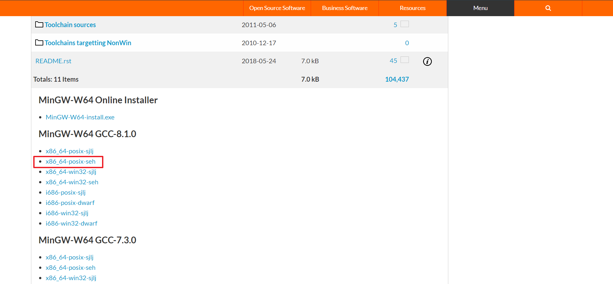
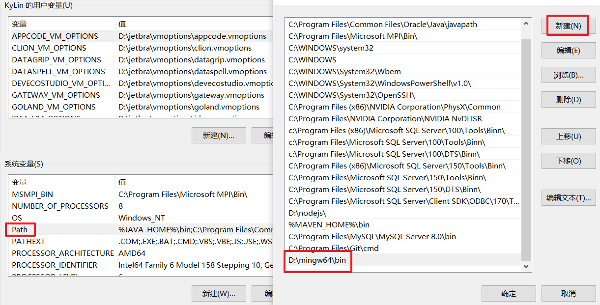
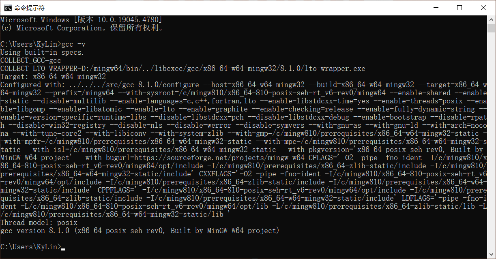

# C语言环境搭建

## 引用

参考文章：[使用vscode运行C语言，vscode配置环境超详细过程](https://blog.csdn.net/o_0ava0_o/article/details/124740167?ops_request_misc=%257B%2522request%255Fid%2522%253A%2522AB0EF402-44AC-49AE-8881-E03A5CFB62A4%2522%252C%2522scm%2522%253A%252220140713.130102334..%2522%257D&request_id=AB0EF402-44AC-49AE-8881-E03A5CFB62A4&biz_id=0&utm_medium=distribute.pc_search_result.none-task-blog-2~all~top_positive~default-2-124740167-null-null.142^v100^pc_search_result_base8&utm_term=%E5%A6%82%E4%BD%95%E4%BD%BF%E7%94%A8vscode%E5%86%99c%E8%AF%AD%E8%A8%80&spm=1018.2226.3001.4187)

<br>

## 摘要

### `安装MinGW-W64`

```
    MinGW 的全称是：Minimalist GNU on Windows ，实际上是将gcc（c/c++编译器）移植到了 Windows 平台下，并且包含了Win32API ，因此可以将源代码编译为可在 Windows 中运⾏的可执⾏程序。⽽且还可以使⽤⼀些 Windows 不具备的，Linux平台下的开发⼯具。
    由于vscode无法编译C语言文件，所以我们需要让其借助gcc来进行编译。
```

<br>

## 部署

### `01`.官网点击下载

[MinGW-W64官网下载链接](https://sourceforge.net/projects/mingw-w64/files/)

  

> PS：为什么不选win版本，因为VSCode编译C语言，实际是基于Linux版本

### `02.`打开压缩包

### `03.`配置mingw64的环境变量，点击Windows设置

  

### `04.`编辑系统环境变量的path变量

  

### `05.`验证环境变量是否配置成功

  