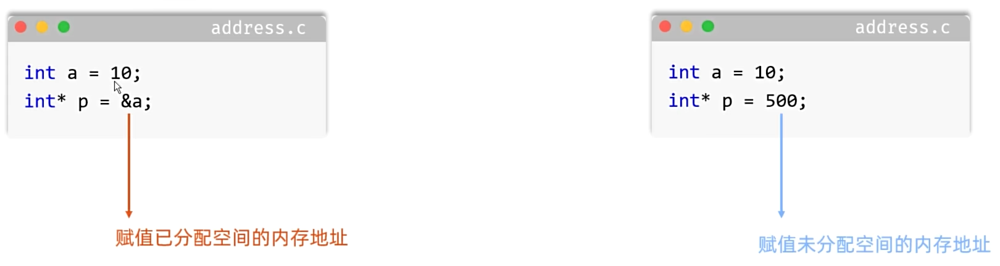
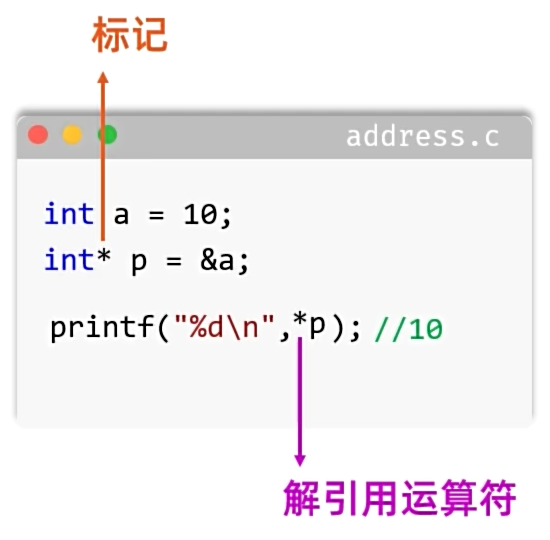

# C语言指针

## `什么是指针`

`指针 = 内存地址`

<br>

## `指针的使用细节`

### `01.`指针变量的名字

在下面事例代码中p指针变量的名字是`p`而不是`*p`

### `02.`指针变量的数据类型要跟指向变量的类型保持一致

变量的类型是int，指针的类型就要是int

### `03.`指针变量占用的大小，跟数据类型无关，跟编译器有关

32位编译器指针变量占用4字节，64位编译器指针变量占用8字节

### `04.`给指针变量赋值的时候，不能把一个数值赋值给指针变量

  

<br>

## `指针的作用`

  

事例代码：
```
#include <stdio.h>

// 主函数
int main()
{
    // 利用指针去获取变量中的数据/存储数据
    int a = 10;

    // 1.定义一个指针去指向变量a
    int *p = &a;

    // 2.利用指针去获取变量中的数据
    printf("%d\n", *p);

    // 3.利用指针去存储数据/修改数据
    *p=200;

    // 4.输出打印
    printf("%d\n", *p);
    printf("%d\n", a);

    // 5.测试指针变量大小
    char c='a';
    char* p1=&c;

    long long n = 100;
    long long* p2=&n;

    printf("%zu\n",sizeof(p1));
    printf("%zu\n",sizeof(p2));
}
```