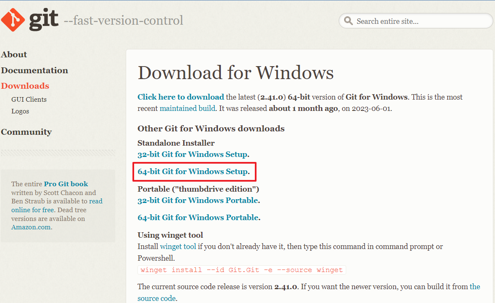
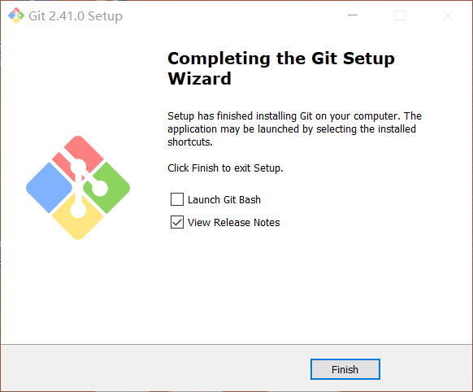

# Git学习笔记

## 引用

---

参考文章：[GIT 卸载干净（图文详解）](https://blog.csdn.net/weixin_43306271/article/details/121735153)

<br>

## 摘要

---

```
    Git是一个开源的分布式版本控制系统，可以有效、高速地处理从很小到非常大的项目版本管理。它是Linus Torvalds为了帮助管理Linux内核开发而开发的一个开放源码的版本控制软件12。您可以使用Git来管理您的项目，跟踪和协调代码更改。
```

<br>

## 部署

---

1. 进入官网，点击对应版本下载。[Git官网](https://git-scm.com/)

      

2. 点击安装包，一直无脑下一步，即可安装完成。

      


### VSCode中将Markdown上传GitHub

推荐博客1：[使用vscode编辑和提交github仓库代码](https://blog.csdn.net/qq_42951560/article/details/108641641)

推荐博客2：[如何从VS Code上传项目到GitHub](https://geek-docs.com/github/github-tutorial/how-to-upload-a-project-to-github-from-vs-code.html)