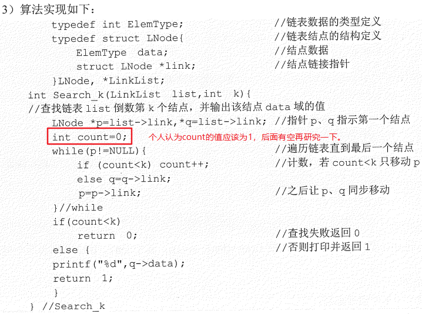

# 数据结构问题清单

## 一、王道课后习题选择题1.2.3的第10题，学了第8章的冒泡排序再回过头看

 

## 二、王道课后习题应用题2.3.7的第4题，若本题改为不带头结点的单链表，请思考如何实现

 

## 三、王道课后习题应用题2.3.7的第19题，验证一下自己的算法

 

## 四、王道课后习题应用题2.3.7的第21题

  

 

## 五、王道课后习题选择题3.3.6的第9题，等复习了五、六章内容后再来看