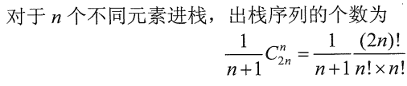

# `计算机组成原理学习笔记`

## `常用单位汇总`

### 数据单位
- **B**：字节（Byte），1字节等于8位（bit）。
- **KB**：千字节（Kilobyte），1KB等于1024字节。
- **MB**：兆字节（Megabyte），1MB等于1024KB。
- **GB**：吉字节（Gigabyte），1GB等于1024MB。
- **TB**：太字节（Terabyte），1TB等于1024GB。
- **PB**：拍字节（Petabyte），1PB等于1024TB。
- **EB**：艾字节（Exabyte），1EB等于1024PB。
- **ZB**：泽字节（Zettabyte），1ZB等于1024EB。
- **YB**：尧字节（Yottabyte），1YB等于1024ZB。

### 频率单位
- **Hz**：赫兹（Hertz），1Hz表示每秒钟有1个周期。
- **kHz**：千赫（Kilohertz），1kHz等于1000Hz。
- **MHz**：兆赫（Megahertz），1MHz等于1000000Hz，或者说1000kHz。
- **GHz**：吉赫（Gigahertz），1GHz等于1000MHz。
- **THz**：太赫（Terahertz），1THz等于1000GHz。

### 时间单位
- **秒（s）**：秒是时间的基本单位。
- **毫秒（ms）**：1毫秒等于10^-3秒，即千分之一秒。
- **微秒（μs）**：1微秒等于10^-6秒，即百万分之一秒。
- **纳秒（ns）**：1纳秒等于10^-9秒，即十亿分之一秒。
- **皮秒（ps）**：1皮秒等于10^-12秒，即万亿分之一秒。
- **飞秒（fs）**：1飞秒等于10^-15秒，即千万亿分之一秒。
- **阿托秒（as）**：1阿托秒等于10^-18秒，即百京分之一秒。

### 常用的二的次方
- **2的0次方**：等于1，这是任何数的0次方的定义。
- **2的1次方**：等于2，这是二进制基础。
- **2的2次方**：等于4，常见于小型数组或循环。
- **2的3次方**：等于8，常见于字节（byte）中的位数。
- **2的4次方**：等于16，常见于一些小型集合的大小。
- **2的5次方**：等于32，常见于某些特定的数据结构中。
- **2的6次方**：等于64，常见于计算机硬件（如64位操作系统）。
- **2的7次方**：等于128，常见于某些特定的数据结构中。
- **2的8次方**：等于256，常见于字节的可能值的数量。
- **2的10次方**：等于1024，常用于表示千字节（KB）。
- **2的12次方**：等于4096，常见于计算机内存页的大小。
- **2的16次方**：等于65536，常见于颜色编码。
- **2的20次方**：等于1,048,576，常用于表示兆字节（MB）。
- **2的30次方**：等于1,073,741,824，常用于表示吉字节（GB）。
- **2的32次方**：等于4,294,967,296，常见于32位系统中的最大整数。
- **2的40次方**：等于1,099,511,627,776，常用于表示太字节（TB）。
- **2的64次方**：常见于64位系统中的最大整数。

 

## `n个不同元素进栈，出栈序列的个数公式：`

  
