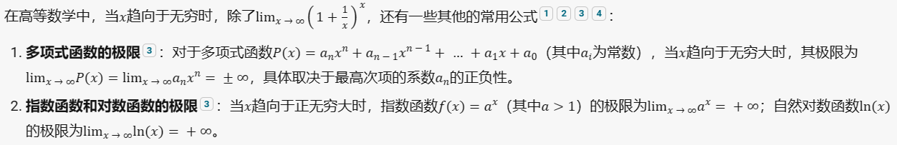
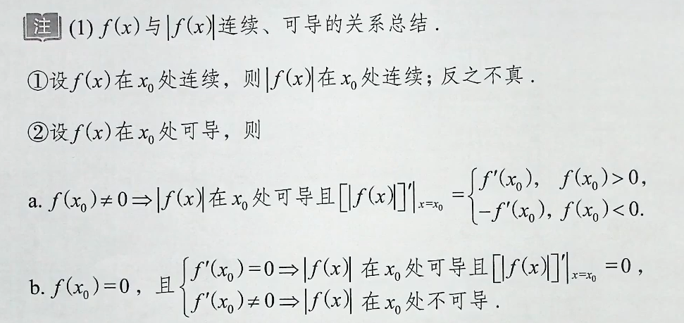

# 高等数学背诵手册

 

## 零基础

### `数学归纳法`

 

### `一元二次方程及其解`

 

### `重要的基本不等式`

 

### `幂函数、指数函数与对数函数`

  

 

### `三角函数与反三角函数`

`三角函数`

  

`1.正弦函数sin(x)的图像`

`2.余弦函数cos(x)的图像`

`3.正切函数tan(x)的图像`

`4.余切函数cot(x)的图像`

`5.正割函数sec(x)的图像`

`6.余割函数csc(x)的图像`

`反三角函数`

 

### `等差数列`

 

### `等比数列`

 

### `直角坐标和极坐标的关系`

 

## 第1讲 函数极限与连续

### `指数函数的图像`

 

### `对数函数的图像`

 

### `反三角函数的图像`

 

### `函数极限的定义`

 

### `函数极限的局部保号性`

 

### `常用的等价无穷小`

 

### `洛必达法则`

 

### `泰勒公式`

 

### `七种未定式的计算`

 

## 第2讲 数列极限

### `数列极限的定义`

 

### `数列极限的性质`

 

### `极限四则运算规则`

 

### `海涅定理（归结原则）`

 

### `压缩映射原理（简化版）`

  

 
 
 
 
 
 
 
 
 
 
 
 
 
 
 
 
 
 
 
 
 
 
 
 
 
 
 
 
 
 
 
 
 
 

## 极限重要公式

### 当x→∞时，重要公式汇总

  

  

 

## `常用的三角函数数值`

### 1.sin(x)

  

### 2.cos(x)

  

### 3.tan(x)

  

### 4.cot(x)

TODO

### 5.sec(x)

  

### 6.csc(x)

TODO

 

## `常用求导例子`

### 1.反双曲正弦函数求导

  

 

## `f(x)与|f(x)|连续、可导的关系总结`

  