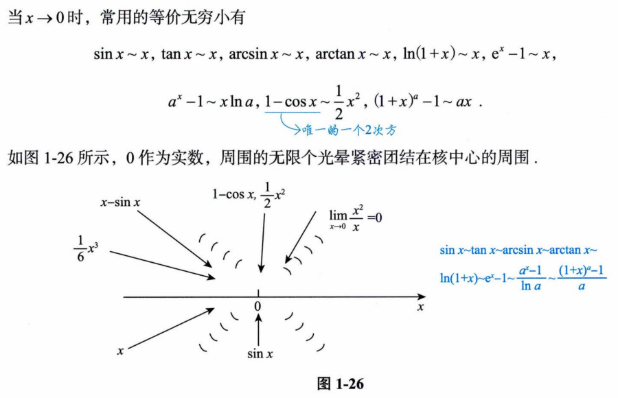
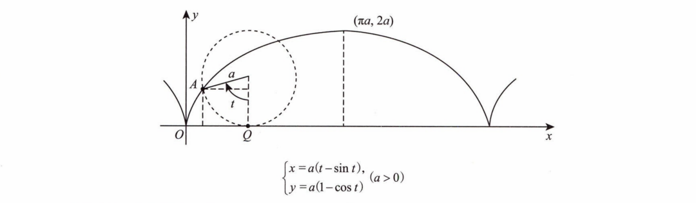

# 高等数学背诵手册

## 零基础

### `数学归纳法`


<br>

### `一元二次方程及其解`


<br>

### `一元n次方程根与系数的关系`


<br>

### `重要的基本不等式`


<br>

### `幂函数、指数函数与对数函数`


  

<br>

### `三角函数与反三角函数`

`三角函数`

  

`1.正弦函数sin(x)的图像`


`2.余弦函数cos(x)的图像`


`3.正切函数tan(x)的图像`


`4.余切函数cot(x)的图像`


`5.正割函数sec(x)的图像`


`6.余割函数csc(x)的图像`


`反三角函数`


<br>

### `等差数列`


<br>

### `等比数列`


<br>

### `直角坐标和极坐标的关系`


<br>

## 第1讲 函数极限与连续

### `指数函数的图像`


<br>

### `对数函数的图像`


<br>

### `反三角函数的图像`


<br>

### `函数极限的定义`


<br>

### `函数极限的局部保号性`


<br>

### `常用的等价无穷小`



<br>

### `当x→∞时，重要公式汇总`


<br>

### `洛必达法则`


<br>

### `泰勒公式`


<br>

### `两个重要极限`


<br>

### `七种未定式的计算`


<br>

## 第2讲 数列极限

### `数列极限的定义`


<br>

### `数列极限的性质`


<br>

### `极限四则运算规则`


<br>

### `海涅定理（归结原则）`


<br>

### `压缩映射原理（简化版）`


<br>

## 第3讲 一元函数微分学的概念

### `导数的定义`


<br>

### `f(x)与|f(x)|连续、可导的关系总结`


<br>

### `导数的几何意义`


<br>

### `微分的概念`


<br>

## 第4讲 一元函数微分学的计算

### `基本求导公式`


<br>

### `常用求导公式`


<br>

### `导数的四则运算`


<br>

### `反函数的二阶导数`


<br>

### `常用的高阶导数求导公式`


<br>

### `莱布尼茨公式求导高阶导数`


```
PS：莱布尼茨公式中的大C为杨辉三角的表示符号，其公式如下
```


<br>

### `泰勒公式求导高阶导数`


  

<br>

## 第5讲

### `判别极值的第一充分条件`


<br>

### `判别极值的第二充分条件`


<br>

### `判别极值的第三充分条件`


<br>

### `判别拐点的第一充分条件`


<br>

### `判别拐点的第二充分条件`


<br>

### `判别拐点的第三充分条件`


<br>

### `极值点与拐点的重要结论`


<br>

### `斜渐近线`


<br>

### `寻找渐近线的顺序`


<br>

### `渐近线的注意事项`


<br>

### `曲率及曲率半径`


<br>

## 附录

### `图像变换`


<br>

### `常用平面图形`

`1.心形线（外摆线的一种）`


`2.摆线（平摆线）`



`3.星形线（内摆线的一种）`


<br>

### `常用的三角函数数值`

`1.sin(x)`


`2.cos(x)`


`3.tan(x)`


`4.cot(x)`


`5.sec(x)`


`6.csc(x)`


<br>

### `重要公式`

`1.三角函数常用公式`


`2.一元二次方程基础`


`3.因式分解公式`


`4.阶乘与双阶乘`

