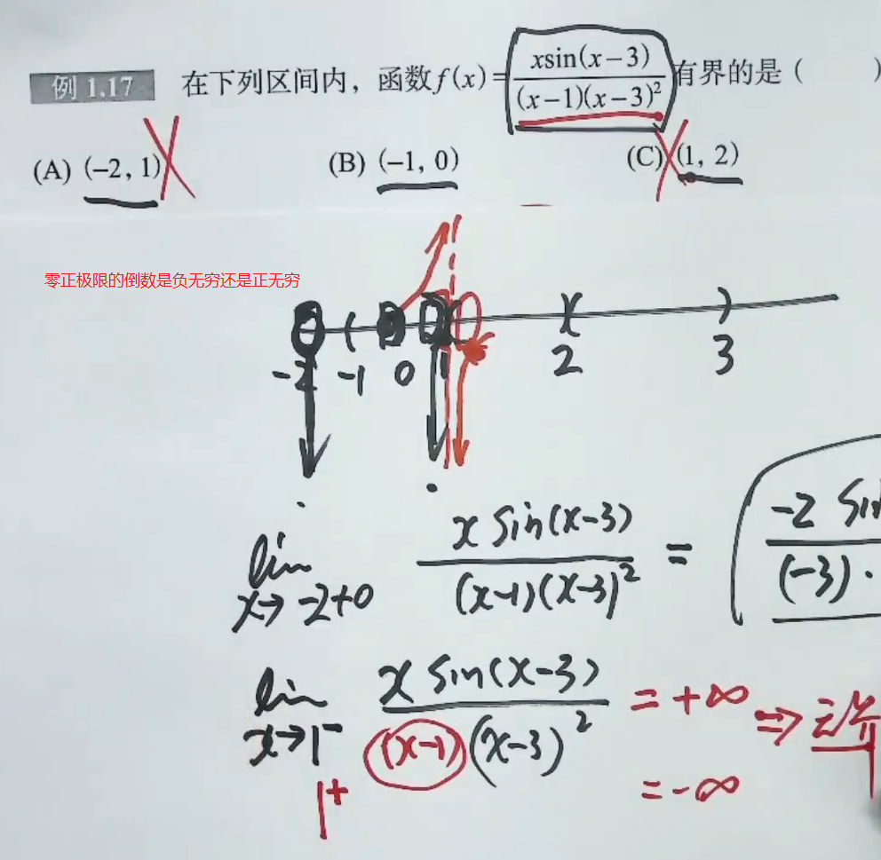

# `高数基础阶段问题汇总`

## 问题1

PS：理解基础30讲18页[注2]的表格可能可以解决这个问题，和习题1.12一起研究

  

 

## 问题2

第一讲课后习题1.8用洛必达可以求解，但是答案用的是否是两个重要极限公式，有空的时候求证一下

 

## 问题3

第一讲课后习题1.14答案的注解部分做法为什么是错误的？

 

## 问题4

掌握第二讲课本例2.14的证明过程，同时自己求证第二问x1<ξ的情况

 

## 问题5

有空的时候研究第二讲课后习题2.2的证明过程，先当做结论背下来，包括注解中的结论