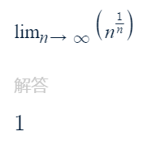
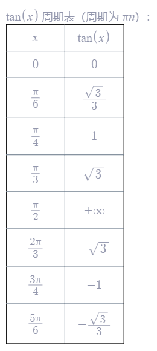

# `高等数学学习笔记`

## `极限重要公式`

### 当x→∞时，重要公式汇总

  

  

 

## `常用的三角函数图像`

### 1.正弦函数sin(x)的图像

### 2.余弦函数cos(x)的图像

### 3.正切函数tan(x)的图像

### 4.余切函数cot(x)的图像

### 5.正割函数sec(x)的图像

### 6.余割函数csc(x)的图像

 

## `常用的三角函数数值`

### 1.sin(x)

  

### 2.cos(x)

  

### 3.tan(x)

  

 

## `常用求导例子`

### 1.反双曲正弦函数求导

  
