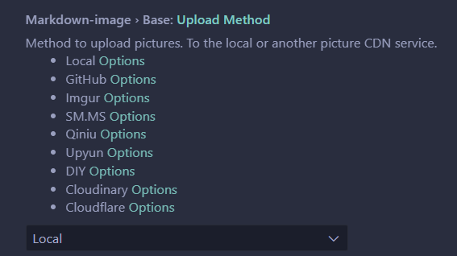

# Markdown学习笔记

> Markdown中文语法文档：[Markdown 入门指南](https://www.markdown.xyz/getting-started/)

 

## 在 Visual Studio Code 中，快捷上传图片

 

那么我们就需要一款插件，来实现快捷键快速粘贴图片等操作，照例打开EXTENSIONS选项卡，这里推荐两款，Markdown Image 和 PicGo。本文以Markdown Image为例（因为它能自定义上传接口）。

  

安装后打开设置，我们可以看到这样一个选项，我们可以根据需求选择图床。直接推送到你的托管平台可以选择 Local ，不想折腾，对速度要求不高的可以选择 SM.MS Imgur 这两个图床，点开 Options ，根据提示注册并填入字段即可。

  

> 现在，我们新建一个 Markdown 文件，应该就可以看到md源文件和预览啦~现在我们测试一下是否能上传。右键看到快捷键是 **Shift+Alt+V** 测试一下，就能粘贴啦~

 

## Markdown给文字添加底色

推荐文章：[Markdown 前景色、背景色](https://m.imooc.com/wiki/markdownlesson-markdowncolor)