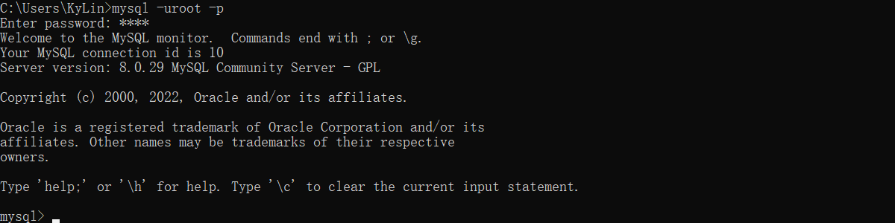

# MySQL数据库入门笔记

## 引用

推荐文章1：[MySQL零基础入门之从青铜到钻石](https://www.imooc.com/article/311324)

推荐文章2：[MySQL零基础入门之从青铜到钻石（二）](https://www.imooc.com/article/312463)

<br>

## 摘要

### 数据库的介绍

1. 数据库概述
   
    - `什么是数据库`

    	存储数据的仓库. 其本质是一个文件系统，数据库按照特定的格式将数据存储起来，用户可以对数据库中的数据进行增加，修改，删除及查询操作。

        

    - `数据的存储方式`

        TODO:

2. 数据库的优点

    数据库是按照特定的格式将数据存储在文件中，通过SQL语句可以方便的对大量数据进行增、删、改、查操作，数据库是对大量的信息进行管理的高效的解决方案。

3. 常见数据库

    **MYSQL**：开源免费的数据库，小型的数据库.已经被Oracle收购了。

    **Oracle**：收费的大型数据库，Oracle公司的产品。Oracle收购SUN公司，收购MYSQL。
    
    **DB2** ：IBM公司的数据库产品,收费的。常应用在银行系统中.
    
    **SQLServer**：MicroSoft 公司收费的中型的数据库。C#、.net等语言常使用。
    
    **SyBase**：已经淡出历史舞台。提供了一个非常专业数据建模的工具PowerDesigner。
    
    **SQLite**: 嵌入式的小型数据库，应用在手机端。

    `常用数据库`：MYSQL，Oracle

    在web应用中，使用的最多的就是MySQL数据库，原因如下：

    - 开源、免费
    - 功能足够强大，足以应付web应用开发（最高支持千万级别的并发访问）

<br>

## 部署

1. 数据库的卸载

    - 打开电脑的服务窗口，关闭MySQL服务并且卸载一切与mysql相关的模块
    
    

    

    
    
    - 找到MySQL的安装目录，查找是否还残留相关文件夹，如果有删除即可
    
    
    
    - 勾选显示文件夹选项
    
    
    
    - 找到ProgramDate文件夹，删除里面mysql文件夹即可
    
    

<br>

2. 数据库的安装

    - [官网下载地址](https://dev.mysql.com/downloads/installer/)

    

    

    

    

    

    

    

    

    

    

    

    

    

    

    

    

    

    

    

    

    

    

    

<br>

3. 数据库的启动

    MySQL启动方式和普通的windows程序双击启动方式不同，分为以下3种：

    - 3.1 Windows服务方式启动

        

        

    - 3.2 命令方式启动

        windows+r键调出运行窗口，输入services.msc命令。随后在服务中找到MySQL80服务启动即可

        

    - 3.3 以管理员身份运行cmd打开dos窗口，输出net start mysql80

        

    > 使用cmd命令打开dos窗口，输出`mysql -V`查看当前MySQL版本

<br>

4. 控制台连接数据库
   
    MySQL是一个需要账户名密码登录的数据库，登陆后使用，它提供了一个默认的root账号，使用安装时设置的密码即可登录

    登录格式1：`mysql -u用户名 -p密码`

    例如：`mysql –uroot -proot`

    

    后输入密码方式：

    `mysql -u用户名 -p回车`

    `密码`

      

    登录格式2：`mysql -hip地址 -u用户名 -p密码`
    
    例如：`mysql –h127.0.0.1 –uroot -proot`

    

    登录格式3：`mysql --host=ip地址 --user=用户名 --password=密码`
    
    例如：`mysql --host=localhost --user=root --password=root`

    

    退出MySQL：`exit`

    

<br>

## 使用

### `数据库管理系统、数据库和表的关系:`

数据库管理系统（DataBase Management System，DBMS）：指一种操作和管理数据库的大型软件，用于建立、使用和维护数据库，对数据库进行统一管理和控制，以保证数据库的安全性和完整性。用户通过数据库管理系统访问数据库中表内的数据

数据库管理程序(DBMS)可以管理多个数据库，一般开发人员会针对每一个应用创建一个数据库。为保存应用中实体的数据，一般会在数据库创建多个表，以保存程序中实体的数据。数据库管理系统、数据库和表的关系如图所示：


### `SQL的概念`

1. 什么是SQL

    结构化查询语言(Structured Query Language)简称SQL,SQL语句就是对数据库进行操作的一种语言。

2. SQL作用

    通过SQL语句我们可以方便的操作数据库中的数据库、表、数据。
    
    SQL是数据库管理系统都需要遵循的规范。不同的数据库生产厂商都支持SQL语句，但都有特有内容。

    

3. SQL语句分类

    DDL(Data Definition Language)数据定义语言
    用来定义数据库对象：数据库，表，列等。关键字：create, drop,alter等

    DML(Data Manipulation Language)数据操作语言
    用来对数据库中表的数据进行增删改。关键字：insert, delete, update等

    DQL(Data Query Language)数据查询语言
    用来查询数据库中表的记录(数据)。关键字：select, where等

    DCL(Data Control Language)数据控制语言(了解)
    用来定义数据库的访问权限和安全级别，及创建用户。关键字：GRANT， REVOKE等

### `SQL通用语法`

1. SQL语句可以单行或多行书写，以分号结尾。

2. 可使用空格和缩进来增强语句的可读性。

3. MySQL数据库的SQL语句不区分大小写，关键字建议使用大写。

    ```
    SELECT * FROM student;
    select * from student;
    SELECT * FROM student;
    ```

### `DDL语句`

#### **DDL(Data Definition Language)数据定义语言**

用来定义数据库对象：数据库，表，列等。关键字：create, drop,alter等

1. DDL操作数据库

    - **创建数据库**

        直接创建数据库：`CREATE DATABASE 数据库名;`

        判断是否存在并创建数据库：`CREATE DATABASE IF NOT EXISTS 数据库名;`

        创建数据库并指定字符集(编码表)：`CREATE DATABASE 数据库名 CHARACTER SET 字符集;`

        具体操作：
        
        1.1. 直接创建数据库db1
        ```
        CREATE DATABASE db1;
        ```
        <br>

        1.2. 判断是否存在并创建数据库db2
        ```
        CREATE DATABASE IF NOT EXISTS db2;
        ```
        <br>

        1.3. 创建数据库并指定字符集为gbk
        ```
        CREATE DATABASE db3 CHARACTER SET gbk;
        ```
        <br>

    - **查看数据库**

        查看所有的数据库：`SHOW DATABASES;`

        查看某个数据库的定义信息：`SHOW CREATE DATABASE 数据库名;`
    
    - **修改数据库**

        修改数据库字符集格式：`ALTER DATABASE 数据库名 DEFAULT CHARACTER SET 字符集;`

        具体操作：

        1.4. 将db3数据库的字符集改成utf8
        ```
        ALTER DATABASE db3 DEFAULT CHARACTER SET utf8;
        ```

    - **删除数据库**

        `DROP DATABASE 数据库名;`

        具体操作：

        1.5. 删除db2数据库
        ```
        DROP DATABASE db2;
        ```

    - **使用数据库**

        查看正在使用的数据库：`SELECT DATABASE();`
        
        使用/切换数据库：`USE 数据库名;`
        
        具体操作：
        
        1.6. 查看正在使用的数据库
        ```
        SELECT DATABASE();
        ```
        <br>

        1.7. 使用db1数据库
        ```
        USE db1;
        ```
        <br>

2. DDL操作表

    > 前提先使用某个数据库

    - **创建表**

        表的结构与excel相似

        语法：

        `CREATE TABLE 表名 (字段名1 字段类型1, 字段名2 字段类型2…);`

        关键字说明：
        ```
        CREATE -- 表示创建
        TABLE -- 表示创建一张表
        ```

        建议写成如下格式:
        ```
        CREATE TABLE 表名 (
        字段名1 字段类型1, 
        字段名2 字段类型2
        );
        ```

        MySQL数据类型

        MySQL中的我们常使用的数据类型如下：

        | 类型             | 描述                 |
        | --------------- | -------------------- |
        | int             | 整型                 |
        | double          | 浮点型                |
        | varchar         | 字符串型              |
        | data            | 日期类型：yyyy-MM-dd  |

        详细的数据类型如下：

        TODO

        具体操作：

        2.1. 创建student表包含id,name,birthday字段
        ```
        CREATE TABLE student (
            id INT,
            name VARCHAR(20),
            birthday DATE
        );
        ```

    - **查看表**

        查看某个数据库中的所有表`SHOW TABLES;`

        查看表结构：`DESC 表名;`

        查看创建表的SQL语句：`SHOW CREATE TABLE 表名;`
   
    - **快速创建一个表结构相同**

        CREATE TABLE 新表名 LIKE 旧表名;
    
        具体操作：

        2.2. 创建s1表，s1表结构和student表结构相同
        ```
        CREATE TABLE s1 LIKE student;
        ```

    - **删除表**

        `DROP TABLE 表名;`

        判断表是否存在并删除表：`DROP TABLE IF EXISTS 表名;`
    
    - **修改表结构**

        添加表列：`ALTER TABLE 表名 ADD 列名 类型;`

        具体操作：

        2.3. 为学生表添加一个新的字段remark,类型为varchar(20)
        ```
        ALTER TABLE student ADD remark VARCHAR(20);
        ```

        修改列类型：`ALTER TABLE 表名 MODIFY列名 新的类型;`

        具体操作：

        2.4. 将student表中的remark字段的改成varchar(100)
        ```
        ALTER TABLE student MODIFY remark VARCHAR(100);
        ```

        修改列名：`ALTER TABLE 表名 CHANGE 旧列名 新列名 类型;`

        具体操作：

        2.5. 将student表中的remark字段名改成intro，类型varchar(30)
        ```
        ALTER TABLE student CHANGE remark intro varchar(30);
        ```

        删除列：`ALTER TABLE 表名 DROP 列名;`
        
        具体操作：

        2.6. 删除student表中的字段intro
        ```1
        ALTER TABLE student DROP intro;
        ```

        修改表名：`RENAME TABLE 表名 TO 新表名;`
        
        具体操作：

        2.7. 将学生表student改名成student2
        ```
        RENAME TABLE student TO student2;
        ```

    - 

3.  


<br>

## 问题

**为什么cmd输入mysql显示不是内部或外部命令：**

这通常是因为 Windows 系统中没有将 MySQL 的安装路径加入到环境变量 PATH 中。你需要执行以下步骤：

1. 通过「开始」菜单搜索「环境变量」，并打开「系统属性」->「高级系统设置」->「环境变量」。

2. 找到「系统变量」中的「Path」，并单击「编辑」。

3. 在「路径」字段后面添加 MySQL 安装目录中 bin 目录的路径，例如：C:\Program Files\MySQL\MySQL Server 8.0\bin

4. 保存更改并重新打开命令提示符，然后再尝试输入「mysql」命令。

如果问题仍然存在，请检查 MySQL 的安装是否正确，确保它的 bin 目录中的所有文件都存在。