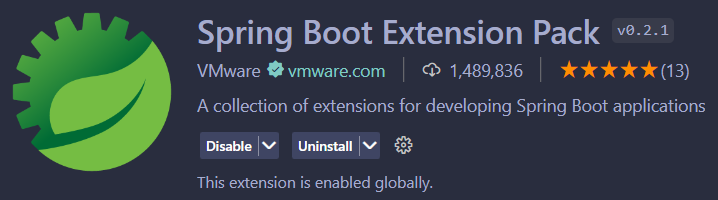
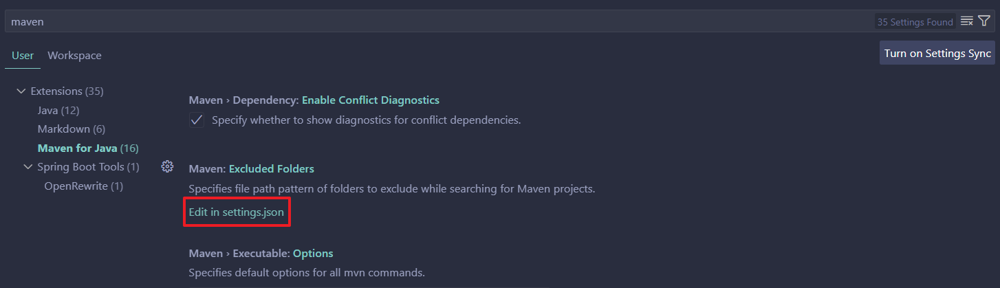
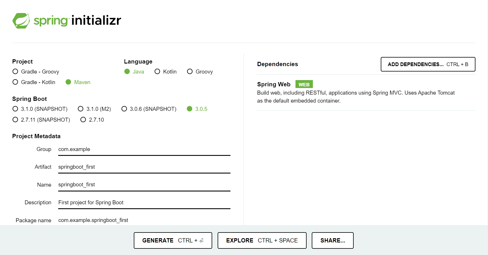
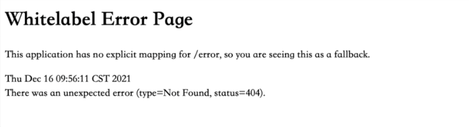
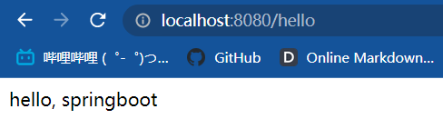

# SpringBoot学习笔记

<br>

## HelloWorld

---

### 引用

推荐文章1：[超详细的VsCode创建SpringBoot项目(图文并茂)](https://blog.csdn.net/zyd573803837/article/details/109263219)

推荐文章2：[VSCode搭建SpringBoot开发环境](https://juejin.cn/post/7114958090784473101)

推荐文章3：[一分钟快速搭建 Spring Boot 项目](https://cloud.tencent.com/developer/article/1924590)

推荐文章4：[如何在Spring boot中修改默认端口](https://www.cnblogs.com/flydean/p/12680327.html)

### 摘要

1. SpringBoot修改默认端口
   
   默认情况下，server.port值是8080。 我们可以在application.properties中这样修改为9091:

   > server.port = 9091

### 部署

> 推荐方法二，原因：VSCode目前仅支持JDK11及以上的版本，若使用JDK11以下的版本则构建项目时会发生错误。

### 方法一：

1. 安装JDK（已经安装，具体步骤后期完善）

2. 安装maven

3. vscode搭建springboot

    在 Visual Studio Code 中打开扩展视图(Ctrl+Shift+X)，搜索并安装
    - **Extension Pack for Java**

      

    - **Spring Boot Extension Pack**

      


4. 配置maven
   
    打开设置，搜索maven，编辑 settings.json

      

    然后把maven的可执行文件路径配置、maven的setting路径配置、java.home的路径配置，拷贝到右侧的用户设置区域并且设置为自己电脑的实际路径

    ```
    {
        "workbench.startupEditor": "newUntitledFile",
        "java.errors.incompleteClasspath.severity": "ignore",
        "workbench.colorTheme": "Material Theme Palenight",
        "java.home":"C:\\Program Files\\Java\\jdk1.8.0_172",
        "java.configuration.maven.userSettings": "D:\\apache-maven-3.9.1\\conf\\settings.xml",
        "maven.executable.path": "D:\\apache-maven-3.9.1\\bin\\mvn.cmd",
        "maven.terminal.useJavaHome": true,
        "maven.terminal.customEnv": [
            {
                "environmentVariable": "JAVA_HOME",
                "value": "C:\\Program Files\\Java\\jdk1.8.0_172"
            }
        ],
        "extensions.autoUpdate": false,
        "workbench.iconTheme": "material-icon-theme",
    }
    ```

    配置完成重启 VSCode

5. 创建SpringBoot项目
   
   - 5.1 使用ctrl+shift+p调出命令并输入spring选择创建一个maven项目
   - 5.2 选择SpringBoot版本
   - 5.3 选择使用的语言
   - 5.4 你的Group id和Artifact Id
   - 5.5 选择包类型
   - 5.6 选择java版本
   - 5.7 选择需要的依赖
   - 5.8 选择保存位置，等待创建成功
   - 5.9 创建成功后Open即可

### 方法二：

1. 去官网下载SpringBoot压缩包

    官网下载地址：https://start.spring.io/

2. 选择相应配置

      

3. 解压之后导入VSCode

### 使用

## 开发第一个SpringBoot项目

项目启动成功后，我们在浏览器里访问 8080 端口测试一下
    
  

这个 404 页面是 Spring Boot 默认的错误页面，表示我们的请求在 Web 服务中不存在。

那该怎么办呢？

我们来增加一个 Controller 文件，用来处理 Web 请求，内容如下：

```
@Controller
public class HelloController {
    
    @GetMapping("/hello")
    @ResponseBody
    public String hello() {
        return "hello, springboot";
    }
}
```

这段代码的业务逻辑非常简单，用户发送 hello 请求，服务器端响应一个“hello, springboot”回去

  

<br>

## Mapping/传参

---

### 引用

知乎文章：[SpringBoot 参数接收只看这一篇文章就够了](https://zhuanlan.zhihu.com/p/599692046)

### 摘要

1. 路径参数 @PathVariable

    **基础使用**

    通过@PathVariable可以将URL中占位符参数{xxx}绑定到处理器类的方法形参中@PathVariable("xxx")

    举个栗子：
    ```
        @GetMapping("/{name}")
        @ResponseBody
        public String hello(@PathVariable String name) {
            return "hello, " + name;
        }
    ```

### 使用

工程案例：<>;

