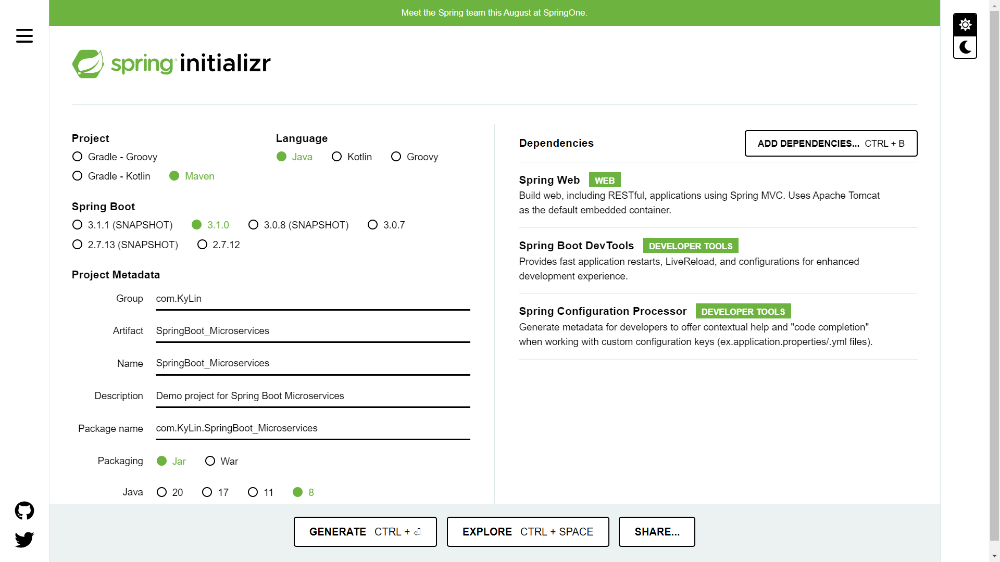
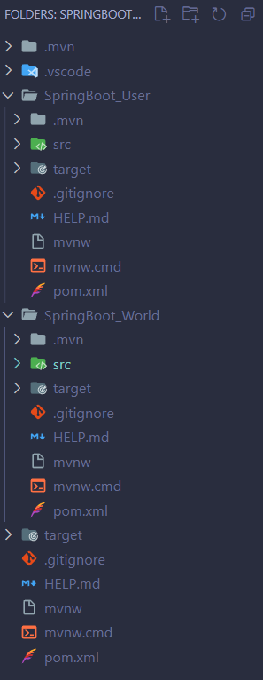

# SpringBoot微服务学习笔记

工程案例：<>;

<br>

## 引用

---

参考文章：[springboot 多模块项目开发](https://www.jianshu.com/p/235a17ce4091)

<br>

## 部署

---

1. 去官网下载一个SpringBoot工程，配置如下图：

    ```
    PS：下图版本选择Java20，SpringBoot3.0之后只支持Java8以上的版本
    ```

      

2. 删除父工程的src，SpringBoot微服务的项目结构如下图

      

3. 在父工程的pom文件中添加如下代码：

    ```
    <packaging>pom</packaging>
	<modules>
		<module>SpringBoot_User</module>
		<module>SpringBoot_World</module>
	</modules>
    ```

4. 在子工程的pom文件中添加如下代码：

    ```
    <parent>
		<groupId>com.KyLin</groupId>
		<artifactId>SpringBoot_Microservices</artifactId>
		<version>0.0.1-SNAPSHOT</version>
		<relativePath>../pom.xml</relativePath> <!-- lookup parent from repository -->
	</parent>
    ```
5. 配置`launch.json`文件
   
   ```
   {
        // Use IntelliSense to learn about possible attributes.
        // Hover to view descriptions of existing attributes.
        // For more information, visit: https://go.microsoft.com/fwlink/?linkid=830387
        "version": "0.2.0",
        "configurations": [
            {
                "type": "java",
                "name": "Current File",
                "request": "launch",
                "mainClass": "${file}"
            },
            {
                "type": "java",
                "name": "SpringBootUserApplication",
                "request": "launch",
                "mainClass": "com.KyLin.SpringBoot_User.SpringBootUserApplication",
                "projectName": "SpringBoot_User",
                "vmArgs":"-Dserver.port=8080"
            },
            {
                "type": "java",
                "name": "SpringBootWorldApplication",
                "request": "launch",
                "mainClass": "com.KyLin.SpringBoot_World.SpringBootWorldApplication",
                "projectName": "SpringBoot_World",
                "vmArgs":"-Dserver.port=8086"
            }
        ]
    }
   ```

6. 使用Maven命令先clean再install即可运行项目