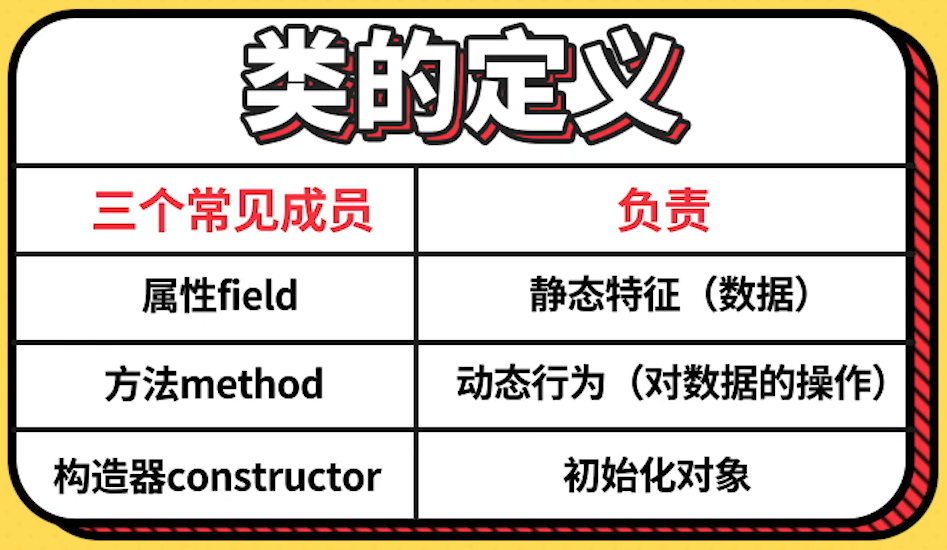
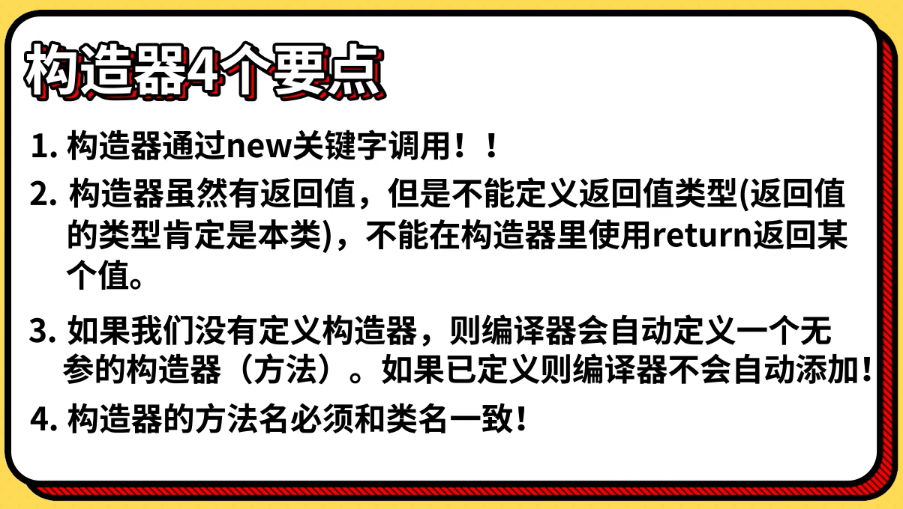

# Java学习笔记

## Java环境的安装与配置

### `引用`

参考视频：[Java背景知识和JDK安装和配置](https://www.bilibili.com/cheese/play/ep4884?t=469&csource=common_hp_history_null)

<br>

### `部署`

1. 进入官网下载JDK

    官网地址：<https://www.oracle.com/java/>

2. 安装

    下载好后直接安装，一直无脑下一步

3. 配置环境变量

    打开高级系统设置，点击环境变量，在系统变量中按下图配置

      

    然后在Path中添加如下图内容，并且移到最上面

      


4. 测试安装是否成功

      

<br>

## JDK的重新安装

### `引用`

参考文章：[完整的卸载Jdk java环境教程](https://www.cnblogs.com/pjhaymy/p/13735277.html)

<br>

### `使用`

1. 卸载下图中的两个程序：

      

2. 在路径 C:\ProgramData\Oracle，删除Oracle文件夹

<br>

## Java基础语法

### `一、Hello World`

1. 写出我们第一个Java程序

    新建一个mycode文件夹，创建一个Welcome.java文件，输入以下代码

    ```
    package a_hello_world;

    public class Welcome {
        public static void main(String[] args){
            System.out.println("Hello World");
        }
    }
    ```

    在cmd窗口中执行以下操作：

      

2. 了解Java程序的运行机制

      

3. 常用的dos命令介绍

      

<br>

### `二、见名知意代码美`

1. 标识符

    标识符四大准则：

      

    标识符使用规范：

      

2. 注释

      

3. Java关键字

      

4. 变量的本质

    

    Java标识符以及变量的本质案例代码（TestVariable.java）：
    
    ```
    package b_variable;

    public class TestVariable {
        // Java 标识符以及变量的本质
        public static void main(String[] args) {
            // 以下为合规的标识符
            // int age = 18;
            // int _age = 19;
            // int $age = 20;
            // int age123 = 21;
            // int 年龄 = 22;

            // 以下为不合规的标识符
            // int 123age = 23; // 数字不能做开头
            // int age# = 24; // 标识符只能是：字母、数字、下划线和$
            // int class = 25; // 标识符不能是关键字

            // 变量的本质
            int monthlySalary = 15000;
            int annualSalary = monthlySalary * 12;
            System.out.println("年薪：" + annualSalary);

            double bonus = 3000.1;
            System.out.println("奖金：" + bonus);
        }
    }
    ```

<br>

### `三、基本数据类型`

Java的数据类型：

  

#### `3.1 数值型`

#### 整型

  

#### 浮点型

  

  

Java整型数据类型案例代码（TestIntDouble.java）：

```
package c_data_type;

public class TestIntDouble {
    // Java基本数据类型之整型和浮点型
    public static void main(String[] args) {
        byte age = 20;
        short salary = 25000;
        int beijingPopulation = 30000000;

        // 整型常量默认的类型是int，改成long类型需要后面加：L/l
        long globalPopulation = 7000000000L;
        System.out.println("整型数据类型：" + age + "," + salary + "," + beijingPopulation + "," + globalPopulation);

        // 关于进制
        int t1 = 65; // 十进制
        int t2 = 065; // 八进制
        int t3 = 0x65; // 十六进制
        int t4 = 0b01000001; // 二进制

        System.out.println("十进制：" + t1);
        System.out.println("八进制：" + t2);
        System.out.println("十六进制：" + t3);
        System.out.println("二进制：" + t4);

        // 测试浮点数
        double d1 = 3.14;
        float f1 = 3.14F; // 浮点常量默认是

        double d2 = 314E-2; // 科学计数法：314*10^(-2)

        System.out.println("double型：" + d1);
        System.out.println("float型：" + f1);
        System.out.println("科学计数法：" + d2);

        // 浮点数是不精确的，用于比较要小心
        // 如果要使用精确的运算，使用BigDecimal类
        float f3 = 0.1F;
        double d3 = 0.1;

        System.out.println(f3);
        System.out.println(d3);
        System.out.println(f3 == d3);
    }
}
```

#### `3.2 字符型`

#### 字符集

Java字符集数据类型案例代码（TestChar.java）：

```
package c_data_type;

public class TestChar {
    // Java基本数据类型之字符集
    public static void main(String[] args) {
        // 测试char
        char c1 = 'A';
        char c2 = '陈';

        System.out.println(c1);
        System.out.println(c2);
    }
}
```

#### 转义字符

  

#### `3.3 布尔型`

#### boolean型

  

Java字符集数据类型案例代码（TestBoolean.java）：

```
package c_data_type;

public class TestBoolean {
    // Java基本数据类型之Boolean型
    public static void main(String[] args) {
        boolean flag = true;
        if (flag) {
            System.out.println("I love coding");
        }
    }
}
```

<br>

### `四、基本运算符`

#### `算术运算符`

  

#### `扩展运算符`

  

#### `关系运算符`

  

#### `逻辑运算符`

  

#### `位运算符`

  

#### `条件运算符`

  

Java基本运算符案例代码（TestOperator.java）：

```
package d_operator;

public class TestOperator {
    public static void main(String[] args) {
        System.out.println("======算术运算符======");
        int a = 3;
        int b = 4;
        int c = (a + b) * 4;
        System.out.println(c);
        int d = 15 / 4;
        System.out.println(d);
        int e = 5 % 3; // 结果是：余数2
        System.out.println(e);

        a = 10;
        b = a++; // 先赋值，后自增
        c = ++a; // 先自增，后赋值
        System.out.println(a);
        System.out.println(b);
        System.out.println(c);

        System.out.println("======扩展运算符======");
        a = 20;
        b = 30;
        a += b;
        System.out.println(a);
        System.out.println(b);

        System.out.println("======关系运算符======");
        a = 20;
        b = 30;
        boolean result = a < b;
        System.out.println(result);

        System.out.println("======逻辑运算符======");
        boolean b1 = true & false; // false
        boolean b2 = true | false; // true
        boolean b3 = !b2; // false
        boolean b4 = true ^ true; // false
        System.out.println(b1);
        System.out.println(b2);
        System.out.println(b3);
        System.out.println(b4);

        // 短路与、短路或
        // boolean x = 3 < 4 || (4 < 4 / 0);
        // System.out.println(x);

        System.out.println("======位运算符======");
        int m = 3;
        int n = 7;
        int p1 = m & n;
        int p2 = m | n;
        int p3 = m ^ n; // ^是异或的意思，不是数学中的幂运算
        int p4 = ~m; // 按位取反
        System.out.println(p1);
        System.out.println(p2);
        System.out.println(p3);
        System.out.println(p4);

        // 移位运算
        int x = 3 << 3; // 3*2*2 = 24
        int y = 12 >> 2; // 12/2/2 = 3
        System.out.println(x);
        System.out.println(y);

        System.out.println("======字符串连接符======");
        int r1 = 3;
        int r2 = 4;
        System.out.println(r1 + r2);
        System.out.println("结果是：" + r1 + r2); // 结果是：34

        System.out.println("======条件运算符======");
        int y1 = 300;
        int y2 = 40;
        int min = y1 < y2 ? y1 : y2; // 总是返回y1和y2比较小的值

        System.out.println(min);
    }
}
```

<br>

### `五、Java数据类型转换`

  

Java数据类型转换案例代码（TestTypeConvert.java）：

```
package e_type_convert;

public class TestTypeConvert {
    // 测试基本数据类型的转换（自动转换、强制转换）
    public static void main(String[] args) {
        // 自动类型转换：表数范围小的可以自动转换为表数范围大的
        long a1 = 3456;
        float a2 = a1;
        System.out.println(a2);

        // 整型常量直接赋值给byte/short/char等类型，只要不超过表数范围，则可以自动转换
        // byte b1 = 121;
        // byte b2 = 200; // byte：[-128, 127]，200超过byte的表数范围，则不合法

        // 算术运算符，两个操作数都是整型：有一个是long，则结果为long。否则结果为int（即使byte，结果也是int）
        long c1 = 1234;
        int c2 = 123;
        long c3 = c1 + c2;
        System.out.println(c3);

        // 算术运算符，有一个操作数是double，则结果是double
        double d1 = 3.14;
        int d2 = 3;
        double d3 = d1 + d2;
        System.out.println(d3);

        // 强制类型转换
        double e1 = 3.98;
        int e2 = (int) e1;
        System.out.println(e2);

        char e3 = 'c';
        int e4 = e3 + 2;
        char e5 = (char) e4;
        System.out.println(e5);

        // 当将一种类型强制转换成另一种类型，而又超出了目标类型的表数范围，就会被截断成一个完全不同的值。
        int f1 = 300;
        byte f2 = (byte) f1;
        System.out.println(f2);
    }
}
```

<br>

### `六、测试键盘输入`

Java测试键盘输入案例代码（TestSystemIn.java）：
```
package f_keypad_input;

import java.util.Scanner;

public class TestSystemIn {
    // 测试键盘输入
    public static void main(String[] args) {
        try (Scanner scanner = new Scanner(System.in)) {
            System.out.print("请输入您的用户名：");
            String userName = scanner.nextLine();
            System.out.print("请输入您的年龄：");
            int age = scanner.nextInt();
            System.out.print("请输入您的月薪：");
            double salary = scanner.nextDouble();

            System.out.println("======录入的信息如下======");
            System.out.println("用户名：" + userName);
            System.out.println("年龄：" + age);
            System.out.println("年薪：" + (salary * 12));
        }
    }
}
```

<br>

### `七、流程控制语句`

#### `选择结构`

#### 1. if语句

  

#### 2. if…else…语句

  

#### 3. 多分支语句

  

#### 4. swich多值判断语句

  

Java测试选择结构案例代码（TestOption.java）：
```
package g_control_language;

public class TestOption {
    // 测试选择结构
    public static void main(String[] args) {
        // System.out.println(Math.random()); // [0, 1)的随机数

        // [0, 10)的随机数
        int r = (int) (Math.random() * 10);
        System.out.println(r);

        // 如果r小于5，则打印“数比较小”
        if (r < 5) {
            System.out.println("数比较小");
        } else {
            System.out.println("数比较大");
        }

        // 生成一个在[0, 100]表示年龄的随机数
        // 13岁以下是儿童，13-35青年，36-59中年，60-85老年,85以上老寿星
        int age = (int) (Math.random() * 100);
        System.out.println("年龄" + age);
        if (age < 13) {
            System.out.println("儿童，珍惜童年的时光");
        } else if (age < 36) {
            System.out.println("青年，勇敢追逐自己的梦想");
        } else if (age < 60) {
            System.out.println("中年，不要虚度光阴");
        } else if (age < 86) {
            System.out.println("老年，好好享受养老生活");
        } else {
            System.out.println("老寿星，继续热爱生活吧");
        }

        // 随机生成a-z的字母；如果是a、e、i、o、u则输出“元音”，否则“辅音”
        int num = (int) (Math.random() * 26);
        char letter = 'a';
        letter = (char) (letter + num);
        if (letter == 'a' || letter == 'e' || letter == 'i' || letter == '0' || letter == 'u') {
            System.out.println("元音：" + letter);
        } else {
            System.out.println("辅音：" + letter);
        }

        // switch语句
        // grade表示大学年级
        int grade = (int) ((Math.random() * 4) + 1);

        switch (grade) {
            case 1:
                System.out.println("大学" + grade + "年级");
                break;
            case 2:
                System.out.println("大学" + grade + "年级");
                break;
            case 3:
                System.out.println("大学" + grade + "年级");
                break;
            default:
                System.out.println("大学" + grade + "年级");
                break;
        }

        // 判断季节
        int month = (int) ((Math.random() * 12) + 1);

        switch (month) {
            case 1:
            case 2:
            case 3:
                System.out.println("春季");
                break;
            case 4:
            case 5:
            case 6:
                System.out.println("夏季");
                break;
            case 7:
            case 8:
            case 9:
                System.out.println("秋季");
                break;
            default:
                System.out.println("冬季");
                break;
        }

        // 买车情况
        String car = "奔驰";

        switch (car) {
            case "奔驰":
                System.out.println("奔驰是一款经典汽车，它以其优雅的外观和卓越的性能而闻名。");
                break;
            case "宝马":
                System.out.println("宝马是一款豪华汽车，它拥有优秀的性能和舒适的驾驶体验。");
                break;
            case "奥迪":
                System.out.println("奥迪是一款高端汽车，它以其先进的技术和出色的性能而受到欢迎。");
                break;
            default:
                System.out.println("对不起，我不知道你买的是什么车。");
        }

        // 阿拉伯数字转换成大写汉字
        int number = (int) (Math.random() * 10);
        char s = ' ';

        switch (number) {
            case 0:
                s = '零';
                break;
            case 1:
                s = '壹';
                break;
            case 2:
                s = '贰';
                break;
            case 3:
                s = '叁';
                break;
            case 4:
                s = '肆';
                break;
            case 5:
                s = '伍';
                break;
            case 6:
                s = '陆';
                break;
            case 7:
                s = '柒';
                break;
            case 8:
                s = '捌';
                break;
            case 9:
                s = '玖';
                break;
        }

        System.out.println("阿拉伯数字：" + number + "，对应的大写汉字：" + s);

        // 系统角色
        String role = "超级管理员";
        int roleNum = 0;
        switch (role) {
            case "超级管理员":
                roleNum = 1;
                break;
            case "普通用户":
                roleNum = 2;
                break;
            default:
                roleNum = 3;
                break;
        }

        System.out.println(role + "------" + roleNum);

        // 超市会员积分奖励活动
        int score = (int) (Math.random() * 10000);
        System.out.println("用户积分：" + score);
        switch (score / 1000) {
            case 9:
            case 8:
            case 7:
                System.out.println("一等奖，奖励苹果20一台");
                break;
            case 6:
            case 5:
                System.out.println("二等奖，奖励苹果14一台");
                break;
            case 4:
            case 3:
                System.out.println("三等奖，奖励烟台苹果一筐");
                break;
            default:
                System.out.println("无奖励");
                break;
        }
    }
}
```

#### `循环结构`

#### 1. while循环

  

#### 2. for循环

  

Java测试循环结构案例代码（TestCircuit.java）：
```
package g_control_language;

public class TestCircuit {
    // 测试循环结构
    public static void main(String[] args) {
        // 打印 1-100
        int i = 1;
        while (i <= 100) {
            System.out.println(i);
            i++;
        }

        // 计算 1-100的和
        int num = 0;
        int sum = 0;
        while (num <= 100) {
            sum += num;
            num++;
        }
        System.out.println("1-100的和：" + sum);

        // 使用for循环打印 1-100
        System.out.println("for循环打印1-100：");
        for (int n = 0; n <= 100; n++) {
            System.out.println(n);
        }

        // 使用for循环计算 1-100的和
        int total = 0;
        for (int m = 0; m <= 100; m++) {
            total += m;
        }
        System.out.println("for循环计算1-100的和：" + total);
    }
}
```

#### `嵌套循环`

Java测试嵌套循环案例代码（TestNestedCycle.java）：
```
package g_control_language;

public class TestNestedCycle {
    // 测试嵌套循环
    public static void main(String[] args) {
        // 打印输出十行，每行输出0-9
        for (int line = 0; line < 10; line++) {
            for (int num = 0; num < 10; num++) {
                System.out.print(num + "\t");
            }
            System.out.println();
        }

        // 输出一个直角三角形
        System.out.println("输出一个直角三角形：");

        for (int line = 1; line <= 5; line++) {
            for (int num = 1; num <= line; num++) {
                System.out.print("*  ");
            }
            System.out.println();
        }

        // 输出一个倒立直角三角形
        System.out.println("输出一个倒立直角三角形：");

        for (int line = 1; line <= 5; line++) {
            for (int num = 1; num <= 6 - line; num++) {
                System.out.print("*  ");
            }
            System.out.println();
        }

        // 输出一个等腰三角形
        System.out.println("输出一个等腰三角形：");
        int tag = 4;
        for (int line = 0; line < 5; line++) {
            for (int num = 0; num < 10; num++) {
                if (num >= tag - line && num <= tag + line) {
                    System.out.print("* ");

                } else {
                    System.out.print("  ");
                }
            }
            System.out.println();
        }
    }
}
```

#### `break和continue语句`

  

Java测试break语句案例代码（TestBreak.java）：
```
package g_control_language;

public class TestBreak {
    // 测试break语句
    public static void main(String[] args) {
        // 产生100以内的随机数，直到随机数为66时终止循环
        int count = 0;
        while (true) {
            int num = (int) (Math.random() * 100);
            System.out.println(num);
            count++;
            if (num == 66) {
                break;
            }
        }
        System.out.println("一共循环了" + count + "次");
    }
}
```

Java测试continue语句案例代码（TestContinue.java）：
```
package g_control_language;

public class TestContinue {
    // 测试continue语句
    public static void main(String[] args) {
        // 把100-150之间不能被3整除的数输出，并且每行输出5个
        int count = 0; // 计数器：表示每行输出几个
        for (int num = 100; num <= 150; num++) {
            if (num % 3 == 0) {
                continue;
            }
            System.out.print(num + "\t");
            count++;
            if (count % 5 == 0) {
                System.out.println();
            }
        }
    }
}
```

Java测试break和continue语句案例代码（TestBreakContinue.java）：
```
package g_control_language;

public class TestBreakContinue {
    // Java的Break和Continue语句综合练习
    public static void main(String[] args) {
        /*
         * 抓动物小游戏
         * 每次随机出现一个动物
         * 如果出现老虎，则游戏结束；如果出现老鹰，躲起来，等待下一个动物出现
         * 如果出现小猫、小狗、小鸟和小乌龟，可以抓住。计数，抓住多少个动物
         */

        // 0-老虎 1-老鹰 2-小猫 3-小狗 4-小鸟 5-小乌龟
        int total = 0;
        int cat = 0;
        int dog = 0;
        int bird = 0;
        int tortoise = 0;

        while (true) {
            int animal = (int) (Math.random() * 6);
            if (animal == 0) {
                System.out.println("老虎出现，撤退撤退！");
                break;
            } else if (animal == 1) {
                System.out.println("老鹰出现，注意注意，先躲起来");
                continue;
            } else if (animal == 2) {
                System.out.println("发现一只小猫，抓住");
                total++;
                cat++;
            } else if (animal == 3) {
                System.out.println("发现一只小狗，抓住");
                total++;
                dog++;
            } else if (animal == 4) {
                System.out.println("发现一只小鸟，抓住");
                total++;
                bird++;
            } else {
                System.out.println("发现一只小乌龟，抓住");
                total++;
                tortoise++;
            }
        }

        System.out.println("一个共抓到了" + total + "只动物");
        System.out.println("一个共抓到了" + cat + "只小猫");
        System.out.println("一个共抓到了" + dog + "只小狗");
        System.out.println("一个共抓到了" + bird + "只小鸟");
        System.out.println("一个共抓到了" + tortoise + "只小乌龟");
    }
}
```

#### `控制语句综合练习`

Java控制语句综合练习案例代码（TestControlSynthesis.java）：
```
package g_control_language;

public class TestControlSynthesis {
    // 控制语句综合练习
    public static void main(String[] args) {
        // 使用for循环，打印出a-z的26个字母
        char letter = 'a';
        for (int num = 0; num < 26; num++) {
            char temp = (char) (letter + num);
            System.out.print(temp + " ");
        }

        System.out.println();

        // 打印九九乘法表
        System.out.println("打印九九乘法表：");
        for (int num1 = 1; num1 <= 9; num1++) {
            for (int num2 = 1; num2 <= num1; num2++) {
                System.out.print(num1 + "*" + num2 + "=" + num1 * num2 + "\t");
            }
            System.out.println();
        }
    }
}
```

年薪计算小软件案例代码（SalarySoft.java）：
```
package g_control_language;

/*
 * 年薪计算小软件
 */
import java.util.Scanner;

public class SalarySoft {
    /*
     * 薪水计算器
     * 1.通过键盘输入用户的月薪，每年是几个月的薪水
     * 2.输出用户的年薪
     * 3.输出一行字“如果年薪超过10万，恭喜你超越90%的人”，“如果年薪超过20万，恭喜你超越98%的人”
     * 4.直到键盘输入数字88，则退出程序
     * 5.输入中途，键盘输入数字66，则这个用户退出计算不显示“恭喜……”，直接显示“重新开始计算……”，然后算下一个用户的年薪
     */
    public static void main(String[] args) {
        System.out.println("年薪计算小程序");
        while (true) {
            try (Scanner scanner = new Scanner(System.in)) {
                System.out.print("请输入您的月薪：");
                int salary = scanner.nextInt();
                System.out.print("请问您每年领几个月的薪水：");
                int month = scanner.nextInt();

                int result = salary * month;
                if (result >= 100000 && result < 200000) {
                    System.out.println("恭喜你超越90%的人");
                    System.out.println("您的年薪是" + salary * month);
                } else if (result >= 200000) {
                    System.out.println("恭喜你超越98%的人");
                    System.out.println("您的年薪是" + salary * month);
                } else {
                    System.out.println("您的年薪是" + salary * month);
                }

                System.out.println("请输入命令：[66]继续  [88]退出");
                int tag = scanner.nextInt();
                if (tag == 88) {
                    System.out.println("程序结束");
                    break;
                }
                if (tag == 66) {
                    System.out.println("请重新输入数据");
                    continue;
                }
            }
        }
    }
}
```

<br>

### `八、方法`

#### `方法的定义和调用`

  

  

  


Java方法的定义和调用案例代码（TestMethod.java）：
```
package h_method;

// 测试方法的定义和调用
public class TestMethod {
    // main方法，程序的主入口
    public static void main(String[] args) {
        int a1 = add(100, 200);
        int a2 = add(200, 300);
        int sum = add(a1, a2); // 实际参数
        System.out.println(sum);

        printInfo();
    }

    // 定义一个求和的方法（有参数，有返回值）
    public static int add(int n1, int n2) { // 形式参数
        int sum = n1 + n2;
        return sum;
    }

    // 定义一个打印信息的方法（没有参数，没有返回值）
    public static void printInfo() {
        System.out.println("KyLin");
    }
}
```

简易计算器案例代码（Calculator.java）：
```
package h_method;

import java.util.Scanner;

// 实现一个计算器
public class Calculator {
    public static void main(String[] args) {
        try (Scanner scanner = new Scanner(System.in)) {
            System.out.print("请输入一个算术表达式：");
            String input = scanner.nextLine();

            String[] parts = input.split(" ");
            double num1 = Double.parseDouble(parts[0]);
            String operator = parts[1];
            double num2 = Double.parseDouble(parts[2]);

            switch (operator) {
                case "+":
                    System.out.println("结果: " + add(num1, num2));
                    break;
                case "-":
                    System.out.println("结果: " + subtract(num1, num2));
                    break;
                case "*":
                    System.out.println("结果: " + multiply(num1, num2));
                    break;
                case "/":
                    System.out.println("结果: " + divide(num1, num2));
                    break;
                default:
                    System.out.println("未知的运算符: " + operator);
                    break;
            }
        } catch (NumberFormatException e) {
            // TODO Auto-generated catch block
            e.printStackTrace();
        }
    }

    // 相加操作
    public static double add(double n1, double n2) {
        double sum = n1 + n2;
        return sum;
    }

    // 相减操作
    public static double subtract(double n1, double n2) {
        double sum = n1 - n2;
        return sum;
    }

    // 相乘操作
    public static double multiply(double n1, double n2) {
        double sum = n1 * n2;
        return sum;
    }

    // 相除操作
    public static double divide(double n1, double n2) {
        double sum = n1 / n2;
        return sum;
    }
}
```

#### `方法的重载`

  

  

  

方法重载案例代码（TestOverload.java）：
```
package h_method;

public class TestOverload {
    public static void main(String[] args) {
        add(100, 200);
        add(100.1, 200);
        add(100, 200, 300);
        add(100, 200.6);
    }

    // 求和的方法
    public static int add(int n1, int n2) {
        int sum = n1 + n2;
        System.out.println(sum);
        return sum;
    }

    // 方法名相同，参数类型不同，构成重载
    public static double add(double n1, int n2) {
        double sum = n1 + n2;
        System.out.println(sum);
        return sum;
    }

    // 方法名相同，参数个数不同，构成重载
    public static int add(int n1, int n2, int n3) {
        int sum = n1 + n2 + n3;
        System.out.println(sum);
        return sum;
    }

    // 方法名相同，参数顺序不同，构成重载
    public static double add(int n1, double n2) {
        double sum = n1 + n2;
        System.out.println(sum);
        return sum;
    }
}
```

<br>

### `九、面向对象编程`

#### `类和对象`

  

  

  

  

类和对象案例代码（Student.java）：
```
package i_obj;

public class Student {
    // 静态特征（数据）
    int id;
    String name;
    int score;
    int age;

    // 方法（动态行为）（对数据的操作）
    public void study() {
        System.out.println(name + "，正在学习！");
    }

    // main方法是程序的入口！
    public static void main(String[] args) {
        Student stu01 = new Student();
        stu01.id = 1001;
        stu01.name = "KyLin";
        stu01.score = 90;
        stu01.age = 23;

        Student stu02 = new Student();
        stu02.id = 1002;
        stu02.name = "Mario";
        stu02.score = 80;
        stu02.age = 19;

        stu01.study();
        stu02.study();
    }
}
```

#### `一个典型的类`

一个典型的类案例代码（Computer.java）：
```
package i_obj;

public class Computer {
    String brand; // 品牌
    int price; // 价格
}
```

一个典型的类案例代码（KyLinStudent.java）：
```
package i_obj;

public class KyLinStudent {
    int id;
    String name;
    int age;
    Computer computer;

    void study() {
        System.out.println("我正在学习！使用的电脑是：" + computer.brand);
    }

    public static void main(String[] args) {
        Computer c1 = new Computer();
        c1.brand = "ThinkPad";
        c1.price = 6000;

        Computer c2 = new Computer();
        c2.brand = "Dell";
        c2.price = 5000;

        KyLinStudent stu1 = new KyLinStudent();
        stu1.id = 1001;
        stu1.name = "KyLin";
        stu1.age = 24;
        stu1.computer = c1;

        stu1.study();
    }
}
```

#### `构造方法详解`

#### 1.构造方法的核心作用

  

  

构造方法的核心作用案例代码（Point.java）：
```
/*
 * 描述二维空间的一个点
 */

package i_obj;

public class Point {
    double x;
    double y;

    public Point(double _x, double _y) {
        x = _x;
        y = _y;
    }

    public static void main(String[] args) {
        Point p1 = new Point(3.0, 4);
        System.out.println(p1.x);
    }
}
```

#### 2.创建对象4大步和构造方法调用之间的关系

  

#### 3.构造方法的重载

  

构造方法的重载案例代码（User.java）：
```
/*
 * 模拟网站的账户（用于测试构造方法的重载）
 */

package i_obj;

public class User {

    int id;
    String userName; // 用户名
    String pwd; // 密码

    public User() {

    }

    public User(int _id) {
        id = _id;
    }

    public User(int _id, String _userName, String _pwd) {
        id = _id;
        userName = _userName;
        pwd = _pwd;
    }

    public static void main(String[] args) {
        User u1 = new User();
        User u2 = new User(1001);
        User u3 = new User(1002, "KyLin", "123456");

        System.out.println(u1.id + u2.id + u3.userName);
    }
}
```
