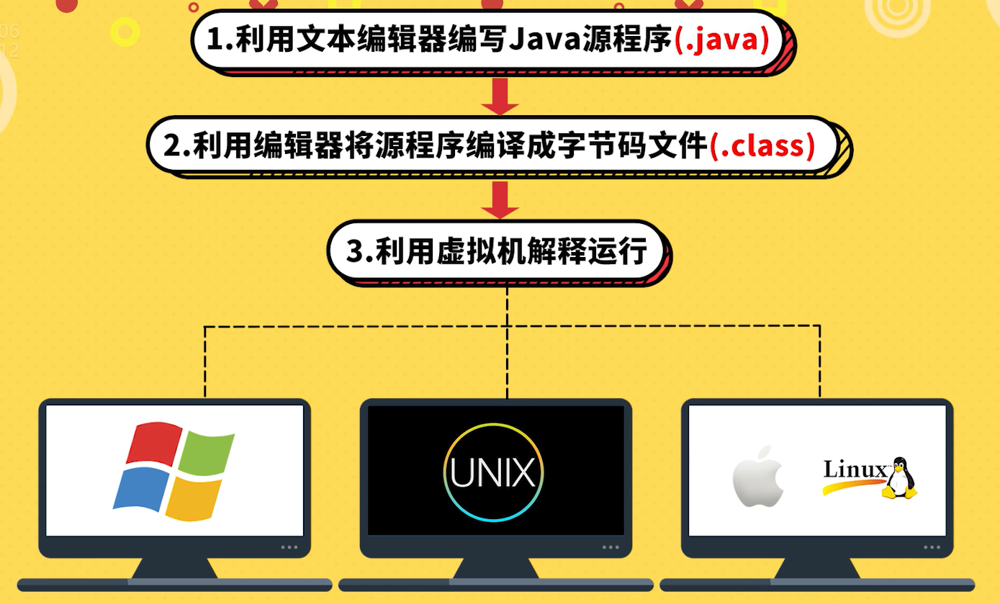

# Java学习笔记

## Java环境的安装与配置

### `引用`

参考视频：[Java背景知识和JDK安装和配置](https://www.bilibili.com/cheese/play/ep4884?t=469&csource=common_hp_history_null)

<br>

### `部署`

1. 进入官网下载JDK

    官网地址：<https://www.oracle.com/java/>

2. 安装

    下载好后直接安装，一直无脑下一步

3. 配置环境变量

    打开高级系统设置，点击环境变量，在系统变量中按下图配置

      

    然后在Path中添加如下图内容，并且移到最上面

      


4. 测试安装是否成功

      

<br>

## JDK的重新安装

### `引用`

参考文章：[完整的卸载Jdk java环境教程](https://www.cnblogs.com/pjhaymy/p/13735277.html)

<br>

### `使用`

1. 卸载下图中的两个程序：

      

2. 在路径 C:\ProgramData\Oracle，删除Oracle文件夹

<br>

## Java基础语法

### `一、Hello World`

1. 写出我们第一个Java程序

    新建一个mycode文件夹，创建一个Welcome.java文件，输入以下代码

    ```
    public class Welcome {
        public static void main(String[] args){
            System.out.println("Hello World");
        }
    }
    ```

    在cmd窗口中执行以下操作：

      

<br>

2. 了解Java程序的运行机制

      

3. 常用的dos命令介绍

      

### `二、见名知意代码美`

1. 标识符

    标识符四大准则：

      

    标识符使用规范：

      

    Java标识符案例代码（Test01.java）：

    ```
    public class Test01 {
        // Java 标识符
        public static void main(String[] args) {
            // 以下为合规的标识符
            int age = 18;
            int _age = 19;
            int $age = 20;
            int age123 = 21;
            int 年龄 = 22;

            // 以下为不合规的标识符
            // int 123age = 23; // 数字不能做开头
            // int age# = 24; // 标识符只能是：字母、数字、下划线和$
            // int class = 25; // 标识符不能是关键字
        }
    }
    ```

2. 注释

      

3. Java关键字

      

4. 变量的本质

    

    Java变量的本质案例代码（Test01.java）：
    
    ```
    public class Test01 {
        // Java 标识符以及变量的本质
        public static void main(String[] args) {
            // 变量的本质
            int monthlySalary = 15000;
            int annualSalary = monthlySalary * 12;
            System.out.println("年薪：" + annualSalary);

            double bonus = 3000.1;
            System.out.println("奖金：" + bonus);
        }
    }
    ```