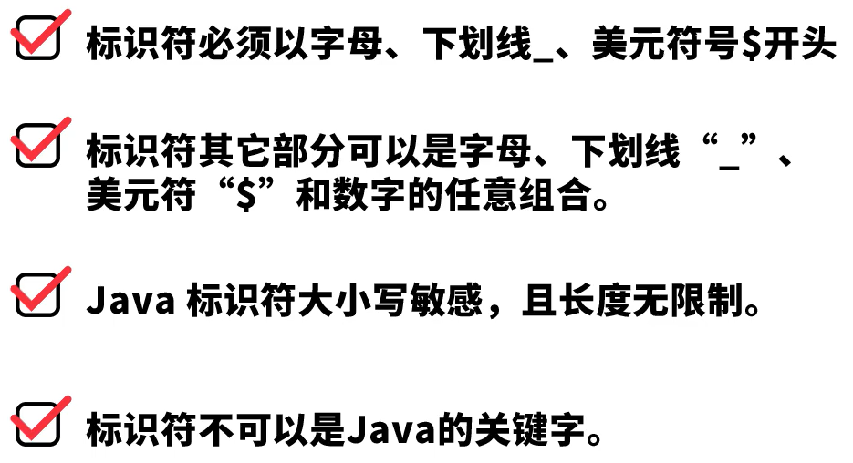

# Java学习笔记

## Java环境的安装与配置

### `引用`

参考视频：[Java背景知识和JDK安装和配置](https://www.bilibili.com/cheese/play/ep4884?t=469&csource=common_hp_history_null)

<br>

### `部署`

1. 进入官网下载JDK

    官网地址：<https://www.oracle.com/java/>

2. 安装

    下载好后直接安装，一直无脑下一步

3. 配置环境变量

    打开高级系统设置，点击环境变量，在系统变量中按下图配置

      

    然后在Path中添加如下图内容，并且移到最上面

      


4. 测试安装是否成功

      

<br>

## JDK的重新安装

### `引用`

参考文章：[完整的卸载Jdk java环境教程](https://www.cnblogs.com/pjhaymy/p/13735277.html)

<br>

### `使用`

1. 卸载下图中的两个程序：

      

2. 在路径 C:\ProgramData\Oracle，删除Oracle文件夹

<br>

## Java基础语法

### `一、Hello World`

1. 写出我们第一个Java程序

    新建一个mycode文件夹，创建一个Welcome.java文件，输入以下代码

    ```
    public class Welcome {
        public static void main(String[] args){
            System.out.println("Hello World");
        }
    }
    ```

    在cmd窗口中执行以下操作：

      

<br>

2. 了解Java程序的运行机制

      

3. 常用的dos命令介绍

      

<br>

### `二、见名知意代码美`

1. 标识符

    标识符四大准则：

      

    标识符使用规范：

      

    Java标识符案例代码（Test01.java）：

    ```
    public class Test01 {
        // Java 标识符
        public static void main(String[] args) {
            // 以下为合规的标识符
            int age = 18;
            int _age = 19;
            int $age = 20;
            int age123 = 21;
            int 年龄 = 22;

            // 以下为不合规的标识符
            // int 123age = 23; // 数字不能做开头
            // int age# = 24; // 标识符只能是：字母、数字、下划线和$
            // int class = 25; // 标识符不能是关键字
        }
    }
    ```

2. 注释

      

3. Java关键字

      

4. 变量的本质

    

    Java变量的本质案例代码（Test01.java）：
    
    ```
    public class Test01 {
        // Java 标识符以及变量的本质
        public static void main(String[] args) {
            // 变量的本质
            int monthlySalary = 15000;
            int annualSalary = monthlySalary * 12;
            System.out.println("年薪：" + annualSalary);

            double bonus = 3000.1;
            System.out.println("奖金：" + bonus);
        }
    }
    ```

<br>

### `三、基本数据类型`

Java的数据类型：

  

#### `3.1 数值型`

#### 整型

  

Java整型数据类型案例代码（TestIntDouble.java）：

```
public class TestIntDouble {
    // Java基本数据类型之整型和浮点型
    public static void main(String[] args) {
        byte age = 20;
        short salary = 25000;
        int beijingPopulation = 30000000;

        // 整型常量默认的类型是int，改成long类型需要后面加：L/l
        long globalPopulation = 7000000000L;
        System.out.println("整型数据类型：" + age + "," + salary + "," + beijingPopulation + "," + globalPopulation);

        // 关于进制
        int t1 = 65; // 十进制
        int t2 = 065; // 八进制
        int t3 = 0x65; // 十六进制
        int t4 = 0b01000001; // 二进制

        System.out.println(t1);
        System.out.println(t2);
        System.out.println(t3);
        System.out.println(t4);
    }
}
```

#### 浮点型

  

  

Java浮点型数据类型案例代码（TestIntDouble.java）：

```
public class TestIntDouble {
    // Java基本数据类型之整型和浮点型
    public static void main(String[] args) {
        // 测试浮点数
        double d1 = 3.14;
        float f1 = 3.14F; // 浮点常量默认是

        double d2 = 314E-2; // 科学计数法：314*10^(-2)

        System.out.println("double型："+d1);
        System.out.println("float型："+f1);
        System.out.println("科学计数法："+d2);

        // 浮点数是不精确的，用于比较要小心
        // 如果要使用精确的运算，使用BigDecimal类
        float f3 = 0.1F;
        double d3 = 0.1;

        System.out.println(f3);
        System.out.println(d3);
        System.out.println(f3 == d3);
    }
}
```

#### `3.2 字符型`

#### 字符集

Java字符集数据类型案例代码（TestChar.java）：

```
public class TestChar {
    // Java基本数据类型之字符集
    public static void main(String[] args) {
        // 测试char
        char c1='A';
        char c2='陈';

        System.out.println(c1);
        System.out.println(c2);
    }
}
```

#### 转义字符

  

#### `3.3 布尔型`

#### boolean型

  

Java字符集数据类型案例代码（TestBoolean.java）：

```
public class TestBoolean {
    // Java基本数据类型之Boolean型
    public static void main(String[] args) {
        boolean flag = true;
        if(flag){
            System.out.println("I love coding");
        }
    }
}
```

### `四、基本运算符`

#### `算术运算符`

  

#### `扩展运算符`

  

#### `关系运算符`

  

#### `逻辑运算符`

  

#### `位运算符`

  

#### `条件运算符`

  

Java基本运算符案例代码（TestOperator.java）：

```
public class TestOperator {
    public static void main(String[] args) {
        System.out.println("======算术运算符======");
        int a = 3;
        int b = 4;
        int c = (a + b) * 4;
        System.out.println(c);
        int d = 15 / 4;
        System.out.println(d);
        int e = 5 % 3; // 结果是：余数2
        System.out.println(e);

        a = 10;
        b = a++; // 先赋值，后自增
        c = ++a; // 先自增，后赋值
        System.out.println(a);
        System.out.println(b);
        System.out.println(c);

        System.out.println("======扩展运算符======");
        a = 20;
        b = 30;
        a += b;
        System.out.println(a);
        System.out.println(b);

        System.out.println("======关系运算符======");
        a = 20;
        b = 30;
        boolean result = a < b;
        System.out.println(result);

        System.out.println("======逻辑运算符======");
        boolean b1 = true & false; // false
        boolean b2 = true | false; // true
        boolean b3 = !b2; // false
        boolean b4 = true ^ true; // false
        System.out.println(b1);
        System.out.println(b2);
        System.out.println(b3);
        System.out.println(b4);

        // 短路与、短路或
        // boolean x = 3 < 4 || (4 < 4 / 0);
        // System.out.println(x);

        System.out.println("======位运算符======");
        int m = 3;
        int n = 7;
        int p1 = m & n;
        int p2 = m | n;
        int p3 = m ^ n; // ^是异或的意思，不是数学中的幂运算
        int p4 = ~m; // 按位取反
        System.out.println(p1);
        System.out.println(p2);
        System.out.println(p3);
        System.out.println(p4);

        // 移位运算
        int x = 3 << 3; // 3*2*2 = 24
        int y = 12 >> 2; // 12/2/2 = 3
        System.out.println(x);
        System.out.println(y);

        System.out.println("======字符串连接符======");
        int r1 = 3;
        int r2 = 4;
        System.out.println(r1 + r2);
        System.out.println("结果是：" + r1 + r2); // 结果是：34

        System.out.println("======条件运算符======");
        int y1 = 300;
        int y2 = 40;
        int min = y1<y2?y1:y2; // 总是返回y1和y2比较小的值

        System.out.println(min);
    }
}
```