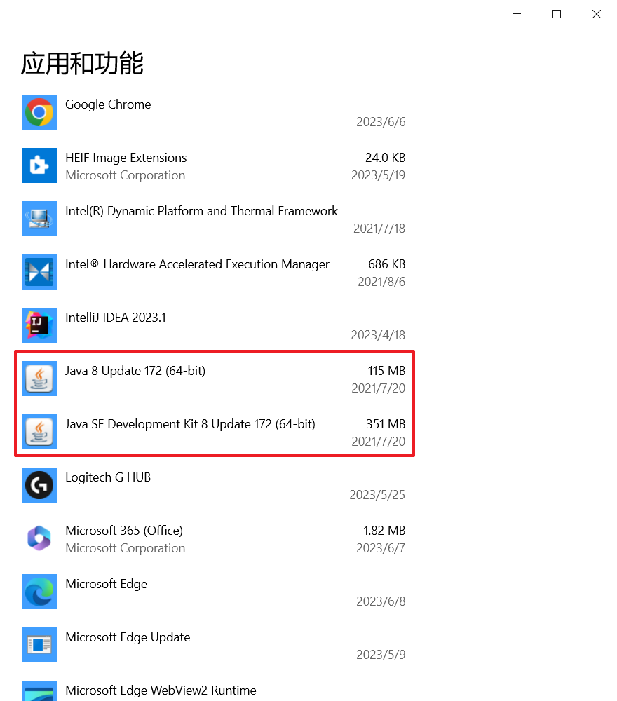

# Java简介

## **引用**

参考视频：[Java背景知识和JDK安装和配置](https://www.bilibili.com/cheese/play/ep4884?t=469&csource=common_hp_history_null)

参考文献：[Java Wiki](https://zh.wikipedia.org/zh-cn/Java)

参考文章：[完整的卸载Jdk java环境教程](https://www.cnblogs.com/pjhaymy/p/13735277.html)

<br>

## **摘要**
```
Java是一种广泛使用的计算机编程语言，拥有跨平台、面向对象、泛型编程的特性，广泛应用于企业级Web应用开发和移动应用开发。
```

<br>

## **部署**

1. `进入官网下载JDK`

    官网地址：<https://www.oracle.com/java/>

2. `安装`

    下载好后直接安装，一直无脑下一步

3. `配置环境变量`

    打开高级系统设置，点击环境变量，在系统变量中按下图配置

      

    然后在Path中添加如下图内容，并且移到最上面

      

4. `测试安装是否成功`

      

### JDK的重新安装

1. `卸载下图中的两个程序：`

      

2. `在路径 C:\ProgramData\Oracle，删除Oracle文件夹`

<br>

## **使用**

> Java的基础语法参看`wiki_java_part`系列的笔记，以下是Java基础语法目录，方便查询知识点

### wiki_java_part1：Hello World

### wiki_java_part2：见名知意代码美

### wiki_java_part3：基本数据类型

### wiki_java_part4：基本运算符

### wiki_java_part5：Java数据类型转换和键盘输入

### wiki_java_part6：流程控制语句

### wiki_java_part7：方法

### wiki_java_part8：类和对象

### wiki_java_part9：图形化分析内存

### wiki_java_part10：包机制和导入类