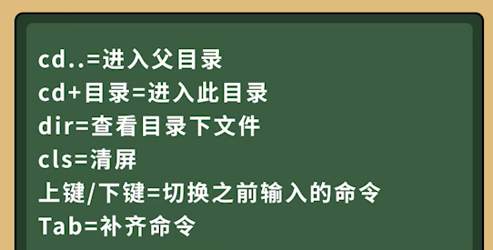

# Java基础语法第一部分：Hello World

## **写出我们第一个Java程序**

`新建一个mycode文件夹，创建一个Welcome.java文件，输入以下代码`

```
package a_hello_world;

public class Welcome {
    public static void main(String[] args){
        System.out.println("Hello World");
    }
}
```

`在cmd窗口中执行以下操作：`

  

`了解Java程序的运行机制`

  

`常用的dos命令介绍`

  