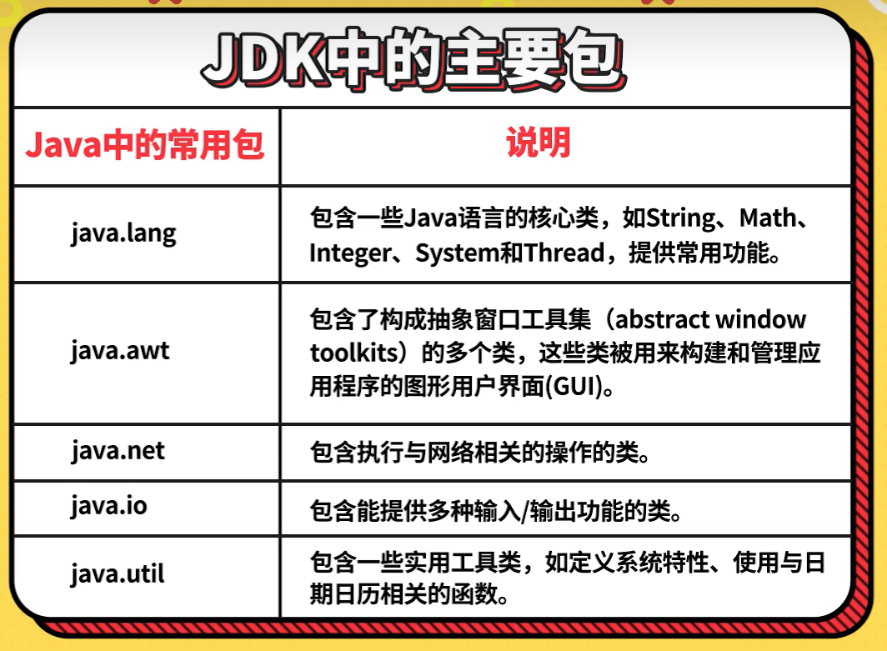
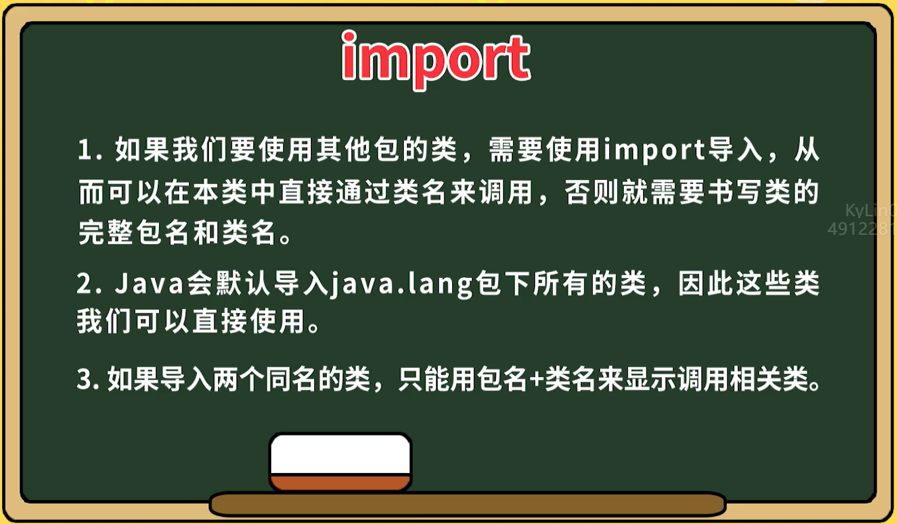

# Java基础语法第十部分：包机制和导入类

## **package包机制**

`JDK中的主要包`

  

`包机制案例代码：`

`（i_obj.com.kylin.test1.Car.java）`
```
package i_obj.com.kylin.test1;

public class Car {
    public void run() {
        System.out.println("Car.run");
    }
}
```

`（i_obj.com.kylin.test2.Car.java）`
```
package i_obj.com.kylin.test2;

public class Car {
    public void stop(){
        System.out.println("Car.stop");
    }
}
```

`（Main1.java）`
```
package i_obj.com.kylin.test3;

import java.util.*; // 这样会降低编译速度，但不会降低运行速度

/**
 * 测试package和import
 */
public class Main1 {
    public static void main(String[] args) {
        // 在同一个类中导入了两个具有相同名称的类，不需要导入这两个类，直接使用完整的类名来区分它们。
        i_obj.com.kylin.test1.Car car = new i_obj.com.kylin.test1.Car();
        car.run();
        i_obj.com.kylin.test2.Car car2 = new i_obj.com.kylin.test2.Car();
        car2.stop();

        String str1 = "";
        java.lang.String str2 = "";
        System.out.println(str1 + str2);

        Date date = new Date();
        System.out.println(date);
    }
}
```

<br>

## **import导入类**

  

`导入类案例代码（Main2）：`
```
package i_obj.com.kylin.test3;

import static java.lang.Math.random;
import static java.lang.Math.*;

/**
 * 测试静态导入
 */
public class Main2 {
    public static void main(String[] args) {
        // 使用静态导入就不需要这种写法
        // Math.random();

        System.out.println(random());
        System.out.println(PI);
    }
}
```

<br>

## **小结**

`问题1`：package在Java中的作用类似于“操作系统中文件夹的作用”主要解决哪两个问题

- `答`：在 Java 中，**包（Package）** 类似于操作系统中的文件夹，主要用于组织类和接口。它们有助于编写更好、更易于管理的代码，解决了以下两个主要问题：

1. **避免命名冲突**：
   - 在不同的包中，可以存在相同名称的类。例如，一个包中可以有名为 `college.staff.cse.Employee` 的类，而另一个包中也可以有名为 `college.staff.ee.Employee` 的类。
   - 包的存在使得这些类能够在不发生冲突的情况下共存。

2. **控制访问权限**：
   - 包提供了访问控制的机制。其中，`protected` 和默认（无访问修饰符）的访问级别是针对包的。
   - `protected` 成员可以被同一包中的其他类及其子类访问。
   - 默认（无访问修饰符）的成员只能被同一包中的其他类访问。
   - 这样，我们可以将一些类的访问权限限制在包内部，实现了一定程度的封装。

    总之，包是一种将相关类组织在一起的机制，使得代码更易于定位、管理和复用。通过使用现有的包中的类，我们可以有效地构建应用程序。

`问题2`：Java里哪一个包中的代码我们是不需要导入可以直接使用的

- `答`：在Java中，有一些包是默认被导入的，不需要使用 `import` 语句来导入。以下是一些常见的默认导入的包：

1. **java.lang**：
   - 该包是 Java 语言的核心包，包含了一些基本的类，如 `String`、`Object` 等。
   - 这些类不需要显式导入，因为它们会自动被加载。

2. **java.util**：
   - 该包提供了一些常用的实用工具类，如 `ArrayList`、`HashMap` 等。
   - 虽然这些类不是默认导入的，但它们在很多 Java 程序中经常被使用，因此通常会显式导入。

    总之，这些包中的类可以直接在代码中使用，无需显式导入。Java 的设计目标之一是保持简洁和易用性，因此默认导入一些常用的类，以方便开发人员编写代码。