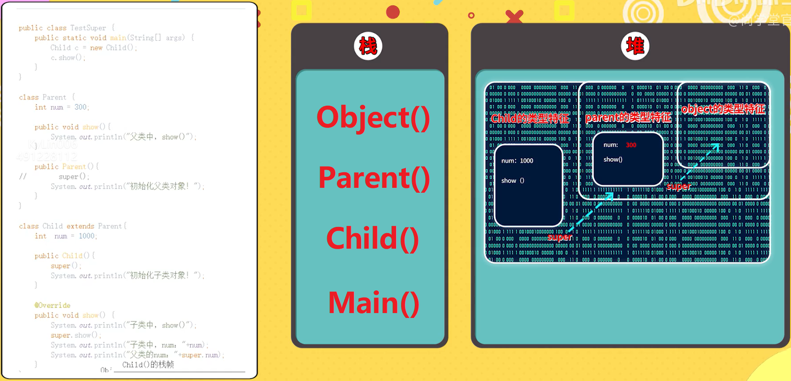

# Java基础语法第十一部分：面向对象的三大特征

## **继承**

### 一、继承的实现

1. 继承让我们更容易实现类的扩展。这样就实现了代码的重用，不用再重新发明轮子（don't reinvent wheels）

2. 从英文字面意思理解，extends的意思是“扩展”。子类是父类的扩展。

`继承使用要点：`

1. Java中只有单继承，没有像C++那样的多继承。

2. Java中类没有多继承，接口有多继承。

3. 子类继承父类，可以得到父类的全部属性和方法（除了父类的构造方法），但不见得可以直接访问（比如，父类私有的属性和方法）

4. 如果定义了一个类时，没有调用extends，则它的父类是：java.lang.Object。

### 二、instanceof运算符

```
instanceof的作用：判断对象是否是这个类的实例对象
```

`继承的实现和instanceof的运用案例代码（TestExtends.java）：`
```
package j_inherit;

/**
 * 测试继承的基本用法
 */
public class TestExtends {
    public static void main(String[] args) {
        Student stu1 = new Student("KyLin", 166, "java");
        stu1.rest();
        stu1.study();
        System.out.println(stu1.name);

        // instanceof判断对象是否是这个类的实例对象
        System.out.println(stu1 instanceof Student);
        System.out.println(stu1 instanceof Person);
    }
}

class Person {
    String name;
    int height;

    public void rest() {
        System.out.println("休息一会！");
    }
}

class Student extends Person {
    String major;

    public void study() {
        System.out.println("Student.study");
    }

    public Student(String name, int height, String major) {
        this.name = name;
        this.height = height;
        this.major = major;
    }
}
```

### 三、方法的重写override

```
方法的重写（override）：子类通过重写父类的方法可以用自身的行为替换父类的行为，方法的重写是实现多态的必要条件
```

`方法的重写需要符合下面的三个要点：`

1. “==”：方法名、形参列表相同。
2. “<=”：返回值类型和声明异常类型，子类小于等于父类。
3. “>=”：访问权限，子类大于等于父类。

`方法的重写案例代码（TestOverride.java）：`
```
package j_inherit;

/**
 * 测试重写
 */
public class TestOverride {
    public static void main(String[] args) {
        Horse h1 = new Horse();
        h1.run();

        Plane p1 = new Plane();
        p1.stop();
    }
}

class Vehicle {
    public void run() {
        System.out.println("run…");
    }

    public void stop() {
        System.out.println("stop…");
    }
}

class Horse extends Vehicle {
    @Override
    public void run() {
        System.out.println("四蹄纷飞，嘚嘚…");
    }
}

class Plane extends Vehicle {
    @Override
    public void run() {
        System.out.println("在空中飞…");
    }

    @Override
    public void stop() {
        System.out.println("在机场停下，不能在空中停");
    }
}
```

### 四、final的三种用法

`final关键字的作用：`

- 修饰变量：被它修饰的变量不可改变。一旦赋了初值，就不能被重新赋值。`final int MAX_SPEED = 120;`

- 修饰方法：该方法不可被子类重写。但是可以被重载！`final void study(){}`

- 修饰类：修饰的类不能被继承。比如：Math、String等。`final class A{}`

### 五、继承和组合

`组合的核心：`
```
“组合”的核心就是“将父类对象作为子类的属性”，然后，“子类通过调用这个属性来获得父类的属性和方法”。
```

`组合和继承的比较：`
1. 组合比较灵活。继承只能有一个父类，但是组合可以有多个属性。

2. 对于“is-a”关系建议使用继承，“has-a”关系建议使用组合。

`Java组合的案例代码（TestComposition.java）：`
```
package j_inherit;

/**
 * 测试组合
 */
public class TestComposition {
    public static void main(String[] args) {
        Stu stu = new Stu("KyLin", 166, "java");
        stu.person.rest();
        System.out.println(stu.person.name);
        System.out.println(stu.person.height);
        System.out.println(stu.major);
    }
}

class Stu {
    Person person = new Person();
    String major;

    public void study() {
        System.out.println("Stu.study");
    }

    public Stu(String name, int height, String major) {
        this.person.name = name;
        this.person.height = height;
        this.major = major;
    }
}

class CPU {
    void calculate() {
        System.out.println("CPU.calculate");
    }
}

class Memory {
    void store() {
        System.out.println("Memory.store");
    }
}

class Computer {
    CPU cpu = new CPU();
    Memory memory = new Memory();
}
```

### 六、Object类

**`Object类源码解析：`**

在Java中，`Object`类是所有类的最终超类。当你定义一个不扩展任何其他类的类时，它会隐式地扩展`java.lang.Object`。此外，基于接口的匿名类也会扩展`Object`。

`Object`类提供了一些通用的方法，每个对象都实现了这些方法。所有的公共方法都可以在数组或接口上调用。受保护的方法`clone`和`finalize`在数组或接口上不可访问，但所有数组类型都有一个可访问的公共版本的`clone`。

以下是`Object`类的一些主要方法：
- `public boolean equals(Object obj)`：指示某个其他对象是否与此对象“相等”。
- `protected Object clone() throws CloneNotSupportedException`：创建并返回此对象的一个副本。
- `public String toString()`：返回该对象的字符串表示。
- `public final void notify()`、`public final void notifyAll()`：唤醒在此对象监视器上等待的单个线程或所有线程。
- `public final void wait(long timeout) throws InterruptedException`：在其他线程调用此对象的 `notify()` 方法或 `notifyAll()` 方法前，导致当前线程等待。

如果你想深入了解`Object`类的源代码，可以参考[GNU Classpath的文档](https://developer.classpath.org/doc/java/lang/Object-source.html)，它提供了`Object`类的源代码。此外，还有一些工具，如[JArchitect](https://stackoverflow.com/questions/55380529/find-out-used-classes-and-methods-from-java-source-code)、[PMD Java](https://blog.codacy.com/java-static-code-analysis-tools)、[Checkstyle](https://blog.codacy.com/java-static-code-analysis-tools)等，可以帮助你进行静态代码分析，更好地理解和分析Java源代码。

**`Java的Object类的案例代码（TestObject.java）：`**
```
package j_inherit;

/**
 * 测试Object类的用法
 */
public class TestObject {
    public static void main(String[] args) {
        Employee e1 = new Employee(1001, "张三");
        Employee e2 = new Employee(1001, "张三");
        System.out.println(e1); // 打印对象默认是调用的toString()

        System.out.println(e1 == e2); // 两个对象是否相同
        System.out.println(e1.equals(e2)); // 重写equals之后，两个对象是否相等（逻辑上某些值的比较）
    }
}

class Employee extends Object {
    int id;
    String name;

    public Employee(int id, String name) {
        this.id = id;
        this.name = name;
    }

    @Override
    public String toString() {
        return "雇员编号：" + id + "，姓名：" + name;
    }

    @Override
    public int hashCode() {
        final int prime = 31;
        int result = 1;
        result = prime * result + id;
        return result;
    }

    @Override
    public boolean equals(Object obj) {
        if (this == obj)
            return true;
        if (obj == null)
            return false;
        if (getClass() != obj.getClass())
            return false;
        Employee other = (Employee) obj;
        if (id != other.id)
            return false;
        return true;
    }
}
```

### 七、super

`super是什么`
1. super“可以看做”是直接父类对象的引用。

2. 可以通过super来访问父类中被子类覆盖的方法或属性。

`super的本质`
1. 在一个类中，若是构造方法的第一行代码没有显式的用super(…)或者this(…)；那么Java默认都会调用super()，含义是调用父类的无参数构造方法。

2. 子类创建的整个过程只创建了一个对象。

3. super的本质就是：当前对象的父类型特征。

`Java中super的案例代码（TestSuper.java）：`
```
package j_inherit;

public class TestSuper {
    public static void main(String[] args) {
        Child c = new Child();
        c.show();
    }
}

class Parent {
    int num = 300;

    public Parent() {
        System.out.println("初始化父类对象！");
    }

    public void show() {
        System.out.println("父类中，show()");
    }
}

class Child extends Parent {
    int num = 1000;

    public Child() {
        // 即使不写下面这行代码，Java默认都会调用super()，含义是调用父类的无参数构造方法。
        // super();

        System.out.println("初始化子类对象！");
    }

    @Override
    public void show() {
        System.out.println("子类中，show()");
        super.show();
        System.out.println("子类的num：" + num);
        System.out.println("父类的num：" + super.num);
    }
}
```

`super案例代码的内存分析：`

  

**`小结`**

`问题1`：“创建子类对象的过程中实际只创建了一个子类对象并没有创建父类对象”这句话对吗？

- `答`：这句话是正确的。在Java中，当你创建一个子类的对象时，实际上并没有创建一个单独的父类对象。然而，子类对象确实包含了一个父类的实例。这是因为子类继承了父类的所有属性和方法。所以，当你创建一个子类对象时，它会包含父类的所有字段和方法，这就像在子类对象内部有一个父类对象一样。

    但是，这并不意味着创建了一个单独的父类对象。父类的构造函数会在子类的构造函数之前被调用，以确保父类的所有字段都已经被正确地初始化。这是Java的继承机制的一部分，确保了子类对象可以正确地使用父类的所有公共和受保护的字段和方法。

    总的来说，创建子类对象的过程中，只创建了一个对象（即子类对象），并没有单独创建一个父类对象。但是，子类对象包含了父类的一个实例，因此可以访问父类的所有公共和受保护的字段和方法。这就是Java的继承机制。

`问题2`：“super就是父类对象的引用”这句话对吗？

- `答`：这句话并不完全准确。在Java中，`super`关键字并不是父类对象的引用，而是一个特殊的关键字，用于从子类中访问父类的成员（字段和方法）。当你在子类的方法或构造函数中使用`super`关键字时，Java运行时系统会知道你是要访问父类的成员。

    例如，如果你在子类的方法中使用`super.someMethod()`，那么Java会在父类中查找名为`someMethod`的方法，并执行它。同样，如果你在子类的构造函数中使用`super()`，Java会调用父类的无参数构造函数。

    然而，`super`并不是一个对象引用，你不能将它赋值给任何变量，也不能在`super`上调用任何对象的方法（除了父类的方法）。它只是一个特殊的关键字，用于在子类中访问父类的成员。

    总的来说，“super就是父类对象的引用”这句话并不准确。`super`是一个特殊的关键字，用于从子类中访问父类的成员。

<br>

## **封装**

TODO

<br>

## **多态**

TODO