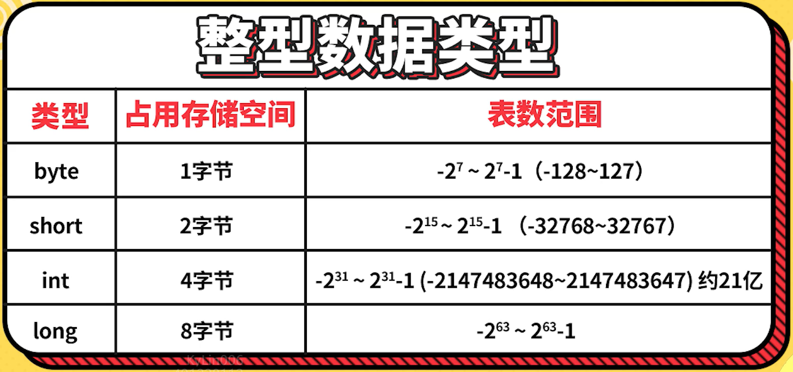
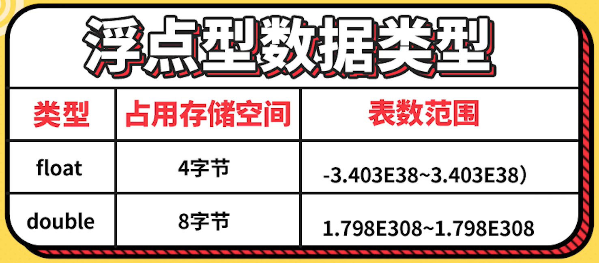

# Java基础语法第三部分：基本数据类型

## **Java的数据类型：**

  

### 数值型

- `整型`

  

- `浮点型`

  

  

Java整型数据类型案例代码（TestIntDouble.java）：

```
package c_data_type;

public class TestIntDouble {
    // Java基本数据类型之整型和浮点型
    public static void main(String[] args) {
        byte age = 20;
        short salary = 25000;
        int beijingPopulation = 30000000;

        // 整型常量默认的类型是int，改成long类型需要后面加：L/l
        long globalPopulation = 7000000000L;
        System.out.println("整型数据类型：" + age + "," + salary + "," + beijingPopulation + "," + globalPopulation);

        // 关于进制
        int t1 = 65; // 十进制
        int t2 = 065; // 八进制
        int t3 = 0x65; // 十六进制
        int t4 = 0b01000001; // 二进制

        System.out.println("十进制：" + t1);
        System.out.println("八进制：" + t2);
        System.out.println("十六进制：" + t3);
        System.out.println("二进制：" + t4);

        // 测试浮点数
        double d1 = 3.14;
        float f1 = 3.14F; // 浮点常量默认是

        double d2 = 314E-2; // 科学计数法：314*10^(-2)

        System.out.println("double型：" + d1);
        System.out.println("float型：" + f1);
        System.out.println("科学计数法：" + d2);

        // 浮点数是不精确的，用于比较要小心
        // 如果要使用精确的运算，使用BigDecimal类
        float f3 = 0.1F;
        double d3 = 0.1;

        System.out.println(f3);
        System.out.println(d3);
        System.out.println(f3 == d3);
    }
}
```

### 字符型

- `字符集`

    Java字符集数据类型案例代码（TestChar.java）：

    ```
    package c_data_type;

    public class TestChar {
        // Java基本数据类型之字符集
        public static void main(String[] args) {
            // 测试char
            char c1 = 'A';
            char c2 = '陈';

            System.out.println(c1);
            System.out.println(c2);
        }
    }
    ```

- `转义字符`

  

### 布尔型

- `boolean型`

  

Java字符集数据类型案例代码（TestBoolean.java）：

```
package c_data_type;

public class TestBoolean {
    // Java基本数据类型之Boolean型
    public static void main(String[] args) {
        boolean flag = true;
        if (flag) {
            System.out.println("I love coding");
        }
    }
}
```