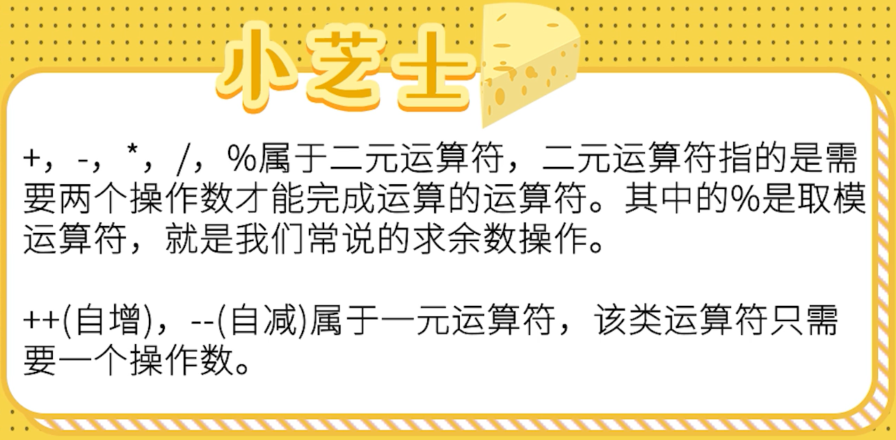

# Java基础语法第四部分：基本运算符

## **算术运算符**

  

<br>

## **扩展运算符**

  

<br>

## **关系运算符**

  

<br>

## **逻辑运算符**

  

<br>

## **位运算符**

  

<br>

## **条件运算符**

  

`Java基本运算符案例代码（TestOperator.java）：`

```
package d_operator;

public class TestOperator {
    public static void main(String[] args) {
        System.out.println("======算术运算符======");
        int a = 3;
        int b = 4;
        int c = (a + b) * 4;
        System.out.println(c);
        int d = 15 / 4;
        System.out.println(d);
        int e = 5 % 3; // 结果是：余数2
        System.out.println(e);

        a = 10;
        b = a++; // 先赋值，后自增
        c = ++a; // 先自增，后赋值
        System.out.println(a);
        System.out.println(b);
        System.out.println(c);

        System.out.println("======扩展运算符======");
        a = 20;
        b = 30;
        a += b;
        System.out.println(a);
        System.out.println(b);

        System.out.println("======关系运算符======");
        a = 20;
        b = 30;
        boolean result = a < b;
        System.out.println(result);

        System.out.println("======逻辑运算符======");
        boolean b1 = true & false; // false
        boolean b2 = true | false; // true
        boolean b3 = !b2; // false
        boolean b4 = true ^ true; // false
        System.out.println(b1);
        System.out.println(b2);
        System.out.println(b3);
        System.out.println(b4);

        // 短路与、短路或
        // boolean x = 3 < 4 || (4 < 4 / 0);
        // System.out.println(x);

        System.out.println("======位运算符======");
        int m = 3;
        int n = 7;
        int p1 = m & n;
        int p2 = m | n;
        int p3 = m ^ n; // ^是异或的意思，不是数学中的幂运算
        int p4 = ~m; // 按位取反
        System.out.println(p1);
        System.out.println(p2);
        System.out.println(p3);
        System.out.println(p4);

        // 移位运算
        int x = 3 << 3; // 3*2*2 = 24
        int y = 12 >> 2; // 12/2/2 = 3
        System.out.println(x);
        System.out.println(y);

        System.out.println("======字符串连接符======");
        int r1 = 3;
        int r2 = 4;
        System.out.println(r1 + r2);
        System.out.println("结果是：" + r1 + r2); // 结果是：34

        System.out.println("======条件运算符======");
        int y1 = 300;
        int y2 = 40;
        int min = y1 < y2 ? y1 : y2; // 总是返回y1和y2比较小的值

        System.out.println(min);
    }
}
```
