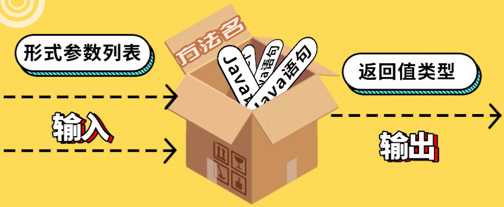
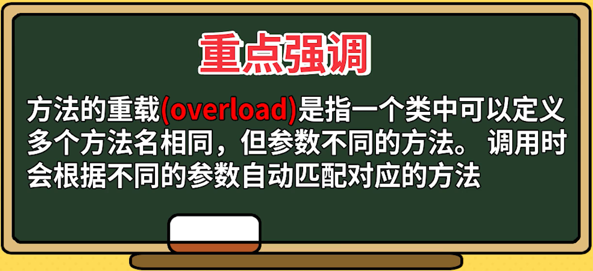
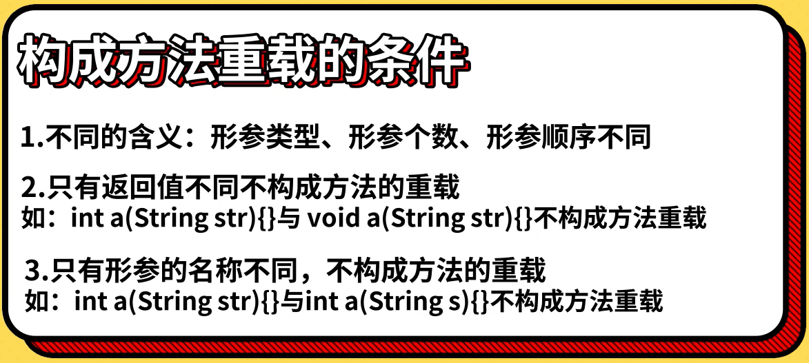

# Java基础语法第七部分：方法

## **方法的定义和调用**

  

  

  


`Java方法的定义和调用案例代码（TestMethod.java）：`
```
package h_method;

// 测试方法的定义和调用
public class TestMethod {
    // main方法，程序的主入口
    public static void main(String[] args) {
        int a1 = add(100, 200);
        int a2 = add(200, 300);
        int sum = add(a1, a2); // 实际参数
        System.out.println(sum);

        printInfo();
    }

    // 定义一个求和的方法（有参数，有返回值）
    public static int add(int n1, int n2) { // 形式参数
        int sum = n1 + n2;
        return sum;
    }

    // 定义一个打印信息的方法（没有参数，没有返回值）
    public static void printInfo() {
        System.out.println("KyLin");
    }
}
```

`简易计算器案例代码（Calculator.java）：`
```
package h_method;

import java.util.Scanner;

// 实现一个计算器
public class Calculator {
    public static void main(String[] args) {
        try (Scanner scanner = new Scanner(System.in)) {
            System.out.print("请输入一个算术表达式：");
            String input = scanner.nextLine();

            String[] parts = input.split(" ");
            double num1 = Double.parseDouble(parts[0]);
            String operator = parts[1];
            double num2 = Double.parseDouble(parts[2]);

            switch (operator) {
                case "+":
                    System.out.println("结果: " + add(num1, num2));
                    break;
                case "-":
                    System.out.println("结果: " + subtract(num1, num2));
                    break;
                case "*":
                    System.out.println("结果: " + multiply(num1, num2));
                    break;
                case "/":
                    System.out.println("结果: " + divide(num1, num2));
                    break;
                default:
                    System.out.println("未知的运算符: " + operator);
                    break;
            }
        } catch (NumberFormatException e) {
            e.printStackTrace();
        }
    }

    // 相加操作
    public static double add(double n1, double n2) {
        double sum = n1 + n2;
        return sum;
    }

    // 相减操作
    public static double subtract(double n1, double n2) {
        double sum = n1 - n2;
        return sum;
    }

    // 相乘操作
    public static double multiply(double n1, double n2) {
        double sum = n1 * n2;
        return sum;
    }

    // 相除操作
    public static double divide(double n1, double n2) {
        double sum = n1 / n2;
        return sum;
    }
}
```

<br>

## **方法的重载**

  

  

  

`方法重载案例代码（TestOverload.java）：`
```
package h_method;

public class TestOverload {
    public static void main(String[] args) {
        add(100, 200);
        add(100.1, 200);
        add(100, 200, 300);
        add(100, 200.6);
    }

    // 求和的方法
    public static int add(int n1, int n2) {
        int sum = n1 + n2;
        System.out.println(sum);
        return sum;
    }

    // 方法名相同，参数类型不同，构成重载
    public static double add(double n1, int n2) {
        double sum = n1 + n2;
        System.out.println(sum);
        return sum;
    }

    // 方法名相同，参数个数不同，构成重载
    public static int add(int n1, int n2, int n3) {
        int sum = n1 + n2 + n3;
        System.out.println(sum);
        return sum;
    }

    // 方法名相同，参数顺序不同，构成重载
    public static double add(int n1, double n2) {
        double sum = n1 + n2;
        System.out.println(sum);
        return sum;
    }
}
```
