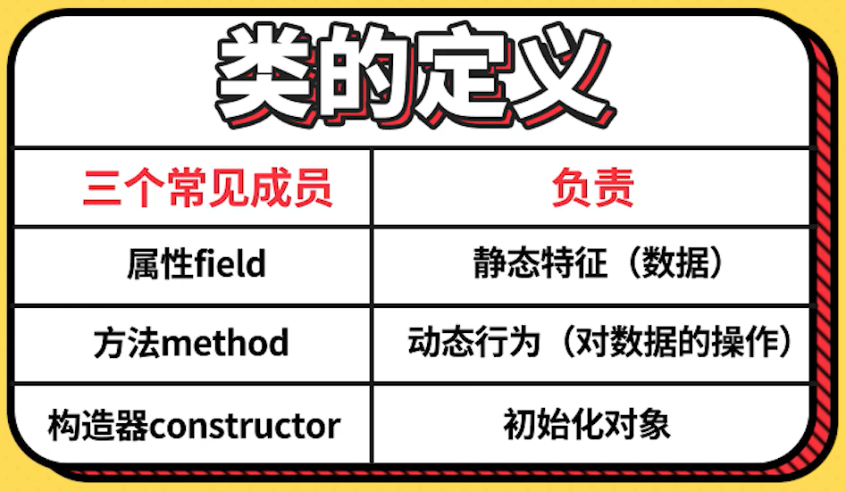
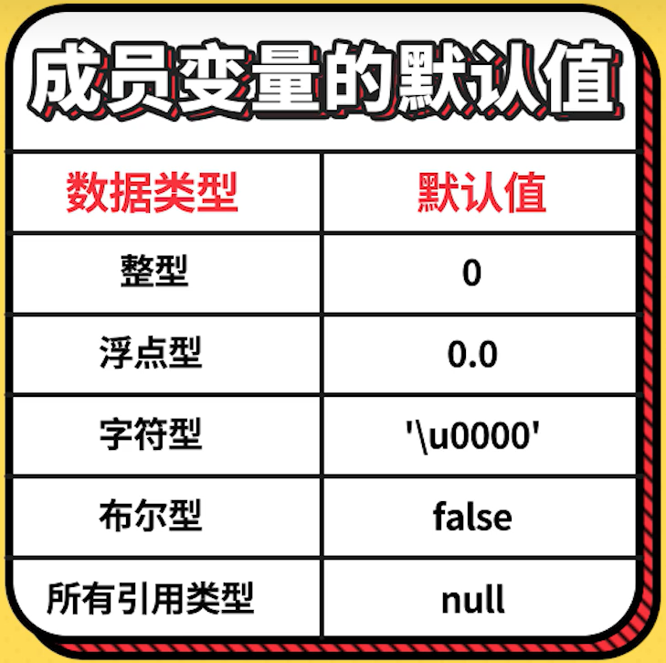
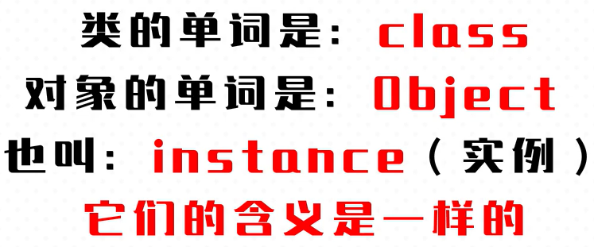
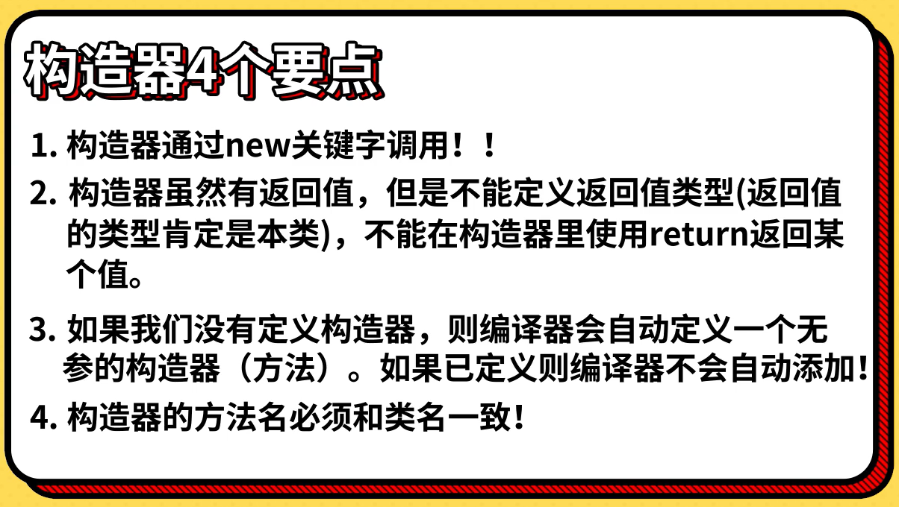
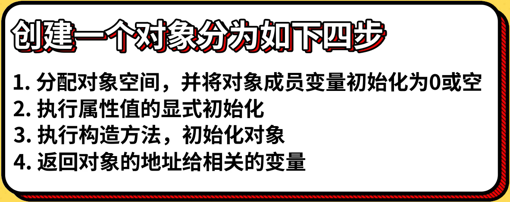
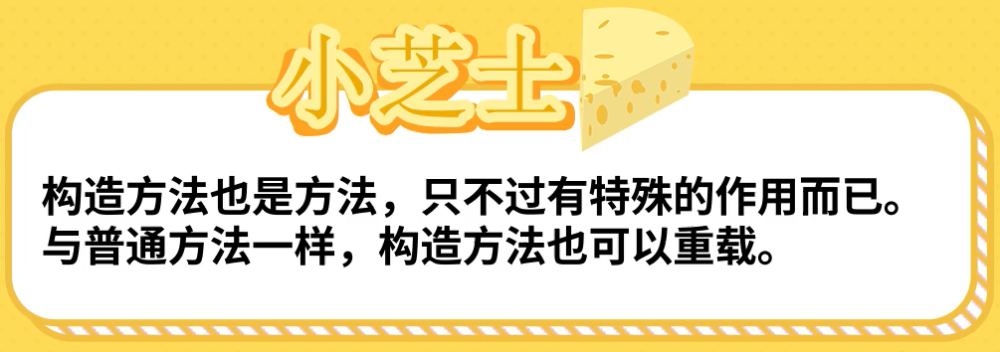

# Java基础语法第八部分：类和对象

## **类和对象的定义**

  

  

  

  

`类和对象案例代码（Student.java）：`
```
package i_obj;

public class Student {
    // 静态特征（数据）
    int id;
    String name;
    int score;
    int age;

    // 方法（动态行为）（对数据的操作）
    public void study() {
        System.out.println(name + "，正在学习！");
    }

    // main方法是程序的入口！
    public static void main(String[] args) {
        Student stu01 = new Student();
        stu01.id = 1001;
        stu01.name = "KyLin";
        stu01.score = 90;
        stu01.age = 23;

        Student stu02 = new Student();
        stu02.id = 1002;
        stu02.name = "Mario";
        stu02.score = 80;
        stu02.age = 19;

        stu01.study();
        stu02.study();
    }
}
```

<br>

## **一个典型的类**

`一个典型的类案例代码：`
- `（Computer.java）`
    ```
    package i_obj;

    public class Computer {
        String brand; // 品牌
        int price; // 价格
    }
    ```

- `（KyLinStudent.java）`
    ```
    package i_obj;

    public class KyLinStudent {
        int id;
        String name;
        int age;
        Computer computer;

        void study() {
            System.out.println("我正在学习！使用的电脑是：" + computer.brand);
        }

        public static void main(String[] args) {
            Computer c1 = new Computer();
            c1.brand = "ThinkPad";
            c1.price = 6000;

            Computer c2 = new Computer();
            c2.brand = "Dell";
            c2.price = 5000;

            KyLinStudent stu1 = new KyLinStudent();
            stu1.id = 1001;
            stu1.name = "KyLin";
            stu1.age = 24;
            stu1.computer = c1;

            stu1.study();
        }
    }
    ```

<br>

## **构造方法详解**

### 构造方法的核心作用

  

  

`构造方法的核心作用案例代码（Point.java）：`
```
/*
 * 描述二维空间的一个点
 */

package i_obj;

public class Point {
    double x;
    double y;

    public Point(double _x, double _y) {
        x = _x;
        y = _y;
    }

    public static void main(String[] args) {
        Point p1 = new Point(3.0, 4);
        System.out.println(p1.x);
    }
}
```

### 创建对象4大步和构造方法调用之间的关系

  

### 构造方法的重载

  

`构造方法的重载案例代码（User.java）：`
```
/*
 * 模拟网站的账户（用于测试构造方法的重载）
 */

package i_obj;

public class User {

    int id;
    String userName; // 用户名
    String pwd; // 密码

    public User() {

    }

    public User(int _id) {
        id = _id;
    }

    public User(int _id, String _userName, String _pwd) {
        id = _id;
        userName = _userName;
        pwd = _pwd;
    }

    public static void main(String[] args) {
        User u1 = new User();
        User u2 = new User(1001);
        User u3 = new User(1002, "KyLin", "123456");

        System.out.println(u1.id + u2.id + u3.userName);
    }
}
```
