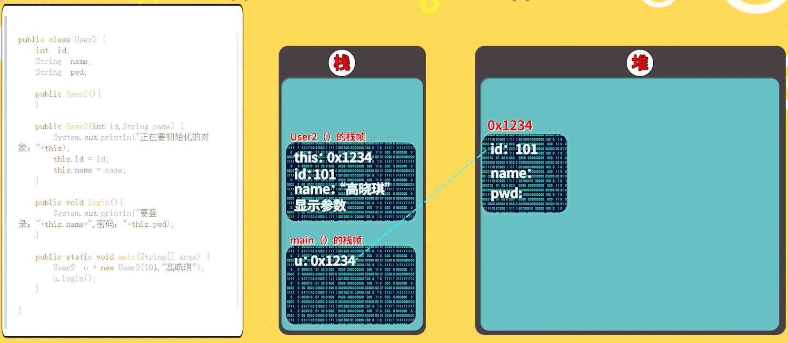
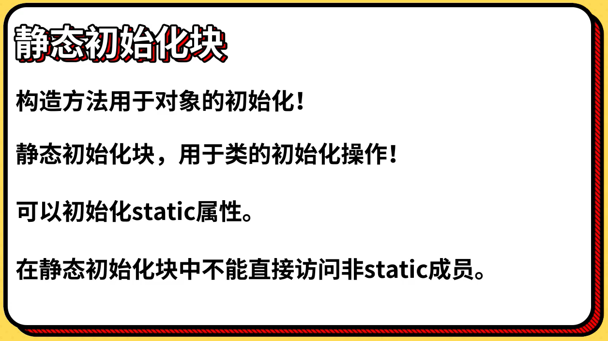

# Java基础语法第九部分：图形化分析内存

## **栈和堆**

### Java虚拟机内存模型（完整版）

  

### Java虚拟机内存模型（简化版）

  

### 栈的特点

  

### 堆的特点

  

### 方法区的特点

  

`堆栈内存分析案例代码（Person.java）：`
```
package i_obj;

public class Person {
    String name;
    int age;

    public void show() {
        System.out.println("姓名：" + name + "\t年龄：" + age);
    }

    Person(String _name, int _age) {
        name = _name;
        age = _age;
    }

    Person() {
    }

    public static void main(String[] args) {
        Person p1 = new Person();
        p1.age = 24;
        p1.name = "张三";
        p1.show();

        Person p2 = new Person("李四", 30);
        p2.show();
    }
}
```

### Demo代码堆栈的内存分析

  

<br>

## **this的本质**

### 结合内存模型讲this的本质

  

### this的常见用法

`this常见用法案例代码（User2.java）：`
```
package i_obj;

public class User2 {
    int id;
    String name;
    String pwd;

    public User2() {

    }

    public User2(int id, String name) {
        System.out.println("正在要初始化的对象：" + this);
        this.id = id;
        this.name = name;
    }

    public void login() {
        System.out.println("要登录：" + this.name + "，密码：" + this.pwd);
    }

    public static void main(String[] args) {
        User2 u = new User2(101, "KyLin");
        u.login();
    }
}
```

`this常见用法内存分析：`

  

  

### this()调用重载的构造方法

`this调用重载的构造方法案例代码（User2.java）：`
```
package i_obj;

public class User2 {
    int id;
    String name;
    String pwd;

    public User2() {

    }

    public User2(int id, String name) {
        System.out.println("正在要初始化的对象：" + this);
        this.id = id;
        this.name = name;
    }

    public User2(int id, String name, String pwd) {
        this(id, name); // 调用了重载的构造器！这种调用，必须位于构造方法的第一行！
        this.pwd = pwd;
    }

    public void login() {
        System.out.println("要登录：" + this.name + "，密码：" + this.pwd);
    }

    public static void main(String[] args) {
        User2 u1 = new User2(101, "KyLin");
        u1.login();

        User2 u2 = new User2(102, "Mario", "123456");
        System.out.println(u2.name + "的密码是：" + u2.pwd);
    }
}
```

<br>

## **static的本质**

### static关键字核心用法

  

### static关键字本质和内存模型

`static的本质案例代码（TestStatic.java）：`
```
/**
 * 测试static的用法
 */
package i_obj;

public class TestStatic {
    static String company = "Linux";

    static void printCompany() {
        System.out.println(company);
        // System.out.println(this); //static方法中不能使用非static
    }

    void login() {
        System.out.println("登录");
    }

    public static void main(String[] args) {
        // static从属于类，不是对象，可以直接调用
        TestStatic.printCompany();

        // 对象不可以直接调用，需要创建
        TestStatic t1 = new TestStatic();
        t1.login();
        TestStatic t2 = new TestStatic();
        t2.login();
    }
}
```

`static内存分析：`

  

### static初始化块

  

### 小结

`问题1`：在Java中static修饰的变量的属性和方法从属于类，普通属性从属于对象。这句话对不对？

- `答`：这句话是正确的。在Java中，static修饰的变量和方法确实从属于类，而不是任何特定的实例。这意味着，无论创建了多少个类的实例，static变量和方法只有一份，所有实例共享这一份。

    相反，非static的变量和方法从属于类的每一个实例。每当创建一个新的实例，就会为这些非static的变量和方法创建一份新的副本。

    这就是为什么我们可以直接通过类名来访问static变量和方法，而对于非static的变量和方法，我们需要通过类的实例来访问。

`问题2`：请画内存图或文字说明“static方法中不能使用this的原因”。

- `答`：在Java中，this关键字是一个引用，指向当前对象的实例。当我们在一个类的非静态方法中使用this时，它指向调用该方法的对象的实例。

    然而，静态方法与对象实例无关，它们属于类，而不是类的任何特定实例。因此，静态方法中没有当前对象实例的概念，也就没有this引用。这就是为什么在静态方法中不能使用this的原因。