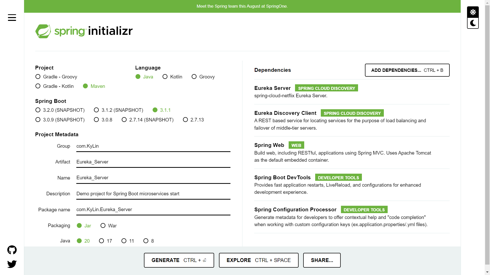
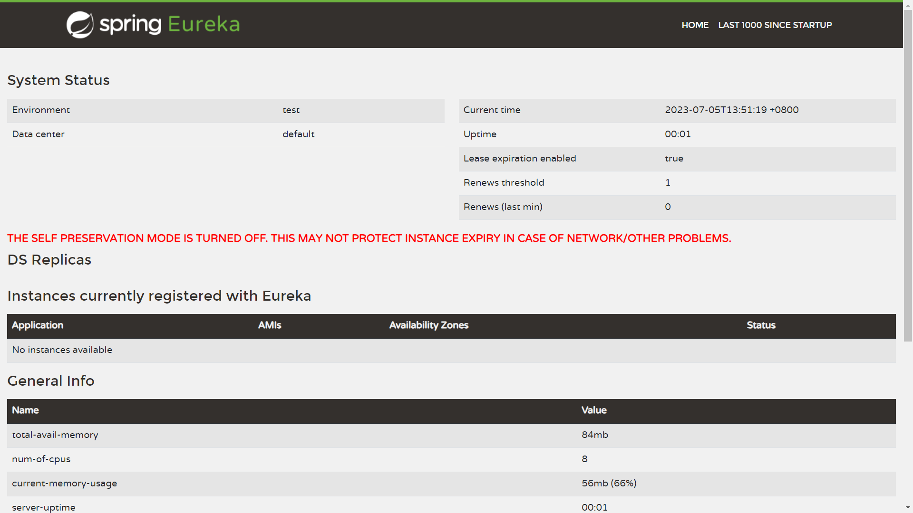
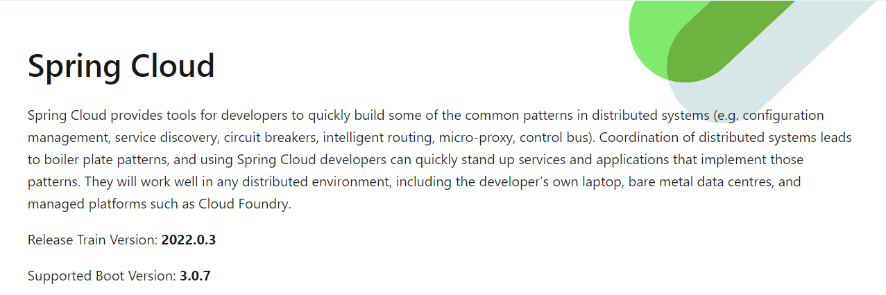
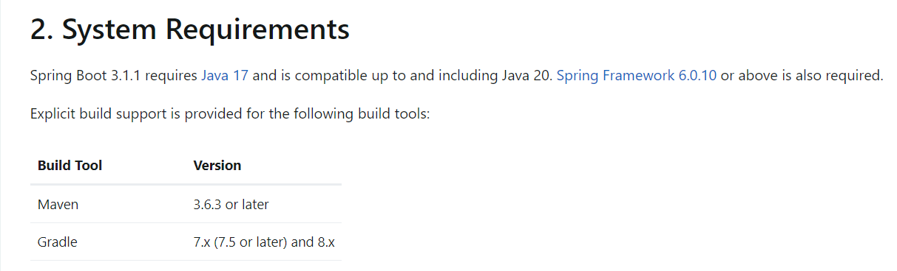

# 网关学习笔记

## 引用

## 摘要

## 部署

1. 新建一个SpringBoot微服务作为网关

      

2. 在父文件的pom文件配置Eureka网关服务的相关依赖：

    ```
    <properties>
		<spring-cloud.version>2022.0.3</spring-cloud.version>
	</properties>

	<dependencyManagement>
		<dependencies>
			<dependency>
				<groupId>org.springframework.cloud</groupId>
				<artifactId>spring-cloud-dependencies</artifactId>
				<version>${spring-cloud.version}</version>
				<type>pom</type>
				<scope>import</scope>
			</dependency>
		</dependencies>
	</dependencyManagement>
    ```

3. 在微服务Eureka注册中心添加相关依赖：
   
   ```
   <dependencies>
		<!-- 网关服务Eureka Server相关依赖 -->
		<dependency>
			<groupId>org.springframework.cloud</groupId>
			<artifactId>spring-cloud-starter-netflix-eureka-server</artifactId>
		</dependency>
	</dependencies>
	```

4. 在application.properties文件中配置Eureka Server

    ```
    # 设置Eureka Server的主机名
    eureka.instance.hostname=localhost

    # 设置Eureka Server的端口号
    server.port=8761

    # 禁用自我保护模式
    eureka.server.enable-self-preservation=false

    # 禁用客户端获取注册信息
    eureka.client.fetch-registry=false

    # 禁用客户端向Eureka Server注册
    eureka.client.register-with-eureka=false

    # 设置Eureka Server的服务URL
    eureka.client.service-url.defaultZone=http://${eureka.instance.hostname}:${server.port}/eureka/
    ```

5. 在Spring Boot应用的主类上添加@EnableEurekaServer注解来启用Eureka Server

6. 运行Spring Boot应用，启动Eureka Server，见到如下界面表示网关服务Eureka配置成功

      

<br>

## 使用

1. [查看SpringCloud所支持的SpringBoot版本](https://docs.spring.io/spring-cloud/docs/current/reference/html/)

      

2. [查看SpringBoot所支持的JDK和Maven版本](https://docs.spring.io/spring-boot/docs/current/reference/html/getting-started.html#getting-started.system-requirements)

      

3. 首先配置高可用的注册中心，根据上面部署的步骤再创建一个注册中心，但不同点在application.properties文件中配置如下：

	Eureka_Server的application.properties文件
	```
	# 设置Eureka Server的端口号
	server.port=8761

	# 应用名称
	spring.application.name=eureka-server

	# 设置Eureka Server的主机名
	eureka.instance.hostname=eureka_server

	# 设置Eureka Server的服务URL
	eureka.client.service-url.defaultZone=http://localhost:8762/eureka/

	# 增加数据库连接
	spring.datasource.url=jdbc:mysql://127.0.0.1:3306/database_start?useUnicode=true&characterEncoding=utf-8&zeroDateTimeBehavior=convertToNull
	spring.datasource.username=root
	spring.datasource.password=root
	spring.datasource.driver-class-name=com.mysql.cj.jdbc.Driver
	```

	Eureka01的application.properties文件
	```
	# 设置Eureka Server的端口号
	server.port=8762

	# 应用名称
	spring.application.name=eureka-server

	# 设置Eureka Server的主机名
	eureka.instance.hostname=eureka01

	# 设置Eureka Server的服务URL
	eureka.client.service-url.defaultZone=http://localhost:8761/eureka/

	# 增加数据库连接
	spring.datasource.url=jdbc:mysql://127.0.0.1:3306/database_start?useUnicode=true&characterEncoding=utf-8&zeroDateTimeBehavior=convertToNull
	spring.datasource.username=root
	spring.datasource.password=root
	spring.datasource.driver-class-name=com.mysql.cj.jdbc.Driver
	```

4. 使用IP + 端口的方式来注册服务，在注册中心的application.properties文件都添加如下配置：

	```
	# 是否使用ip地址注册
	eureka.instance.prefer-ip-address=true

	# ip + 端口 注册服务
	eureka.instance.instance-id=${spring.cloud.client.ip-address}:${server.port}
	```

5. 