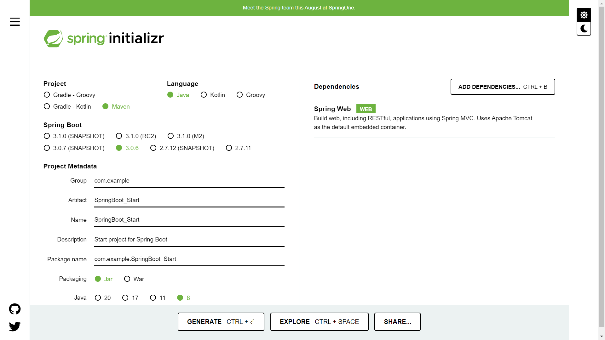
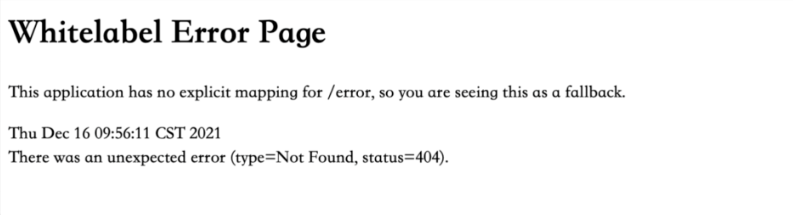
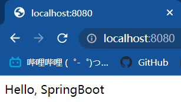
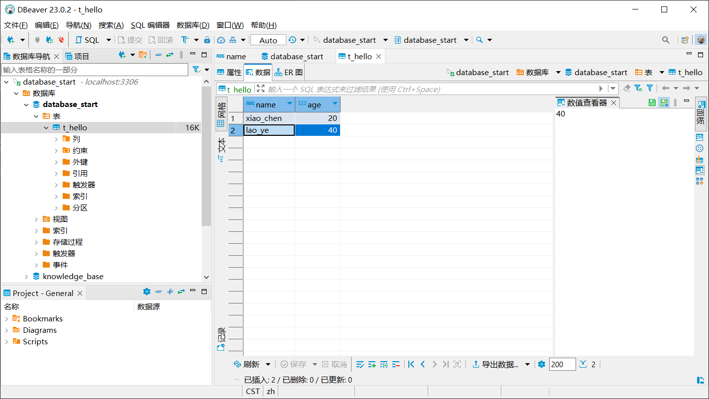
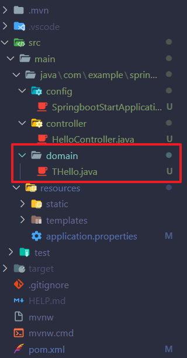
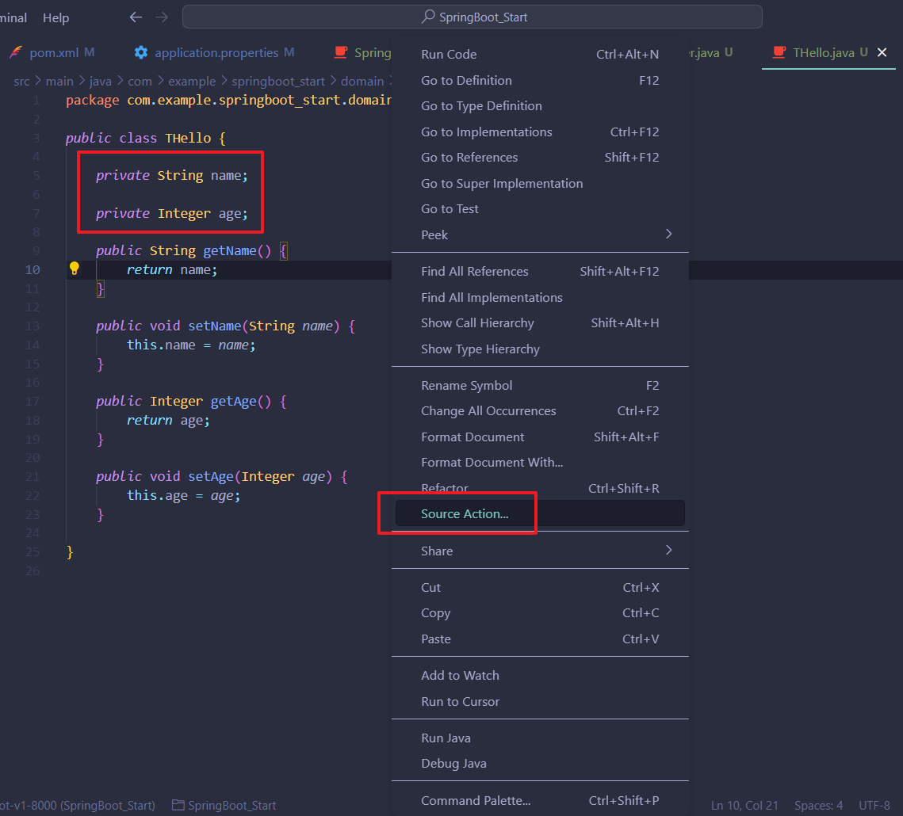
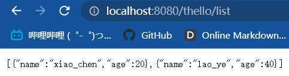
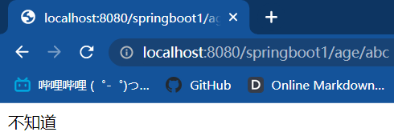

# SpringBoot学习笔记

工程案例：<https://github.com/KyLin066/SpringBoot_Start>

<br>

## HelloWorld

---

### `引用`

推荐文章1：[超详细的VsCode创建SpringBoot项目(图文并茂)](https://blog.csdn.net/zyd573803837/article/details/109263219)

推荐文章2：[VSCode搭建SpringBoot开发环境](https://juejin.cn/post/7114958090784473101)

推荐文章3：[一分钟快速搭建 Spring Boot 项目](https://cloud.tencent.com/developer/article/1924590)

推荐文章4：[如何在Spring boot中修改默认端口](https://www.cnblogs.com/flydean/p/12680327.html)

### `摘要`

```
通过VSCode搭建好一个SpringBoot工程，并输出"Hello, SpringBoot"
```

### `部署`

1. 去官网下载SpringBoot压缩包

    官网下载地址：https://start.spring.io/

2. 选择相应配置

      

3. 解压之后导入VSCode

### `使用`

<br>

项目启动成功后，我们在浏览器里访问 8080 端口测试一下
    
  

这个 404 页面是 Spring Boot 默认的错误页面，表示我们的请求在 Web 服务中不存在。

那该怎么办呢？

我们来增加一个 Controller 文件，用来处理 Web 请求，内容如下：

```
@RestController
public class HelloController {
    
    @GetMapping("/")
    public String start() {
        return "Hello, SpringBoot";
    }

}
```

这段代码的业务逻辑非常简单，用户发送 hello 请求，服务器端响应一个“Hello, SpringBoot”回去

  

SpringBoot修改默认端口
   
默认情况下，server.port值是8080。 我们可以在application.properties中这样修改为9091:

```
server.port = 9091
```

<br>

## Mapping/传参

---

### `引用`

知乎文章：[SpringBoot 参数接收只看这一篇文章就够了](https://zhuanlan.zhihu.com/p/599692046)

### `使用`

路径参数 @PathVariable

**基础使用**

通过@PathVariable可以将URL中占位符参数{xxx}绑定到处理器类的方法形参中@PathVariable("xxx")

    举个栗子：
    ```
        @GetMapping("/{name}")
        public String hello(@PathVariable String name) {
            return "Hello, " + name;
        }
    ```

<br>

## SpringBoot集成Mybatis

---

### `引用`

推荐文章1：[SpringBoot 数据库的基本操作](https://blog.csdn.net/u010412719/article/details/70147824)

<br>

### `摘要`

```
实现在浏览器输入localhost:8080/springboot1/age/{name}
查询出所输入名字的年龄
```

### `部署`

1. 在 MySQL 中新建一个`t_hello`的表，添加相应的数据

      

2. 集成Mybatis首先在Maven的porm.xml中添加相关依赖

    ```
    <!-- 集成mybatis-->
    <dependency>
        <groupId>org.mybatis.spring.boot</groupId>
        <artifactId>mybatis-spring-boot-starter</artifactId>
        <version>3.0.0</version>
    </dependency>
    <!-- 集成mysql连接 -->
    <dependency>
        <groupId>mysql</groupId>
        <artifactId>mysql-connector-java</artifactId>
        <version>8.0.29</version>
    </dependency>
    ```

3. 在application.properties中添加数据库连接

    ```
    # 增加数据库连接
    spring.datasource.url=jdbc:mysql://127.0.0.1:3306/database_start?useUnicode=true&characterEncoding=utf-8&zeroDateTimeBehavior=convertToNull
    spring.datasource.username=root
    spring.datasource.password=root
    spring.datasource.driver-class-name=com.mysql.cj.jdbc.Driver
    ```

4. 添加一个domain的包，新建一个与数据库表同名的实体类，并且项目按按下图分层

      

5. 在实体类中写入数据库表中相应的变量，并右键空白处，选择source action，生成get和set方法

      

6. 下面创建一个接口，新建一个mapper层在java文件夹中，接口都放在mapper层

    **THelloMapper.java**
    ```
    package com.example.springboot_start.mapper;

    import java.util.List;

    import com.example.springboot_start.domain.THello;

    public interface THelloMapper {

        public List<THello> list();
        
    }
    ```

7. 另外在resource文件夹下新建一个mapper层，用于存放SQL脚本，如果以后有新的项目，粘贴下面这段代码，稍作修改即可

    ```
    <?xml version="1.0" encoding="UTF-8" ?>
    <!DOCTYPE mapper PUBLIC "-//mybatis.org//DTD Mapper 3.0//EN" "http://mybatis.org/dtd/mybatis-3-mapper.dtd" >
    <mapper namespace="com.example.springboot_start.mapper.THelloMapper" >

        <select id="list" resultType="com.example.springboot_start.domain.THello">
            select `name`, `age` from `t_hello`
        </select>

    </mapper>
    ```

8. 接着在启动类中添加下面这行代码让，项目可以识别mapper层

    ```
    @MapperScan("com.example.springboot_start.mapper")
    ```

9. 在application.properties中添加下面这段代码，使整个项目识别resource中mapper层的xml文件

    ```
    # 配置mybatis所有Mapper.xml所在的路径
    mybatis.mapper-locations=classpath:/mapper/**/*.xml
    ```

<br>

### `使用`

1. 添加一个service层，基本的业务逻辑都是写在这个层，新建一个类，添加如下代码

    ```
    package com.example.springboot_start.service;

    import java.util.List;

    import org.springframework.stereotype.Service;

    import com.example.springboot_start.domain.THello;
    import com.example.springboot_start.mapper.THelloMapper;

    import jakarta.annotation.Resource;


    @Service //Service层都需要添加@Service注解
    public class THelloService {

        //使用@Resource将THelloMapper注入进来，也可以使用@Autowired
        //@Resource是JDK自带的，@Autowired是SpringBoot框架的
        @Resource
        private THelloMapper tHelloMapper;
        
        public List<THello> list () {
            return tHelloMapper.list();
        }

    }
    ```

2. 在controller层添加如下代码，即可显示数据库中的数据

    ```
    @RequestMapping("/") /** 匹配路径 */
    @RestController
    public class HelloController {

        @Resource
        private THelloService tHelloService;

        @GetMapping("/thello/list")
        public List<THello> list() {
            return tHelloService.list();
        }

    }
    ```

3. 做到这一步，证明SpringBoot集成Mybatis连接数据库成功

      

4. 下面就开始实现根据三级域名输入的字段来查询年龄，首先在mapper层写一个方法

    ```
    public interface THelloMapper {

        public THello findTHelloByName(String name);
        
    }
    ```

5. 接着在mapper的xml文件中添加如下代码

    ```
    <select id="findTHelloByName" parameterType="String" resultType="com.example.springboot_start.domain.THello">
	    select * from t_hello where name = #{name,jdbcType=VARCHAR}
    </select>
    ```

6. 然后在service层写如下方法

    ```
    public THello findTHelloByName(String name){
        return tHelloMapper.findTHelloByName(name);
    }
    ```

7. 最后在controller层添加如下代码就完成了

    ```
    @GetMapping("/springboot1/age/{name}")
    public String list(@PathVariable String name) {
        THello thello = tHelloService.findTHelloByName(name);
        return "The age of " + name + " is : " + thello.getAge();
    }
    ```

8. 效果如下图

      

9. 如果输入一个数据库不存在的名称，显示不知道，那么写一个if判断

    ```
    @GetMapping("/springboot1/age/{name}")
    public String list(@PathVariable String name) {
        THello thello = tHelloService.findTHelloByName(name);
        if (thello == null) {
            return "不知道";
        } else {
            return "The age of " + name + " is : " + thello.getAge();
        }
    }
    ```

10. 效果如下图
    
      

<br>


## SpringBoot实现增删改查，而且能进行批量操作

---

### `引用`

推荐文章：[spring boot 整合Mybatis 完成增删改查](https://blog.csdn.net/zyq854296521/article/details/128253944?utm_medium=distribute.pc_relevant.none-task-blog-2~default~baidujs_baidulandingword~default-1-128253944-blog-112287161.235^v35^pc_relevant_anti_vip&spm=1001.2101.3001.4242.2&utm_relevant_index=2)

<br>

### `摘要`

```
SpringBoot工程集成好Mybatis之后，实现基本的增删改查
其中，增的的部分，要求id、uuid、create_time自动生成，其它要求在页面填入；
改的部分也一样，不改这三个字段，其它都要求填入
```

<br>

### `使用`

1. 创建一个实体类，例如：

    ```
    package com.example.SpringBoot_Start.domain;

    import java.sql.Date;

    import io.swagger.v3.oas.annotations.media.Schema;
    import jakarta.validation.constraints.NotBlank;

    public class TWorld {

        @Schema(description = "自增ID")
        private Long id;

        @Schema(description = "唯一标识")
        private String uuid;

        @Schema(description = "可用性标记")
        private Short active;

        @Schema(description = "名称")
        @NotBlank(message = "名称不能为空")
        private String worldName;

        @Schema(description = "年龄")
        private Integer worldAge;

        @Schema(description = "描述")
        private String worldDesc;

        @Schema(description = "半径")
        private Float worldRadius;

        @Schema(description = "重量")
        private Double worldWeight;

        @Schema(description = "创建时间")
        private Date createTime;

        public Long getId() {
            return id;
        }

        public void setId(Long id) {
            this.id = id;
        }

        public String getUuid() {
            return uuid;
        }

        public void setUuid(String uuid) {
            this.uuid = uuid;
        }

        public Short getActive() {
            return active;
        }

        public void setActive(Short active) {
            this.active = active;
        }

        public String getWorldName() {
            return worldName;
        }

        public void setWorldName(String worldName) {
            this.worldName = worldName;
        }

        public Integer getWorldAge() {
            return worldAge;
        }

        public void setWorldAge(Integer worldAge) {
            this.worldAge = worldAge;
        }

        public String getWorldDesc() {
            return worldDesc;
        }

        public void setWorldDesc(String worldDesc) {
            this.worldDesc = worldDesc;
        }

        public Float getWorldRadius() {
            return worldRadius;
        }

        public void setWorldRadius(Float worldRadius) {
            this.worldRadius = worldRadius;
        }

        public Double getWorldWeight() {
            return worldWeight;
        }

        public void setWorldWeight(Double worldWeight) {
            this.worldWeight = worldWeight;
        }

        public Date getCreateTime() {
            return createTime;
        }

        public void setCreateTime(Date createTime) {
            this.createTime = createTime;
        }

        // @PrePersist
        // public void init() {
        //     this.uuid = UUID.randomUUID().toString().replace("-", "");
        // }

    }
    ```

2. 然后，创建一个Mapper接口，例如：

    ```
    package com.example.SpringBoot_Start.mapper;

    import java.util.List;

    import org.apache.ibatis.annotations.Delete;
    import org.apache.ibatis.annotations.Insert;
    import org.apache.ibatis.annotations.Options;
    import org.apache.ibatis.annotations.Select;
    import org.apache.ibatis.annotations.Update;

    import com.example.SpringBoot_Start.domain.TWorld;

    public interface TWorldMapper {

        // 查询全部数据
        @Select("SELECT * FROM t_world")
        List<TWorld> findAll();

        // 根据ID查询单条数据
        @Select("SELECT * FROM t_world WHERE id = #{id}")
        TWorld selectById(Long id);

        // 根据ID批量查询数据
        @Select({
            "<script>",
            "SELECT * FROM t_world WHERE id IN ",
            "<foreach collection='list' item='id' open='(' separator=',' close=')'>",
            "#{id}",
            "</foreach>",
            "</script>"
        })
        List<TWorld> selectByIds(List<Long> tWorldIds);

        // 查询数据库中有几条数据
        @Select("SELECT count(*) FROM t_world")
        Long count();

        // 新增数据
        @Insert("INSERT INTO t_world(uuid, active, worldName, worldAge, worldDesc, worldRadius, worldWeight, createTime) VALUES(uuid(), #{active}, #{worldName}, #{worldAge}, #{worldDesc}, #{worldRadius}, #{worldWeight}, now())")
        @Options(useGeneratedKeys = true, keyProperty = "id")
        int insert(TWorld tWorld);

        // 修改数据
        @Update("UPDATE t_world SET active=#{active}, worldName=#{worldName}, worldAge=#{worldAge}, worldDesc=#{worldDesc}, worldRadius=#{worldRadius}, worldWeight=#{worldWeight} WHERE id=#{id}")
        int update(TWorld tWorld);

        // 根据ID删除数据
        @Delete("DELETE FROM t_world WHERE id=#{id}")
        int deleteById(Long id);
        
        // 批量添加
        // @Insert("INSERT INTO t_world(uuid, active, worldName, worldAge, worldDesc, worldRadius, worldWeight, createTime) VALUES(uuid(), #{active}, #{worldName}, #{worldAge}, #{worldDesc}, #{worldRadius}, #{worldWeight}, now())")
        // @Options(useGeneratedKeys = true, keyProperty = "id")
        // int batchInsert(List<TWorld> tWorldList);
    }
    ```

3. 接着，创建一个TWorldService类，例如：

    ```
    package com.example.SpringBoot_Start.service;

    import java.util.List;

    import org.springframework.beans.factory.annotation.Autowired;
    import org.springframework.stereotype.Service;

    import com.example.SpringBoot_Start.domain.TWorld;
    import com.example.SpringBoot_Start.mapper.TWorldMapper;

    @Service
    public class TWorldService {

        @Autowired
        private TWorldMapper tWorldMapper;

        // 根据ID查询单个数据
        public TWorld getTWorldById(Long id) {
            return tWorldMapper.selectById(id);
        }

        //根据ID批量查询数据
        public List<TWorld> getTWorldByIds(List<Long> tWorldIds) {
            return tWorldMapper.selectByIds(tWorldIds);
        }

        // 查询数据数量
        public Long countTWorlds() {
            return tWorldMapper.count();
        }

        // 添加数据
        public void addTWorld(TWorld tWorld) {
            tWorldMapper.insert(tWorld);
        }

        // 删除数据
        public void deleteTWorld(Long tWorldId) {
            tWorldMapper.deleteById(tWorldId);
        }

        // public void addBatch(List<TWorld> tWorldList) {
        // for (TWorld tWorld : tWorldList){
        // tWorldMapper.insert(tWorld);
        // }
        // }

    }
    ```

4. 接着，创建一个控制器类，例如：

    ```
    package com.example.SpringBoot_Start.controller;

    import java.util.ArrayList;
    import java.util.HashMap;
    import java.util.List;
    import java.util.Map;

    import org.springframework.beans.factory.annotation.Autowired;
    import org.springframework.validation.BindingResult;
    import org.springframework.web.bind.annotation.DeleteMapping;
    import org.springframework.web.bind.annotation.GetMapping;
    import org.springframework.web.bind.annotation.PathVariable;
    import org.springframework.web.bind.annotation.PostMapping;
    import org.springframework.web.bind.annotation.PutMapping;
    import org.springframework.web.bind.annotation.RequestBody;
    import org.springframework.web.bind.annotation.RequestMapping;
    import org.springframework.web.bind.annotation.RequestParam;
    import org.springframework.web.bind.annotation.RestController;

    import com.example.SpringBoot_Start.domain.TWorld;
    import com.example.SpringBoot_Start.mapper.TWorldMapper;
    import com.example.SpringBoot_Start.service.TWorldService;

    import io.swagger.v3.oas.annotations.Operation;
    import io.swagger.v3.oas.annotations.tags.Tag;
    import jakarta.validation.Valid;

    @RestController
    @RequestMapping("/world")
    @Tag(name = "World管理", description = "World管理相关接口")
    public class TWorldController {

        @Autowired
        private TWorldMapper tWorldMapper;

        @Autowired
        private TWorldService tWorldService;

        // 查询全部数据
        @Operation(summary = "查询全部数据")
        @GetMapping("/")
        public List<TWorld> getTWorldList() {
            return tWorldMapper.findAll();
        }

        // 根据ID查询数据
        @Operation(summary = "根据ID查询单个数据")
        @GetMapping("/{id}")
        public TWorld getTWorldById(@PathVariable Long id) {
            return tWorldService.getTWorldById(id);
        }

        // 查询数据库中有几条数据
        @Operation(summary = "查询World数量")
        @GetMapping("/getCount")
        public Long countTWorlds() {
            return tWorldService.countTWorlds();
        }

        // 添加操作
        @Operation(summary = "添加单个数据")
        @PostMapping("/addOne")
        public String addTWorld(@Valid @RequestBody TWorld tWorld, BindingResult bindingResult) {
            if (bindingResult.hasErrors()) {
                return bindingResult.getFieldError().getDefaultMessage();
            }
            tWorldMapper.insert(tWorld);
            return "添加成功";
        }

        // 修改操作
        @Operation(summary = "修改单个数据")
        @PutMapping("/")
        public String updateTWorld(@RequestBody TWorld tWorld) {
            if (tWorldMapper.update(tWorld) == 1) {
                return "更新成功";
            } else {
                return "World不存在";
            }
        }

        // 删除操作
        @Operation(summary = "删除单个数据")
        @DeleteMapping("/{id}")
        public String deleteTWorld(@PathVariable Long id) {
            if (tWorldMapper.deleteById(id) == 1) {
                return "删除成功";
            } else {
                return "World不存在";
            }
        }

        // 根据ID批量查询数据
        @Operation(summary = "根据ID批量查询数据")
        @GetMapping("/getBatch")
        public List<TWorld> getBatch(@RequestParam List<Long> tWorldIds) {
            return tWorldService.getTWorldByIds(tWorldIds);
        }

        // 批量添加
        @Operation(summary = "批量添加数据")
        @PostMapping("/addBatch")
        public Map<String, List<Long>> addBatch(@RequestBody List<TWorld> tWorldList) {
            Map<String, List<Long>> result = new HashMap<>();
            List<Long> successIds = new ArrayList<>();
            List<Long> failedIds = new ArrayList<>();

            for (TWorld tWorld : tWorldList) {
                try {
                    tWorldService.addTWorld(tWorld);
                    successIds.add(tWorld.getId());
                } catch (Exception e) {
                    failedIds.add(tWorld.getId());
                }
            }

            result.put("success", successIds);
            result.put("failed", failedIds);
            return result;
        }

        // 批量删除
        @Operation(summary = "批量删除数据")
        @DeleteMapping("/deleteBatch")
        public Map<String, List<Long>> deleteBatch(@RequestBody List<Long> tWorldIds) {
            Map<String, List<Long>> result = new HashMap<>();
            List<Long> successIds = new ArrayList<>();
            List<Long> failedIds = new ArrayList<>();

            for (Long tWorldId : tWorldIds) {
                try {
                    tWorldService.deleteTWorld(tWorldId);
                    successIds.add(tWorldId);
                } catch (Exception e) {
                    failedIds.add(tWorldId);
                }
            }

            result.put("success", successIds);
            result.put("failed", failedIds);
            return result;
        }

    }
    ```

<br>

## 如何在SpringBoot + SpringDoc中对数据的增删改查进行验证

---

### `部署`

要在SpringBoot项目中使用Bean Validation，您需要添加相关的依赖。如果您使用的是Maven，可以在`pom.xml`文件中添加以下依赖：

```
<!-- 配置Bean Validation相关的依赖 -->
<dependency>
	<groupId>org.springframework.boot</groupId>
	<artifactId>spring-boot-starter-validation</artifactId>
	<version>3.1.0</version>
</dependency>
```

<br>

### `使用`

1. 首先，您需要在用户实体类中添加验证注解来定义验证规则：

    ```
    public class User {
        private Long id;

        @NotBlank(message = "姓名不能为空")
        private String name;

        @Min(value = 0, message = "年龄不能小于0")
        @Max(value = 150, message = "年龄不能大于150")
        private Integer age;

        // 省略 getter 和 setter 方法
    }
    ```

    在上面的例子中，我们在`name`属性上添加了`@NotBlank`注解来验证姓名不能为空，在`age`属性上添加了`@Min`和`@Max`注解来验证年龄必须在0到150之间。

2. 然后，在Controller中，您可以使用@Valid注解来开启验证功能，并使用BindingResult对象来获取验证结果：

    ```
    @RestController
    @RequestMapping("/users")
    @Tag(name = "用户管理", description = "用户管理相关接口")
    public class UserController {

        @Autowired
        private UserService userService;

        @Operation(summary = "添加用户")
        @PostMapping("/")
        public String addUser(@Valid @RequestBody User user, BindingResult bindingResult) {
            if (bindingResult.hasErrors()) {
                FieldError error = bindingResult.getFieldError();
                if (error != null) {
                    return error.getDefaultMessage();
                }
            }
            userService.addUser(user);
            return "添加成功";
        }
    }
    ```

    在上面的例子中，我们在`addUser`方法的参数中使用了`@Valid`注解来开启验证功能，并使用了`BindingResult`对象来获取验证结果。如果验证失败，我们可以从`BindingResult`对象中获取错误信息并返回给客户端。

<br>

## 问题

---

1. VSCode提交The project was not built since its build path is incomplete. Cannot find the class file for java.lang.Object.

    参考文章：[VS code报错](https://blog.csdn.net/weixin_42110816/article/details/126469604)

<br>

2. 如何解决java.lang.illegalargumentexception: property 'sqlsessionfactory' or 'sqlsessiontemplate' are required
    
    参考文章：[SpringBoot3整合MyBatis报错](https://blog.csdn.net/ZHENFENGSHISAN/article/details/128010240)

    **版本问题**：我的SpringBoot和Mybatis对应版本如下所示

    SpringBoot版本：
    ```
    <parent>
		<groupId>org.springframework.boot</groupId>
		<artifactId>spring-boot-starter-parent</artifactId>
		<version>3.0.5</version>
		<relativePath/> <!-- lookup parent from repository -->
	</parent>
    ```

    Mybatis版本：
    ```
    <dependency>
        <groupId>org.mybatis.spring.boot</groupId>
        <artifactId>mybatis-spring-boot-starter</artifactId>
        <version>3.0.0</version>
    </dependency>
    ```