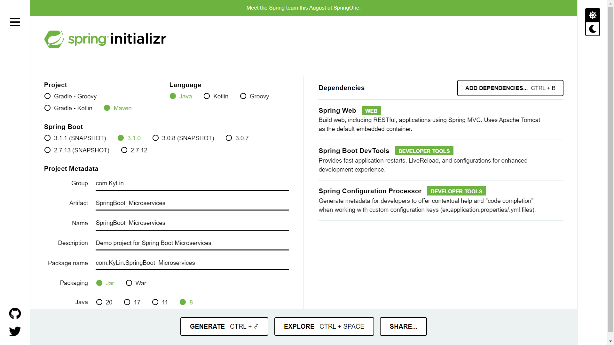
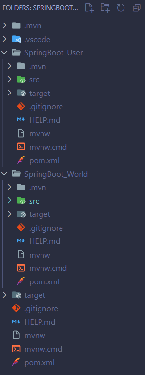

# SpringBoot微服务学习笔记

工程案例：<https://github.com/KyLin066/Microservices_Start>;

<br>

## `引用`

---

参考文章：[springboot 多模块项目开发](https://www.jianshu.com/p/235a17ce4091)

<br>

## `部署`

---

1. 去官网下载一个SpringBoot工程，配置如下图：

    ```
    PS：下图版本选择Java20，SpringBoot3.0之后只支持Java8以上的版本
    ```

      

2. 删除父工程的src，SpringBoot微服务的项目结构如下图

      

3. 在父工程的pom文件中添加如下代码：

    ```
    <packaging>pom</packaging>
	<modules>
		<module>SpringBoot_User</module>
		<module>SpringBoot_World</module>
	</modules>
    ```

4. 在子工程的pom文件中添加如下代码：

    ```
    <parent>
		<groupId>com.KyLin</groupId>
		<artifactId>SpringBoot_Microservices</artifactId>
		<version>0.0.1-SNAPSHOT</version>
		<relativePath>../pom.xml</relativePath> <!-- lookup parent from repository -->
	</parent>
    ```
5. 配置`launch.json`文件
   
   ```
   {
        // Use IntelliSense to learn about possible attributes.
        // Hover to view descriptions of existing attributes.
        // For more information, visit: https://go.microsoft.com/fwlink/?linkid=830387
        "version": "0.2.0",
        "configurations": [
            {
                "type": "java",
                "name": "Current File",
                "request": "launch",
                "mainClass": "${file}"
            },
            {
                "type": "java",
                "name": "SpringBootUserApplication",
                "request": "launch",
                "mainClass": "com.KyLin.SpringBoot_User.SpringBootUserApplication",
                "projectName": "SpringBoot_User",
                "vmArgs":"-Dserver.port=8080"
            },
            {
                "type": "java",
                "name": "SpringBootWorldApplication",
                "request": "launch",
                "mainClass": "com.KyLin.SpringBoot_World.SpringBootWorldApplication",
                "projectName": "SpringBoot_World",
                "vmArgs":"-Dserver.port=8086"
            }
        ]
    }
   ```

6. 使用Maven命令先clean再install即可运行项目

<br>

## `使用`

---

1. 参考HttpClient学习笔记，完成HttpClient的部署

2. UserService.java的代码如下：

    ```
    package com.KyLin.SpringBoot_User.service;

    import java.io.IOException;
    import java.util.ArrayList;
    import java.util.List;

    import org.apache.hc.client5.http.classic.methods.HttpDelete;
    import org.apache.hc.client5.http.classic.methods.HttpGet;
    import org.apache.hc.client5.http.classic.methods.HttpPost;
    import org.apache.hc.client5.http.classic.methods.HttpPut;
    import org.apache.hc.client5.http.impl.classic.CloseableHttpClient;
    import org.apache.hc.client5.http.impl.classic.CloseableHttpResponse;
    import org.apache.hc.client5.http.impl.classic.HttpClients;
    import org.apache.hc.core5.http.ContentType;
    import org.apache.hc.core5.http.HttpEntity;
    import org.apache.hc.core5.http.HttpStatus;
    import org.apache.hc.core5.http.ParseException;
    import org.apache.hc.core5.http.io.entity.EntityUtils;
    import org.apache.hc.core5.http.io.entity.StringEntity;
    import org.springframework.beans.factory.annotation.Autowired;
    import org.springframework.boot.configurationprocessor.json.JSONException;
    import org.springframework.boot.configurationprocessor.json.JSONObject;
    import org.springframework.stereotype.Service;

    import com.KyLin.SpringBoot_User.domain.User;
    import com.KyLin.SpringBoot_User.domain.WorldDTO;
    import com.KyLin.SpringBoot_User.mapper.UserMapper;
    import com.KyLin.SpringBoot_User.utils.HttpUtils;
    import com.fasterxml.jackson.core.type.TypeReference;
    import com.fasterxml.jackson.databind.ObjectMapper;

    @Service
    public class UserService {

        @Autowired
        private UserMapper userMapper;

        ObjectMapper objectMapper = new ObjectMapper();
        TypeReference<List<WorldDTO>> typeReference = new TypeReference<List<WorldDTO>>() {};

        // 修改操作
        public void update(Long id, User user) {
            user.setId(id);
            userMapper.update(user);
        }

        // HttpClient查询World的全部数据
        public List<WorldDTO> getWorld() throws IOException, ParseException {
            List<WorldDTO> worlds = new ArrayList<>();
            CloseableHttpClient httpClient = HttpClients.createDefault();
            HttpGet httpGet = new HttpGet("http://localhost:8086/world/findAll");
            CloseableHttpResponse response = httpClient.execute(httpGet);
            try {
                int statusCode = response.getCode();
                String reasonPhrase = response.getReasonPhrase();
                if (statusCode == HttpStatus.SC_OK) {
                    // 获取成功
                    HttpEntity entity = response.getEntity();
                    String json = EntityUtils.toString(entity);
                    worlds = objectMapper.readValue(json, typeReference);
                } else {
                    // 处理错误响应
                    System.err.println("Error getting worlds: " + reasonPhrase);
                }
            } finally {
                response.close();
            }
            return worlds;
        }

        // HttpClient添加单个World数据
        public String addWorld() throws IOException, ParseException, JSONException {

            CloseableHttpClient httpConnection = HttpUtils.getHttpConnection();
            HttpPost httpPost = new HttpPost("http://localhost:8086/world/addOne");

            JSONObject param = new JSONObject();
            param.put("active", "1");
            param.put("worldName", "Planet666");
            param.put("worldAge", 66);
            param.put("worldDesc", "666");
            param.put("worldRadius", 66.6);
            param.put("worldWeight", 6.6);

            StringEntity stringEntity = new StringEntity(param.toString());
            httpPost.setHeader("Content-Type", ContentType.APPLICATION_JSON.toString());
            httpPost.setEntity(stringEntity);
            CloseableHttpResponse execute = httpConnection.execute(httpPost);

            String result = EntityUtils.toString(execute.getEntity());
            return "添加单个World数据结果：" + result;

        }

        // HttpClient修改单个World数据
        public void updateWorld(WorldDTO world) throws IOException {
            CloseableHttpClient httpClient = HttpClients.createDefault();
            HttpPut httpPut = new HttpPut("http://localhost:8086/world/update/6");
            String json = "{\"active\":" + world.getActive() + ", \"worldName\":\"" + world.getWorldName() + "\", \"worldAge\":" + world.getWorldAge() + ", \"worldDesc\":\"" + world.getWorldDesc() + "\", \"worldRadius\":" + world.getWorldRadius() + ", \"worldWeight\":" + world.getWorldWeight() + "}";
            StringEntity entity = new StringEntity(json, ContentType.APPLICATION_JSON);
            httpPut.setEntity(entity);
            CloseableHttpResponse response = httpClient.execute(httpPut);
            try {
                int statusCode = response.getCode();
                String reasonPhrase = response.getReasonPhrase();
                if (statusCode == HttpStatus.SC_NO_CONTENT) {
                    // 更新成功
                    System.out.println("User updated successfully");
                } else {
                    // 处理错误响应
                    System.err.print("Error updating user:" + reasonPhrase);
                }
            } finally {
                response.close();
            }
        }

        // HttpClient删除单个World数据
        public void deleteWorld() throws IOException {
            CloseableHttpClient httpClient = HttpClients.createDefault();
            HttpDelete httpDelete = new HttpDelete("http://localhost:8086/world/28");
            CloseableHttpResponse response = httpClient.execute(httpDelete);
            try {
                int statusCode = response.getCode();
                String reasonPhrase = response.getReasonPhrase();
                if (statusCode == HttpStatus.SC_NO_CONTENT) {
                    // 删除成功
                    System.out.println("World deleted successfully");
                } else {
                    // 处理错误响应
                    System.err.println("Error deleting world: " + reasonPhrase);
                }
            } finally {
                response.close();
            }
        }

    }
    ```

3. UserController.java的代码如下：

    ```
    package com.KyLin.SpringBoot_User.controller;

    import java.io.IOException;
    import java.util.List;

    import org.apache.hc.client5.http.classic.methods.HttpPost;
    import org.apache.hc.client5.http.impl.classic.CloseableHttpClient;
    import org.apache.hc.client5.http.impl.classic.CloseableHttpResponse;
    import org.apache.hc.core5.http.ContentType;
    import org.apache.hc.core5.http.ParseException; 
    import org.apache.hc.core5.http.io.entity.EntityUtils;
    import org.apache.hc.core5.http.io.entity.StringEntity;
    import org.springframework.beans.factory.annotation.Autowired;
    import org.springframework.boot.configurationprocessor.json.JSONException;
    import org.springframework.boot.configurationprocessor.json.JSONObject;
    import org.springframework.http.ResponseEntity;
    import org.springframework.web.bind.annotation.DeleteMapping;
    import org.springframework.web.bind.annotation.GetMapping;
    import org.springframework.web.bind.annotation.PathVariable;
    import org.springframework.web.bind.annotation.PostMapping;
    import org.springframework.web.bind.annotation.PutMapping;
    import org.springframework.web.bind.annotation.RequestBody;
    import org.springframework.web.bind.annotation.RequestMapping;
    import org.springframework.web.bind.annotation.RestController;

    import com.KyLin.SpringBoot_User.domain.User;
    import com.KyLin.SpringBoot_User.domain.WorldDTO;
    import com.KyLin.SpringBoot_User.mapper.UserMapper;
    import com.KyLin.SpringBoot_User.service.UserService;
    import com.KyLin.SpringBoot_User.utils.HttpUtils;

    import io.swagger.v3.oas.annotations.Operation;
    import io.swagger.v3.oas.annotations.tags.Tag;

    @RestController
    @RequestMapping("/user")
    @Tag(name = "用户管理", description = "用户管理相关接口")
    public class UserController {
        
        @Autowired
        private UserMapper userMapper;

        @Autowired
        private UserService userService;

        // 查询全部用户
        @Operation(summary = "查询全部用户")
        @GetMapping("/search")
        public List<User> getUserList() {
            return userMapper.findAll();
        }

        // 添加操作
        @Operation(summary = "添加单个用户")
        @PostMapping("/add")
        public String addUser(@RequestBody User user) {
            userMapper.insert(user);
            return "添加成功";
        }

        // 修改操作
        // @Operation(summary = "修改单个用户")
        // @PutMapping("/update")
        // public String updateUser(@RequestBody User user) {
        //     if (userMapper.update(user) == 1) {
        //         return "更新成功";
        //     } else {
        //         return "用户不存在";
        //     }
        // }

        @Operation(summary = "修改单个用户")
        @PutMapping("/update/{id}")
        public ResponseEntity<Void> update(@PathVariable Long id, @RequestBody User user) {
            userService.update(id, user);
            return ResponseEntity.noContent().build();
        }

        // 删除操作
        @Operation(summary = "删除单个用户")
        @DeleteMapping("/{id}")
        public String deleteUser(@PathVariable Long id) {
            if (userMapper.deleteById(id) == 1) {
                return "删除成功";
            } else {
                return "用户不存在";
            }
        }

        /*
        * 使用HttpClient进行添加操作
        */
        @Operation(summary = "HttpClient测试接口")
        @GetMapping("/test")
        public void test() throws IOException, JSONException, ParseException {
            CloseableHttpClient httpConnection = HttpUtils.getHttpConnection();
            HttpPost httpPost = new HttpPost("http://localhost:8080/user/add");

            JSONObject param = new JSONObject();
            param.put("name", "KyLin");
            param.put("age", 23);

            StringEntity stringEntity = new StringEntity(param.toString());
            httpPost.setHeader("Content-Type", ContentType.APPLICATION_JSON.toString());
            httpPost.setEntity(stringEntity);
            CloseableHttpResponse execute = httpConnection.execute(httpPost);

            String result = EntityUtils.toString(execute.getEntity());
            System.out.println("调用post 返回结果：" + result);
        }

        // 查询World全部数据
        @Operation(summary = "HttpClient查询World全部数据")
        @GetMapping("/findAllWorld")
        public List<WorldDTO> getWorld() throws ParseException, IOException {
            return userService.getWorld();
        }

        // 添加单个World数据
        @Operation(summary = "HttpClient添加单个World数据")
        @GetMapping("/addWorld")
        public String addWorld() throws ParseException, IOException, JSONException {
            return userService.addWorld();
        }

        // HttpClient修改单个World数据
        @Operation(summary = "HttpClient修改单个World数据")
        @PutMapping("/updateWorld")
        public ResponseEntity<Void> updateWorld(@RequestBody WorldDTO world) throws IOException {
            userService.updateWorld(world);
            return ResponseEntity.noContent().build();
        }

        // 删除单个World数据
        @Operation(summary = "HttpClient删除单个World数据")
        @DeleteMapping("/deleteWorld")
        public ResponseEntity<Void> deleteWorld() throws IOException {
            userService.deleteWorld();
            return ResponseEntity.noContent().build();
        }

    }
    ```