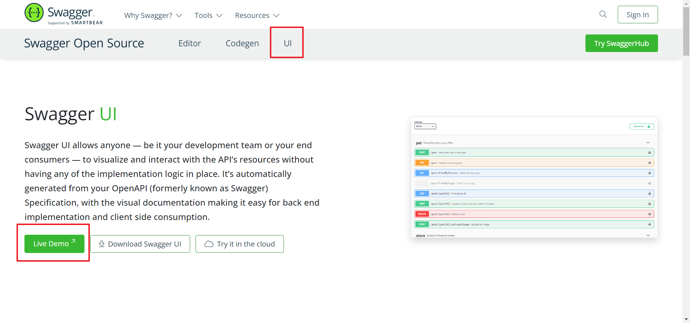
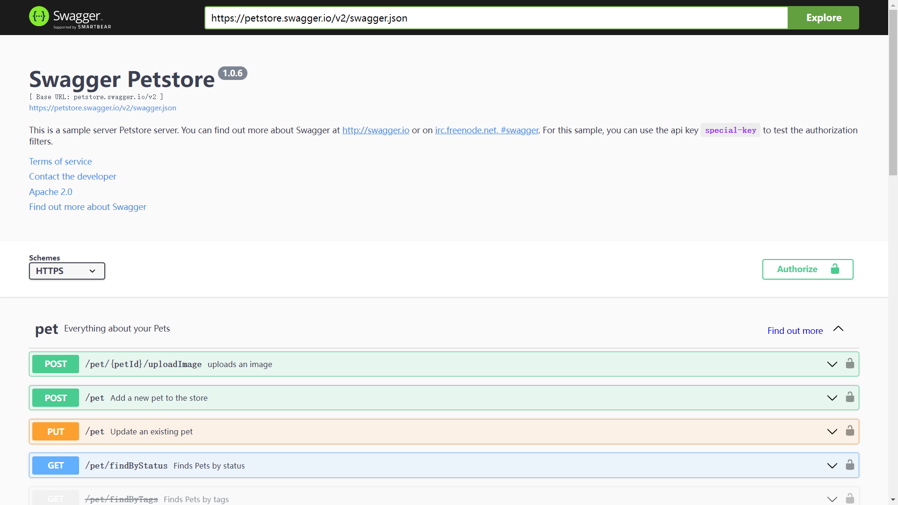
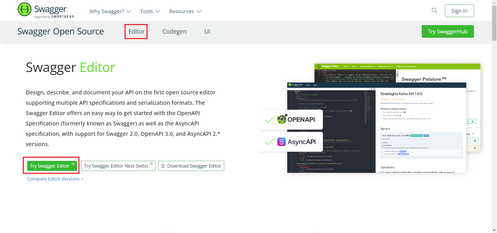
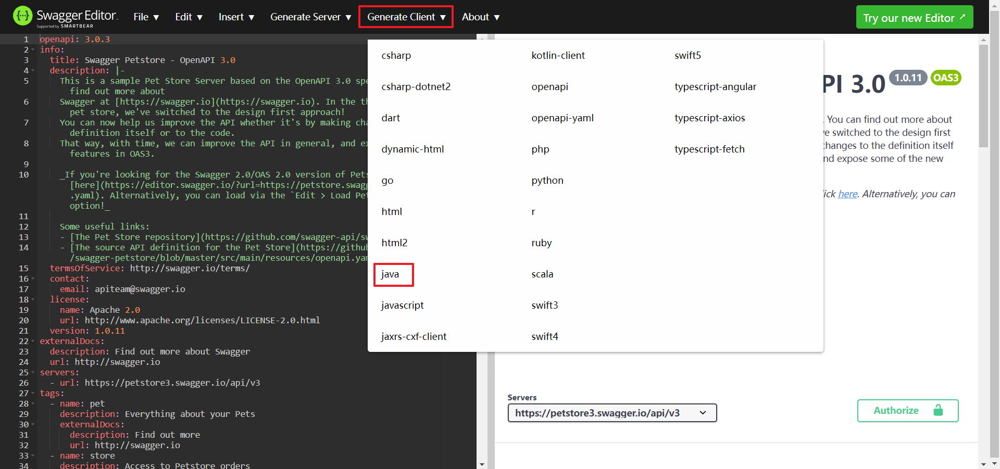
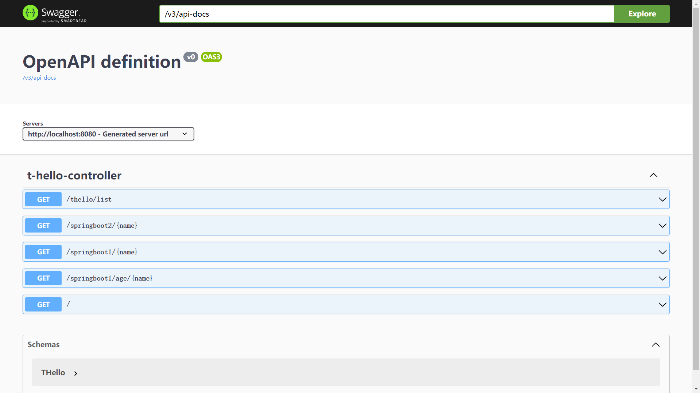
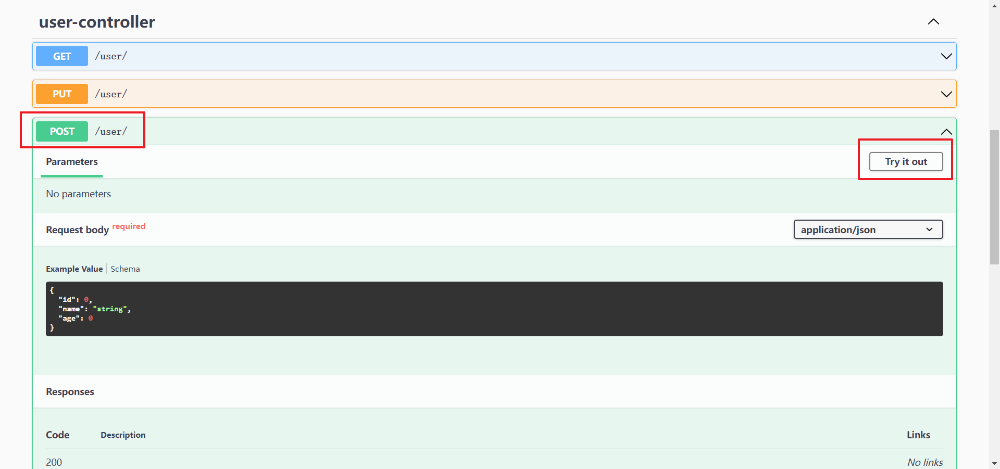
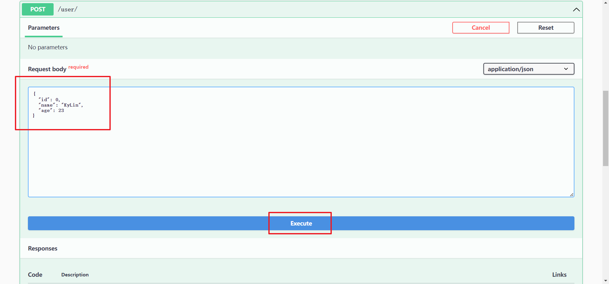
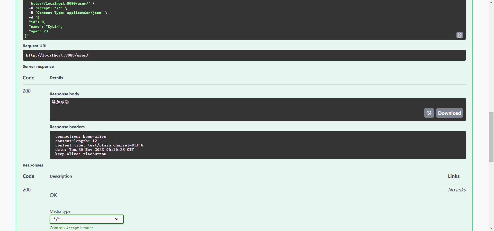

# Swagger使用教程

## `引用`

---

[Swagger官网地址](https://swagger.io/)

[SpringDoc官方文档](https://springdoc.org/v2/)

<br>

## `摘要`

---

```
Swagger是一款RESTFUL接口的文档在线生成软件和RESTFUL接口的功能测试软件
```

### **Swagger周边生态**

1. Swagger UI

    进入官网之后，点击UI，选择Live Demo，即查看Swagger UI的效果

      

      

2. Swagger Editor

    进入官网之后，点击Editor，选择Try Swagger Editor，即查看Swagger Editor的在线编辑器

      

    进行编辑之后即可导出相应语言的客户端或服务端的代码

      

3. Swagger Codegen
   
   TODO:

<br>

## `部署`

---

参考文章：[SpringBoot3中Swagger的引入](https://blog.csdn.net/qq_40109267/article/details/129671447)

1. 在pom.xml中引入依赖

    ```
    <!-- SpringDoc相关依赖 -->
	<dependency>
        <groupId>org.springdoc</groupId>
        <artifactId>springdoc-openapi-starter-webmvc-ui</artifactId>
        <version>2.1.0</version>
	</dependency>
    ```

2. 在application.properties设置Swagger文档的路径

	```
	# 设置swagger-ui的默认路径
	springdoc.swagger-ui.path=/swagger-ui.html
	```

3. 浏览器输入地址：`http://localhost:8080/swagger-ui/index.html`

	  

<br>

## `使用`

---

1. 选择需要测试的功能，点击`Try it out`按钮

      

2. 输入相应的字段，点击`Execute`按钮

      

3. 在Server response中可以查看操作是否成功

      
