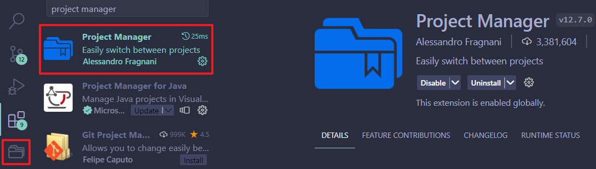
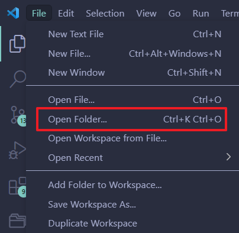
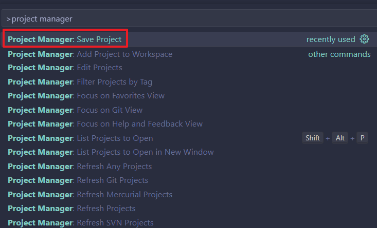
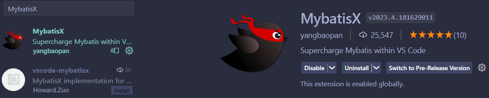
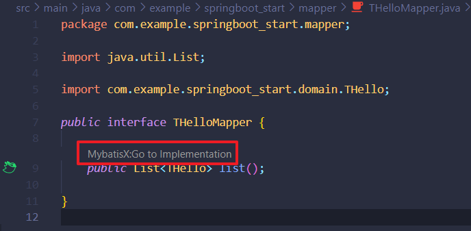

# VsCode插件汇总

## 1.Project Manager

### `引用`

推荐文章：[Vscode使用插件Project Manager管理项目](https://blog.csdn.net/weixin_39493668/article/details/127071322)

### `摘要`

```
每次在vscode中更换项目时，都需要更换虚拟环境，编译器以及编译路径非常麻烦，所以可以使用vscode中的插件Project Manager来快捷转换。
```

### `部署`

首先在Extensions中搜索并下载插件

  

下载后出现右侧的标签，就是project manager项目管理器

### `使用`

1. 在文件中选择打开文件夹，打开你想要管理的项目文件

      

2. ctrl+shift+p打开如下命令面板，并输入project manager找到save project这一项
   
     

<br> 

## 2.Markdown Image

### `摘要`

```
在 Visual Studio Code 中，快捷上传图片
那么我们就需要一款插件，来实现快捷键快速粘贴图片等操作，照例打开EXTENSIONS选项卡，这里推荐两款，Markdown Image 和 PicGo。本文以Markdown Image为例（因为它能自定义上传接口）。
```

### `部署`

首先在Extensions中搜索Markdown Image并下载插件

 

### `使用`

安装后打开设置，我们可以看到这样一个选项，我们可以根据需求选择图床。直接推送到你的托管平台可以选择 Local ，不想折腾，对速度要求不高的可以选择 SM.MS Imgur 这两个图床，点开 Options ，根据提示注册并填入字段即可。

  

```
现在，我们新建一个 Markdown 文件，应该就可以看到md源文件和预览啦~现在我们测试一下是否能上传。右键看到快捷键是 Shift+Alt+V 测试一下，就能粘贴啦~
```

<br>

## 3.MybatisX

### `摘要`

```
MybatisX 弥补了在 VSCode 下没有高效、功能强大的 Mybatis 辅助功能插件，该插件当前还处于预览版本，特性与BUG会持续修复，请放心安装，让你拥有比 Idea 更强大的 MybatisX 增强功能。
```

### `部署`

首先在Extensions中搜索MybatisX并下载插件

  


### `使用`

点击下图此处即可实现mapper之间的跳转

  
