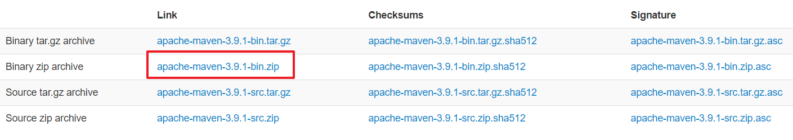
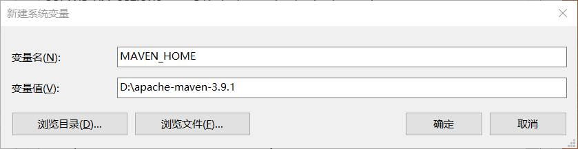
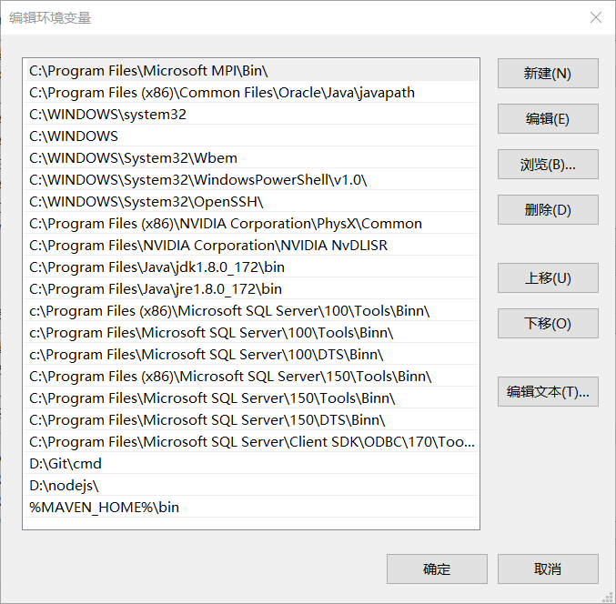
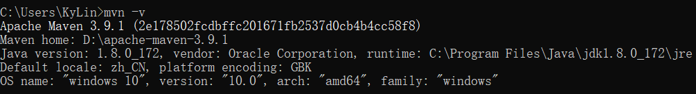
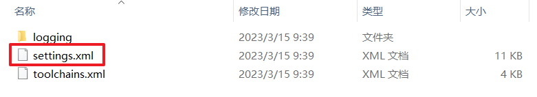
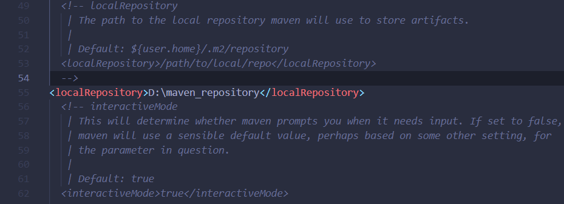
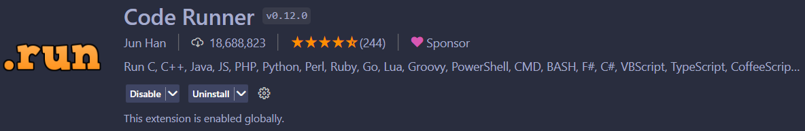

# Maven学习笔记

工程案例：<>;

 

## `引用`

[Maven相关依赖搜索网站](https://mvnrepository.com/)

推荐文章1：[Maven的安装与配置](https://blog.csdn.net/pan_junbiao/article/details/104264644)

推荐文章2：[【VSCode】Java编程语言编译、调试、测试、maven环境搭建](https://www.jianshu.com/p/c33bfd3aef44)

## `摘要`

- 当使用某个包的时候，需要在pom.xml中写版本号。要确认其版本，可以到Maven 官网去搜索相应的包名：<https://mvnrepository.com/>;

## `部署`

1. 官网下载地址：https://maven.apache.org/download.cgi

2. 选择 bin.zip 后缀下载，解压到本地

      

    下载完成后，将安装文件解压到指定的目录中。

3. 设置环境变量

    接着需要设置环境变量，将Maven安装配置到操作系统环境中。打开系统属性面板（在桌面上右键“我的电脑” → “属性”），单击高级系统设置。

4. 新建系统变量

    变量名：MAVEN_HOME

    变量值：D:\apache-maven-3.9.1

      

5. 修改Path变量值

    在Path变量值后面加上：%MAVEN_HOME%\bin

      
    
6. 验证
   
    输入命令： 
    
    > mvn -v

      

7. 修改settings.xml
    
    修改 ./conf/settings.xml 文件

      

    配置本地仓库

    > <localRepository>D:\maven_repository</localRepository>

      

## `使用`

### 搭建Maven，输出Hello World

1. 安装VSCode的扩展CodeRunner

      

    > 代码一键运行：安装好Code Runner之后，打开你所要运行的文件，有多种方式来快捷地运行代码：
    > - 键盘快捷键 Ctrl+Alt+N
    > - 快捷键 F1 调出 命令面板, 然后输入 Run Code
    > - 在编辑区，右键选择 Run Code
    > - 在左侧的文件管理器，右键选择 Run Code
    > - 右上角的运行小三角按钮

    选择 文件 -> 首选项 -> 设置，打开VS Code设置页面，找到 Run Code configuration，勾上 Run In Terminal 选项。设置之后，代码就会在 Terminal 中运行了。

2. maven项目的创建

    下面创建maven项目：快捷键`ctrl + shift + p`打开command窗口，输入`maven`，选择`maven-archetype-quickstart`，然后选择一个版本后，创建一个maven项目，在输入几个关键的参数后（groupId、artifactId、package等），显示BUILD SUCCESS即为创建成功。打开刚才所创建的项目，可以看到main和test两个目录

3. 测试hello，world代码