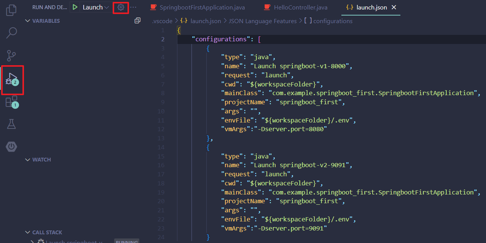

# 反向代理

## 引用

推荐文章1：[Nginx反向代理设置 从80端口转向其他端口](https://www.cnblogs.com/youmeng/p/14553607.html)

推荐文章2：[Nginx配置——反向代理](https://blog.csdn.net/zxd1435513775/article/details/102508463)

推荐文章3：[使用nginx根据不同域名转发到不同端口](https://juejin.cn/post/6844903700427702279)

## 摘要

**何为反向代理：**

在介绍反向代理之前，先来了解一下正向代理。

`正向代理：`如果把局域网外的Internet想象成一个巨大的资源库，则局域网中的客户端要访问Internet，则需要通过代理服务器来访问，这种代理服务就称为正向代理，下面是正向代理的原理图


`反向代理：`看下面原理图，就一目了然。其实客户端对代理是无感知的，因为客户端不需要任何配置就可以访问，我们只需要将请求发送到反向代理服务器，由反向代理服务器去选择目标服务器获取数据后，在返回给客户端，此时反向代理服务器和目标服务器对外就是一个服务器，暴露的是代理服务器地址，隐藏了真实服务器 IP地址。


## 使用

<br>

**Nginx反向代理设置 从80端口转向SpringBoot服务器的8080端口**

1. 启动Nginx和SpringBoot服务器

2. 找到conf/nginx.conf文件，编辑：

    ```
    server {
            listen       80; #监听端口
            server_name  www.kylin.com; ##监听地址

            ##请求的url过滤，正则匹配，~为区分大小写，~*为不区分大小写。
            location ~ / {
                proxy_pass   http://127.0.0.1:8080;
            }

        }
    ```

    listen：监听80端口

    server_name：转发到哪个地址

    proxy_pass：代理到哪个地址

    nginx常用命令（要进入到nginx的目录）：

    开启：start nginx

    重启：nginx -s reload（一定要重启 不然不生效）

<br>

**使用nginx根据不同域名转发到不同端口**

假如在同一台服务器上部署了2个server，分别对应8080，,9091端口，并用2个不同的域名分别对应这两个端口，我们可以使用nginx的转发动态请求到不同端口的应用上

```
    server {
        listen       80; #监听端口
        server_name  springboot1.kylin.com; ##监听地址

        ##请求的url过滤，正则匹配，~为区分大小写，~*为不区分大小写。
        location ~ / {
            proxy_pass   http://127.0.0.1:8080;
        }

        # redirect server error pages to the static page /50x.html
        #
        error_page   500 502 503 504  /50x.html;
        location = /50x.html {
            root   html;
        }
    }

    server {
        listen       80; #监听端口
        server_name  springboot2.kylin.com; ##监听地址

        ##请求的url过滤，正则匹配，~为区分大小写，~*为不区分大小写。
        location ~ / {
            proxy_pass   http://127.0.0.1:9091;
        }

        # redirect server error pages to the static page /50x.html
        #
        error_page   500 502 503 504  /50x.html;
        location = /50x.html {
            root   html;
        }
    }
```

<br>

**Nginx打印自定义日志**

在server里添加

> access_log  logs/access.www.kylin.com.log;

<br>

**使用nginx根据不同二级目录转发到不同端口**

```
    server {
        listen       80; #监听端口
        server_name  www.kylin.com; ##监听地址

        location ~ ^/springboot1/ {
            proxy_pass   http://127.0.0.1:8080;
        }

        location ~ ^/springboot2/ {
            proxy_pass   http://127.0.0.1:9091;
        }
    }
```

<br>

**一个SpringBoot项目如何启动两个进程**

1. 在run and debug里点击open "launch.json"

      

2. 对launch.json文件进行修改

    ```
    {
        "configurations": [
            {
                "type": "java",
                "name": "Launch springboot-v1-8000",
                "request": "launch",
                "cwd": "${workspaceFolder}",
                "mainClass": "com.example.springboot_first.SpringbootFirstApplication",
                "projectName": "springboot_first",
                "args": "",
                "envFile": "${workspaceFolder}/.env",
                "vmArgs":"-Dserver.port=8080"
            },
            {
                "type": "java",
                "name": "Launch springboot-v2-9091",
                "request": "launch",
                "cwd": "${workspaceFolder}",
                "mainClass": "com.example.springboot_first.SpringbootFirstApplication",
                "projectName": "springboot_first",
                "args": "",
                "envFile": "${workspaceFolder}/.env",
                "vmArgs":"-Dserver.port=9091"
            }
        ]
    }
    ```